# Vyasa Diagrams Reference

Vyasa renders Mermaid and D2 diagrams with zoom, pan, reset, and fullscreen controls. Both support dark/light theme switching.

---

## Mermaid

Use literal `<br/>` for line breaks inside Mermaid node labels and edge labels. Do not use `\n` inside labels.

### Basic usage

````markdown
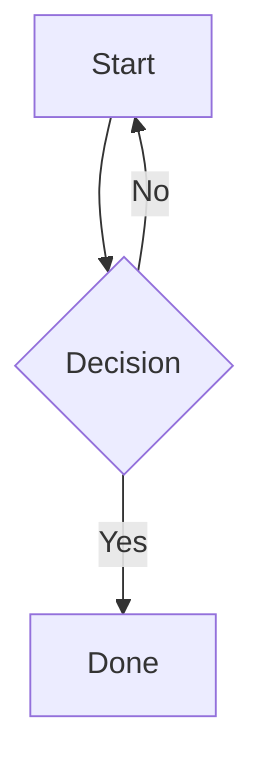
````

### Multiline labels

````markdown
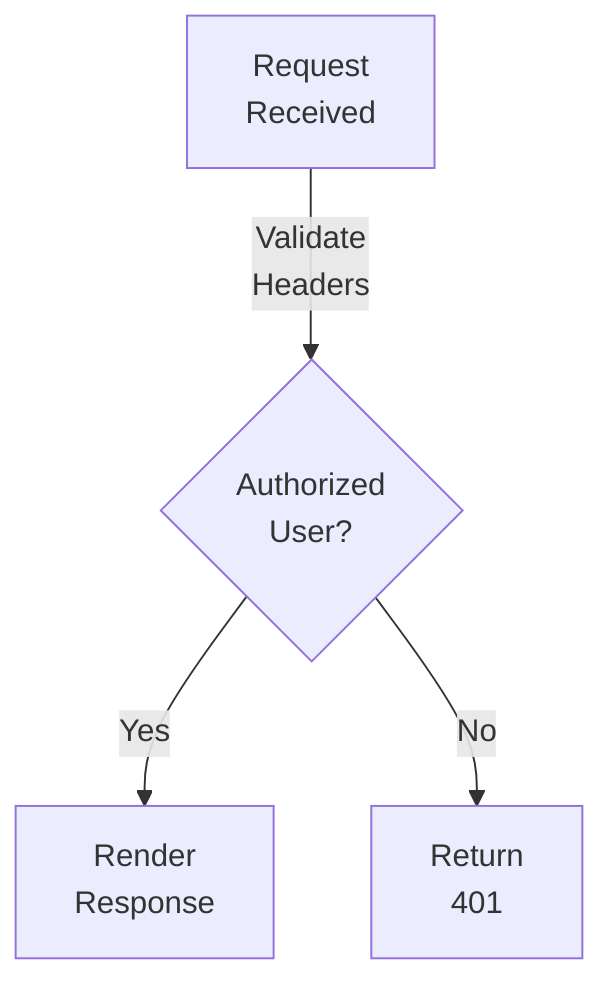
````

### Frontmatter controls

````markdown

````

| Key | Default | Description |
|-----|---------|-------------|
| `width` | `65vw` | Diagram container width |
| `height` | `auto` | Container height |
| `min-height` | `400px` | Minimum height |
| `aspect_ratio` | — | For Gantt charts |

### Supported diagram types

**flowchart / graph**
````markdown
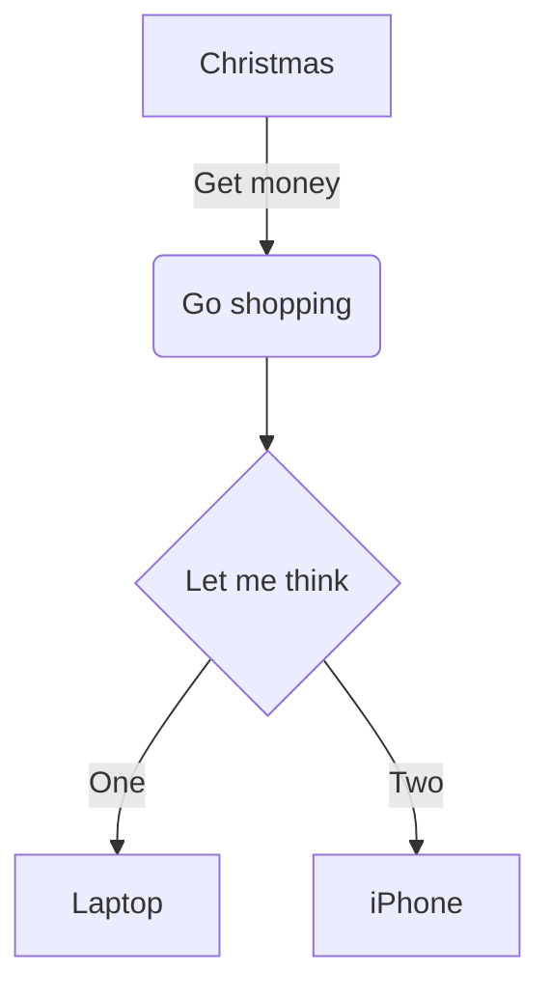
````

**sequenceDiagram**
````markdown
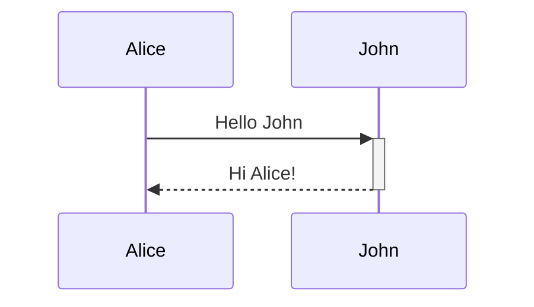
````

**classDiagram**
````markdown
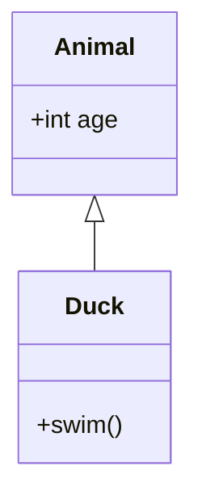
````

**erDiagram**
````markdown
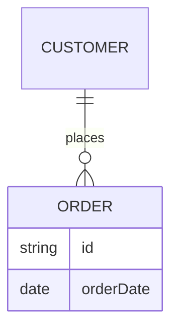
````

**stateDiagram-v2**
````markdown
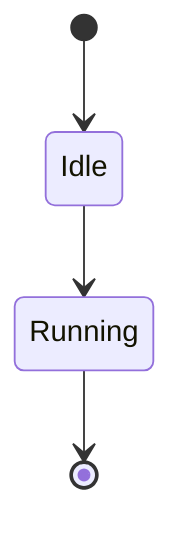
````

**gantt**
````markdown
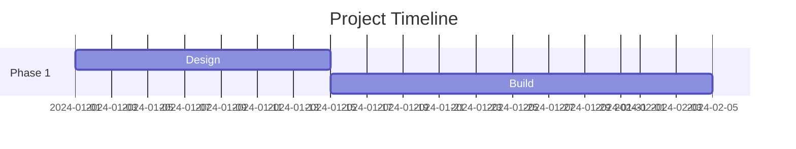
````

**mindmap**
````markdown
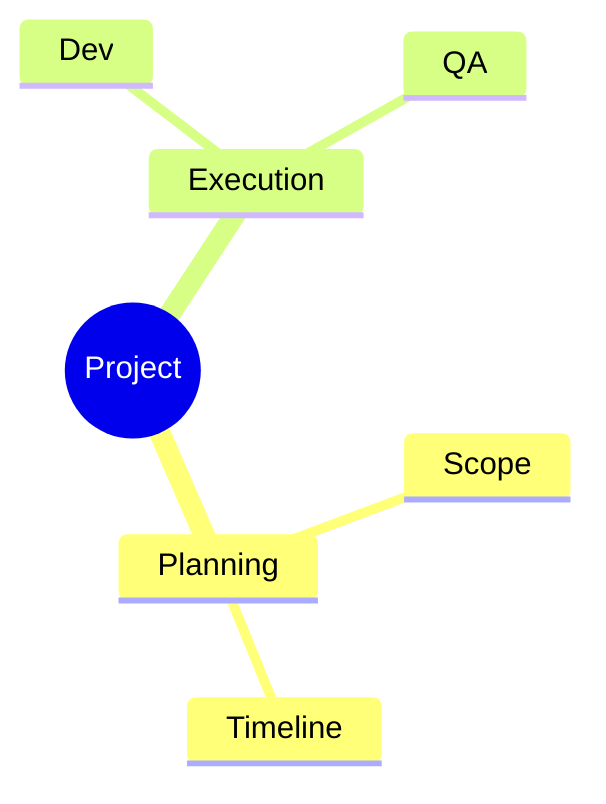
````

**timeline**
````markdown
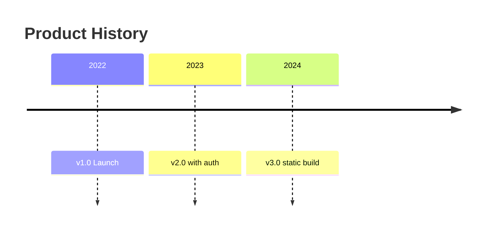
````

**architecture-beta**
````markdown
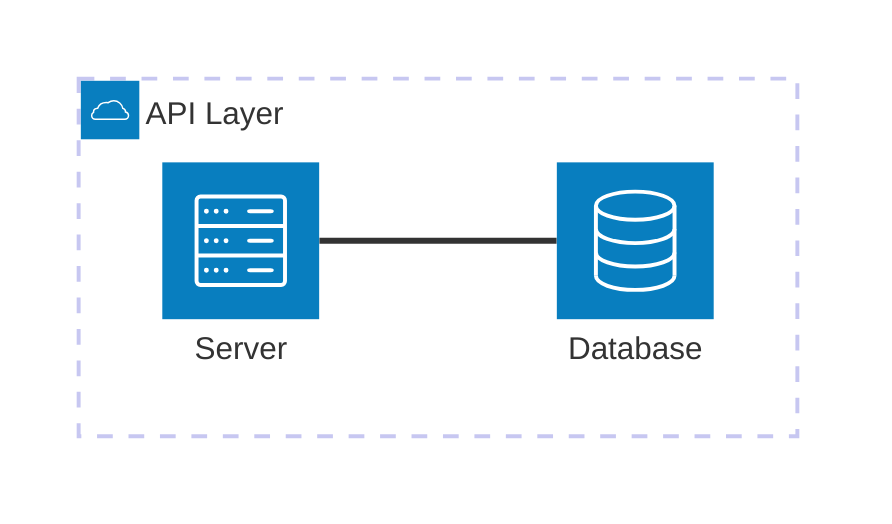
````

**Other supported types:** `sankey-beta`, `radar-beta`, `treemap-beta`, `C4Context`, `mindmap`

---

## D2

D2 produces structured diagrams with icons. Requires `d2` to be installed on the system.

### Basic usage

````markdown
```d2
---
title: Request Flow
width: 70vw
---
direction: right
user -> api -> db
```
````

### Frontmatter controls

| Key | Default | Description |
|-----|---------|-------------|
| `width` | `65vw` | Container width |
| `height` | `auto` | Container height |
| `title` | — | Shown in fullscreen and as caption |
| `layout` | `elk` | `elk` or `dagre` |
| `theme_id` | — | D2 theme ID (light) |
| `dark_theme_id` | — | D2 theme ID (dark) |
| `sketch` | `false` | Hand-drawn style |
| `animate_interval` | — | Enable composition animation (ms per step) |
| `animate` | — | Boolean shorthand for animation |

### Node with icon

```d2
web: {
  label: Web App
  icon: "https://api.iconify.design/mdi:web.svg"
}
api: {
  label: API Server
  icon: "https://api.iconify.design/mdi:api.svg"
}

web -> api: HTTP
```

### Grouped nodes

```d2
---
title: Service Groups
width: 85vw
layout: elk
---
direction: right
frontend: {
  web: { label: Web }
  mobile: { label: Mobile }
}
backend: {
  api: { label: API }
  db: { label: DB }
}

frontend.web -> backend.api
frontend.mobile -> backend.api
backend.api -> backend.db
```

### SQL table shape

```d2
users: {
  shape: sql_table
  id: int {constraint: primary_key}
  email: string {constraint: unique}
}

orders: {
  shape: sql_table
  id: int {constraint: primary_key}
  user_id: int {constraint: foreign_key}
}

orders.user_id -> users.id
```

### Sequence diagram

```d2
flow: {
  shape: sequence_diagram
  client: { shape: person }
  api: { shape: rectangle }

  client -> api: POST /login
  api -> client: 200 + token
}
```

### Composition animation

```d2
---
title: Deployment Steps
width: 85vw
animate_interval: 1200
---
direction: right
build -> test -> deploy -> monitor

scenarios: {
  step1: {
    title.label: Build
    (build -> test)[0].style.stroke: "#2563eb"
  }
  step2: {
    title.label: Test
    (test -> deploy)[0].style.stroke: "#16a34a"
  }
  step3: {
    title.label: Deploy
    (deploy -> monitor)[0].style.stroke: "#f59e0b"
  }
}
```

When `animate_interval` is set and no `target` is specified, Vyasa auto-targets all boards (`*`).

### Icon sources

- Iconify API: `https://api.iconify.design/{set}:{name}.svg`
  - Examples: `mdi:database`, `logos:postgresql`, `material-symbols:person`
- D2 icon catalog: `https://icons.terrastruct.com/`

### Tips

- Use `layout: elk` for complex graphs; `dagre` for simpler left-to-right flows.
- `width: 85vw` or `90vw` for large architecture diagrams.
- Split very dense diagrams into multiple blocks linked by headings.
- For animated compositions, keep labels short and scenario deltas minimal.

---

## Cytograph (Cytoscape.js interactive DAG)

A `cytograph` fence renders an interactive collapsible DAG via Cytoscape.js. All nodes are pre-loaded; JS handles show/hide on click. The default layout is now `vyasa`, a reading-oriented left-to-right hierarchy tuned for sentence-width labels.

### Basic usage

````markdown
```cytograph
---
height: 70vh
layout: dagre
---
nodes:
  - id: root
    label: "repo heart"
    state: explored
  - id: agent
    label: "Agent"
    state: explored
  - id: run
    label: "run()"
    state: frontier
  - id: runoutput
    label: "RunOutput"
    state: unexplored
edges:
  - source: root
    target: agent
  - source: agent
    target: run
  - source: run
    target: runoutput
```
````

### Frontmatter controls

| Key | Default | Description |
|---|---|---|
| `height` | `60vh` | Canvas height |
| `layout` | `vyasa` | `vyasa` (left-to-right reading layout), `dagre` (top-down DAG), or `cola` (force-directed) |
| `initial_depth` | `2` | How many levels are visible on load; deeper nodes are hidden |
| `source` | unset | Optional sidecar containing the full graph; prefer `.cytree` for large trees |

### Node fields

| Field | Required | Description |
|---|---|---|
| `id` | yes | Slug-safe identifier (no spaces) |
| `label` | yes | Display text |
| `state` | yes | `explored`, `frontier`, or `unexplored` |
| `url` | no | Navigate here when a leaf node is clicked |

### Node states

| State | Visual | Meaning |
|---|---|---|
| `explored` | light primary tint bg + bold primary text | node has been visited/covered |
| `frontier` | paper background + ink text | children exist but not yet expanded |
| `unexplored` | muted grey bg + soft ink text | not yet interacted with |

**Important:** `state` controls fill color and text color only. Border is driven entirely by graph structure (`has-children` / `cy-expanded` classes), not state. Do not design states expecting a solid-fill explored node — Cytoscape canvas does not reliably render white text on dark fills.

Border rules (independent of state):
- **Dashed primary border** = has children, currently collapsed
- **Solid primary border** = has children, currently expanded
- **Thin neutral border** = leaf node (no children)

All colors derive from Vyasa theme variables (`--vyasa-primary`, `--vyasa-paper`, `--vyasa-paper-low`, `--vyasa-paper-accent`, `--vyasa-ink`, `--vyasa-ink-soft`) so light/dark mode and theme presets are respected automatically.

### Click behavior

- **Click parent node (has children):** toggles expansion state. Visibility is recomputed from the DAG roots rather than hidden/shown tree-style, so nodes reachable from another open parent stay visible.
- **Collapse:** collapsing one parent does not hide descendants that are still reachable from another visible expanded path.
- **Click leaf node with `url`:** navigates. Internal paths use HTMX history-aware navigation, so browser back/forward restores both URL and content correctly. `http(s)://` URLs open in a new tab.
- Children beyond `initial_depth` are pre-loaded but hidden. No server round-trip on expand.
- URL nodes use a link-like label treatment and theme-primary text rather than a literal CSS underline, because Cytoscape canvas labels do not support `text-decoration`.
- In source-backed graphs, only the currently visible portion is materialized into Cytoscape. The backing JSON may contain far more nodes than the live viewport graph.

### URL example

```yaml
nodes:
  - id: mermaid
    label: "Mermaid Diagrams"
    state: unexplored
    url: "posts/vyasa manual/mermaid-diagrams"
```

Internal URLs use Vyasa's routing convention (no `.md` extension, `posts/` prefix for content paths).

### Source-backed graphs

For large trees, prefer a sidecar file instead of embedding the full graph inline:

````markdown
```cytograph
---
source: ./tree.cytree
layout: vyasa
initial_depth: 1
---
```
````

For `.json` sources, the expected shape is:

```json
{
  "nodes": [
    { "id": "root", "label": "Root", "state": "explored" }
  ],
  "edges": [
    { "source": "root", "target": "child" }
  ]
}
```

Notes:
- `source:` is resolved relative to the current markdown file.
- Non-markdown Cytograph sources should resolve to a raw file URL such as `/download/...`, not `/posts/...`.
- The full source graph is fetched once, but only the currently visible nodes and edges are materialized into Cytoscape.
- If `source:` is used and `initial_depth` is omitted, Vyasa defaults it to `1`.

### Preferred large-tree source format: `.cytree`

For tree-shaped graphs, prefer `.cytree` over JSON. It cuts token cost by making hierarchy implicit and compressing repeated URL bases.

Core ideas:

- Indentation defines parent/child structure
- `! ` marks `explored`
- `* ` marks `frontier`
- Blank marker means `unexplored`
- `@base <path>` sets a shared URL base for sibling lines
- `-> #fragment` reuses the active base
- `-> =` means “same document as current base, no fragment”
- Node ids are derived from the label path; do not hand-author ids in the compact source

Example:

````
! Vyasa
  * Writing and Markdown
    @base posts/vyasa manual/markdown-features
    * Markdown Features -> =
    * Headings and anchors -> #headings
      Plain-text headings -> #headings
      Heading IDs -> #heading-ids
````

### Implementation notes (for modifying cytograph behavior)

- Style cascade order matters in Cytoscape: class selectors (`.has-children`) and attribute selectors (`[state="explored"]`) have equal specificity; later rules win. Keep border/structure rules first, state fill/color rules after.
- **Do not use white text (`color: '#ffffff'`) on colored node backgrounds.** Cytoscape canvas rendering does not reliably show white text on primary-colored fills. Use the tint pattern instead: `background-opacity: 0.15` + `color: primary`.
- `vyasa` is a Vyasa preset name, not a native Cytoscape engine. It compiles to a left-to-right dagre configuration with denser vertical packing for text-heavy graphs.
- `_cytographInstances` stores the live Cytoscape instance plus DAG visibility state (`expandedIds`, `collapsedIds`, roots, and computed visible edges). Expand/collapse correctness depends on recomputing visibility from roots after each interaction.
- For source-backed graphs, keep the full graph in JS maps and materialize only visible nodes/edges into Cytoscape. Do not keep the entire backing graph mounted in the live viewport when the goal is large-tree readability.
- Stop any prior active layout before starting a new one, especially when switching layouts interactively.
- `_cytographInstances` is keyed by container `id`. `refreshCytographStyles()` iterates it to re-apply styles on theme change.
- MutationObserver watches `class` (dark mode toggle) and `style` (theme preset CSS var change) on `document.documentElement`.

### Notes

- Use `layout: vyasa` by default for text-heavy knowledge maps and reading-oriented DAGs.
- Use `layout: dagre` for strict top-down hierarchies or when the vertical flow matters more than reading order.
- Use `layout: cola` when the graph has many cross-edges or when you want a looser exploratory layout.
- `initial_depth: 1` shows only root + direct children — best for large trees (20+ nodes).
- Controls:
  - `Layout: ...` cycles `dagre -> cola -> vyasa -> dagre`
  - `All` expands every currently visible/materialized parent in the current layout
  - `Reset` restores the original expansion state
  - `Fit` fits the current visible graph to the viewport
  - `+` / `−` zoom the viewport

### Large-tree conventions

For Cytograph trees that grow into the hundreds of nodes, layout tuning alone is not enough. The graph shape must be compressed first.

- Keep the main graph at concept/module level. Do not dump every file-path leaf into the root graph.
- Prefer a `source:` sidecar for very large trees so the markdown page does not carry the full graph payload inline.
- Prefer `.cytree` for large tree-shaped source files because it is much cheaper for LLMs to read and edit than repeated `nodes` / `edges` JSON.
- Prefer `initial_depth: 1` for very large trees; make users expand one branch at a time.
- If a node has more than about 8 children, prefer a grouped rollup node over rendering all children directly in the main graph.
- Shorten labels aggressively in the main graph. Put long file paths in the URL target or follow-on page, not in the visible label.
- Treat `All` as a current-frontier view, not “load the whole universe,” for very large DAGs.
- Split a graph into linked subgraphs when visible node count or label width makes the layout sparse, overlap-prone, or hard to scan.
- Use `vyasa` for text-heavy trees, `dagre` for strict hierarchy-first diagrams, and `cola` for exploratory cross-linked maps.

---

## Interactions (both Mermaid and D2)

- Mouse wheel or `+`/`−` buttons to zoom
- Click and drag to pan
- `Reset` button to restore zoom
- `⛶` button for fullscreen (ESC or click backdrop to close)
- Theme toggle re-renders both diagram types
