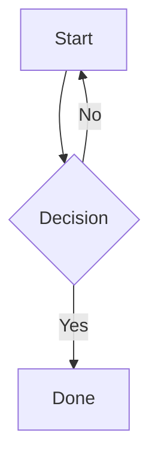

# Vyasa Markdown Features

All standard CommonMark markdown works. The following are Vyasa-specific or extended features.

## Frontmatter

```markdown
---
title: My Post Title
---

Post content starts here.
```

`title` overrides the default title (derived from filename). Other keys are stored but not used by Vyasa currently.

## Index / landing page

Place `index.md` or `README.md` (case-insensitive) in any folder to make it the landing page for that folder. `index.md` takes precedence over `README.md`.

## Raw markdown access

Append `.md` to any post URL to fetch its source: `/posts/my-note.md`

For normal page navigation, do the opposite: use the Vyasa route without `.md`, such as `/posts/my-note` or `my-note#section`. The `.md` suffix is only for explicit raw-source access.

## Markdown includes

Vyasa code-include syntax can now treat markdown files as markdown instead of as code blocks.

```markdown
{ ./guide.md ln[1:40] }
{ ./guide.md#api }
{* ./guide.md#api *}
```

- When the included file ends in `.md`, the included content renders as native markdown.
- `ln[start:end]` on a `.md` include renders just that line slice as markdown.
- `#section` on a `.md` include renders the whole heading section matching that anchor, up to the next heading of the same or higher level.
- Both plain-brace and starred include forms work; the starred form remains backward-compatible.
- For normal links in prose, still prefer route-style links like `guide#api` rather than `.md`, unless you explicitly want raw source.

## Extended inline syntax

```markdown
~~strikethrough~~
==highlighted text==
E = mc^2^          (superscript)
H~2~O              (subscript)
{++inserted text++}
{--deleted text--}
```

## Footnotes / sidenotes

```markdown
Main text with a note.[^1]

[^1]: This appears as a sidenote on desktop, inline on mobile.
```

On desktop (xl breakpoint), footnotes render as interactive margin sidenotes. Clicking the reference highlights the sidenote.

## Tables

```markdown
| Column A | Column B |
|----------|----------|
| row 1    | data     |
| row 2    | data     |
```

Markdown tables render inside a horizontal scroll wrapper. By default, each cell is capped at `33vw` so one verbose column does not consume the whole viewport.

Use a per-table override when needed:

```markdown
<!-- table max-col=24vw -->
| Column A | Column B |
|----------|----------|
| long prose | more prose |
```

## Definition lists

```markdown
Term
: Definition text here.
```

## Task lists

```markdown
- [x] Done
- [ ] Not done
```

## Abbreviation expansion

```markdown
The HTML spec defines how browsers work.

*[HTML]: HyperText Markup Language
```

Any occurrence of "HTML" in the document gets an `<abbr>` tooltip.

You can also configure site-wide abbreviations in `.vyasa` so certain words are always uppercased in auto-generated titles:

```toml
abbreviations = ["API", "UI", "CLI"]
```

## Tabbed content

:::tabs
::tab{title="Rendered"}
:::tabs
::tab{title="Python"}
```python
def hello():
    return "world"
```
::tab{title="JavaScript"}
```js
function hello() { return "world"; }
```
::tab{title="Output"}
```
world
```
:::
::tab{title="Markdown Source" copy-from="Rendered"}
:::

Tabs are interactive. Any content (code, prose, images) can go inside a tab.

## Table of contents

```markdown
[TOC]
```

Inserts a table of contents at that position based on all headings in the document.

## Custom heading IDs

```markdown
## My Section {#my-anchor}
```

Link to it with `[link text](#my-anchor)`.

Inside `items` / `tasks` author text, prefer normal markdown links in both labels and attr values, like `Docs [API](my-note#my-anchor):`, `spec: [API](my-note#my-anchor)`, or `owner: [Alice](/posts/team/alice)`. Use route-style targets for navigation, not `.md`, unless you explicitly want raw markdown.

## Math (KaTeX)

```markdown
Inline: $E = mc^2$

Block:
$$
\int_a^b f(x)\,dx = F(b) - F(a)
$$
```

Escape a literal dollar sign with `\$5`.

## Mermaid diagrams

````markdown

````

Optional frontmatter to control size:

````markdown

````

See `references/diagrams.md` for full Mermaid reference.

## D2 diagrams

````markdown
```d2
---
title: My System
width: 85vw
layout: elk
---
direction: right
web -> api -> db
```
````

See `references/diagrams.md` for full D2 reference.

## YouTube embed

```markdown
[yt:dQw4w9WgXcQ|Optional caption]
```

Renders as a responsive embedded video player.

## Inline code with CSS class

```markdown
`highlighted`{.highlight}
```

Renders as `<span class="highlight">highlighted</span>`. Useful with folder-level `custom.css`.

## Obsidian-style callouts

```markdown
> [!faq]- Can callouts be nested?
> > [!todo] Yes.
```

Supports aliases like `warn`, `error`, `faq`, `help`, `check`, `done`, `summary`, `tldr`, and `cite`, plus fold markers `+` and `-`, nesting, custom titles, and custom types. This is the preferred emitted form.

For richer task cards, prefer markdown task-list syntax instead of custom HTML:

```markdown
- [ ] Write a blog post | author: John Doe | deadline: 2024-12-31 | priority: high | status: in progress | project: Vyasa Blog
```

Recognized task metadata families:

- person: `owner`, `author`, `assignee`, `person`, `user`, `who`
- deadline: `deadline`, `due`, `date`, `when`, `eta`
- priority: `priority`, `urgency`, `severity`, `importance`
- status: `status`, `state`, `phase`
- project: `project`, `bucket`, `area`, `team`, `stream`

## Tasks graphs

For dependency planning or structured relationship maps, use a fenced `tasks` block inside a normal markdown page:

Size keys like `width`, `min_height`, and `height` should use full CSS lengths such as `760px`, `70vh`, or `calc(85vh - 57px)`. Do not use bare numbers like `height: 760`.

```markdown
```tasks
---
title: Sprint Slice
default_open_depth: -1
width: 80vw
height: 70vh
---
id: sprint-slice
Frontend:
  - T-001 :: Design | estimate: 1d | owner: Alice
  - T-002 :: Build | estimate: 2d | owner: Alice
API:
  - T-010 :: Endpoint contract | estimate: 1d | owner: Alice
  - T-003 :: Backend | estimate: 3d | owner: Bob

T-001 ->|unblocks| T-002, T-010
T-002, T-010 -> T-003
```
```

Notes:

- `tasks` fences support optional YAML frontmatter first. Current renderer keys: `title`, `default_open_depth`, `width`, `min_height`, `height`.
- `default_open_depth` is an integer. `0` folds all groups, `1` opens root groups, larger values open deeper levels, and `-1` opens all groups.
- After frontmatter, the graph body is terse line-based syntax, not YAML.
- Do not wrap the whole graph in one top-level group. Start with multiple meaningful top-level groups, or direct items if grouping adds no value.
- `Group Label:` nests by indentation. `- id :: Item Label` under a group belongs to that group.
- Use inline attrs after `|`, such as `- T-001 :: Design | owner: Alice | estimate: 1d`.
- Attr values may contain normal markdown links, such as `- T-001 :: Design | spec: [API](guide#api) | owner: [Alice](team/alice)`.
- Group and item labels may also contain normal markdown links, such as `Docs [API](guide#api):` or `- T-001 :: Design [Spec](guide#api)`.
- Node colors resolve in this order: per-node `color:` attr first, then nearest colored parent group, then the active frontmatter `color_by` palette lookup.
- Preferred color syntax is nested palettes under frontmatter `color_by:`, for example:
  `color_by:`
  `  status:`
  `    On Track: "#86efac"`
  `    At Risk: "#fcd34d"`
  `  owner:`
  `    Alice: "#93c5fd"`
- Only attrs declared under frontmatter `color_by:` appear in the UI color-mode dropdown. Legacy `color_by: status` plus `color_palette:` remains supported for backward compatibility.
- Use global edge lines for dependencies: `a -> b`, `a, b -> c`, or `a ->|edge label| b`.
- Quote complex ids, labels, attrs, or edge labels as JSON strings: `"task-id" :: "Line one\nLine two with \"quotes\" and [brackets]"`.
- Groups render as expandable cards in a React Flow graph.
- Collapsed groups render as selectable summary cards. Expanded groups render as background regions with explicit controls instead of selectable bodies.
- Edge routing is renderer-owned: shallow center-to-center angles use left/right side handles and terminate in a dot; steeper connections use top/bottom handles and terminate in an arrowhead.
- Press `F` to fit, `U` to unfold all groups, and `Shift+U` to collapse all groups.
- Renderer-owned layout attrs (`graph_x`, `graph_y`, `collapsed`, `pill_x`, `pill_y`) may appear in saved source after interaction; treat as implementation detail, not authoring API.
- The block renders as an interactive React Flow graph, not as a code sample.
- Cards are draggable, snap to grid, support edge create/delete and popup editing.
- Nested group structure is persisted when the fenced block is rewritten.
- Warnings (missing deps, cycles, owner overlaps) render in a collapsible panel inside the graph.
- Persisted edits rewrite the fenced block source in the markdown file itself.

## Code snippet includes

```markdown
{* ../../docs_src/stream_json_lines/tutorial001_py310.py ln[1:24] hl[9:11,22] *}
```

Embeds a file as a code block. `ln[start:end]` slices by 1-based source lines, and `hl[...]` highlights original source lines or ranges.

## Explicit heading IDs and permalinks

```markdown
### My Title { #server-sent-events-sse }
```

Uses the explicit id for both the heading anchor and the `¶` permalink/TOC target.


Renders as styled callout boxes.

## Collapsible sections

```markdown
<details>
<summary>Click to expand</summary>

Hidden content here. Supports full markdown inside.

</details>
```

## Smart typography

```markdown
"Curly quotes auto-convert"
-- en-dash
--- em-dash
```

## Page break (print/PDF)

```markdown
\pagebreak
```

## Line block (preserves line breaks)

```markdown
| Roses are red
| Violets are blue
```

## Keyboard shortcuts

```markdown
Press <kbd>Ctrl</kbd> + <kbd>S</kbd> to save.
```

## Citation

```markdown
See Smith et al. [@smith2024].
```

## Cascading folder CSS

Place `custom.css` or `style.css` in any folder. Styles are scoped to that folder's section and cascade to subfolders. See `references/theming.md` for selectors and examples.

## Relative links

```markdown
[Other post](../other-folder/post.md)
[Home](/)
[Section](#heading-anchor)
```

Relative `.md` links are automatically resolved to the correct Vyasa post URLs with HTMX attributes for SPA navigation.

## Images

```markdown


```

Relative image paths are resolved relative to the post's folder.
