# Vyasa Diagrams Reference

Vyasa renders Mermaid and D2 diagrams with zoom, pan, reset, and fullscreen controls. Both support dark/light theme switching.

---

## Mermaid

Use literal `<br/>` for line breaks inside Mermaid node labels and edge labels. Do not use `\n` inside labels.

### Basic usage

````markdown
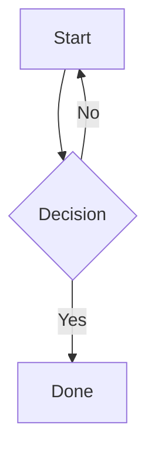
````

### Multiline labels

````markdown
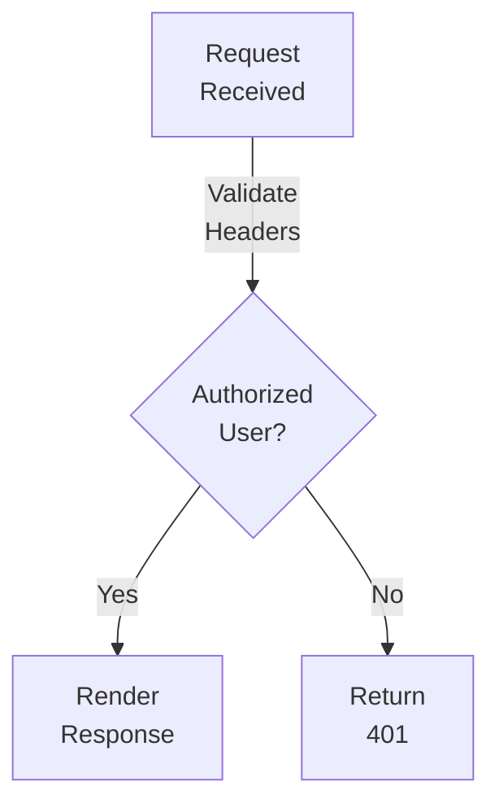
````

### Frontmatter controls

````markdown

````

| Key | Default | Description |
|-----|---------|-------------|
| `width` | `65vw` | Diagram container width |
| `height` | `auto` | Container height |
| `min-height` | `400px` | Minimum height |
| `aspect_ratio` | — | For Gantt charts |

### Supported diagram types

**flowchart / graph**
````markdown
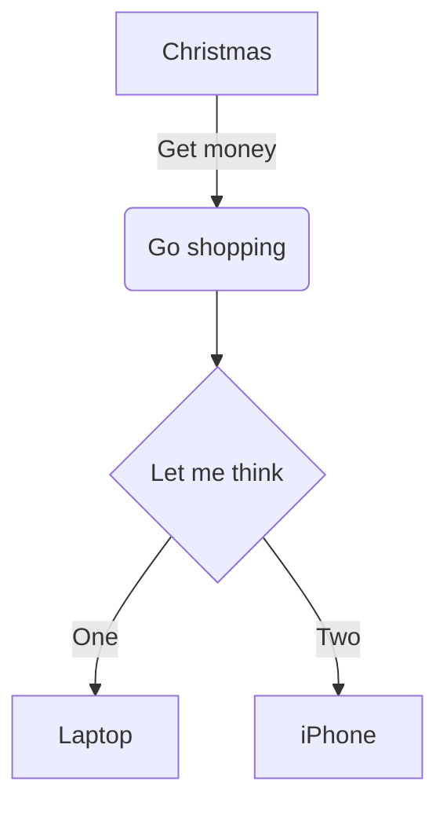
````

**sequenceDiagram**
````markdown
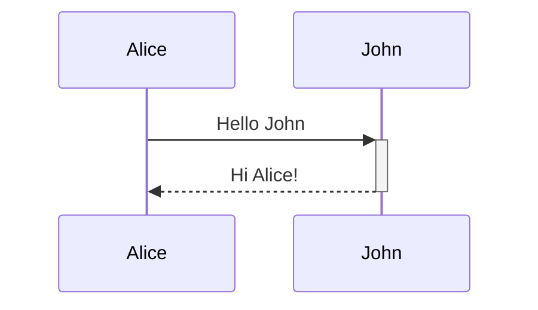
````

**classDiagram**
````markdown
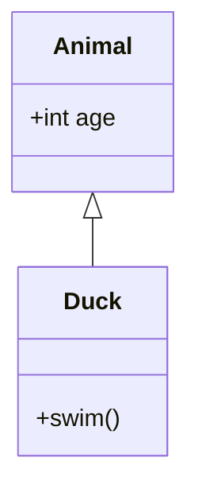
````

**erDiagram**
````markdown
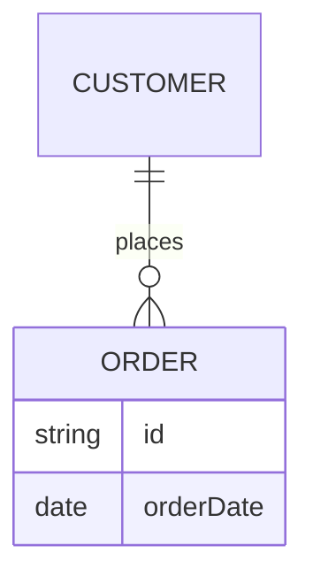
````

**stateDiagram-v2**
````markdown
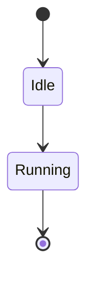
````

**gantt**
````markdown
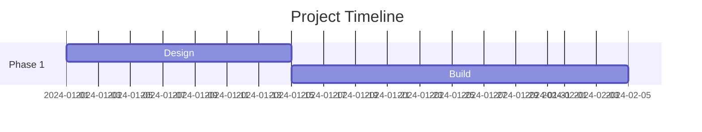
````

**mindmap**
````markdown
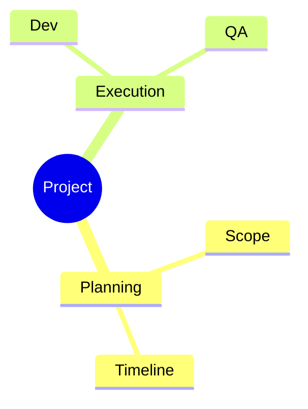
````

**timeline**
````markdown
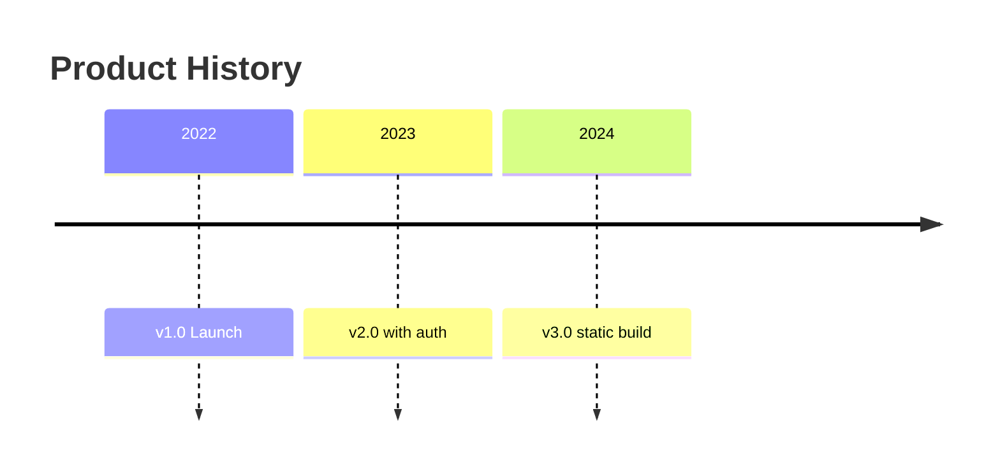
````

**architecture-beta**
````markdown
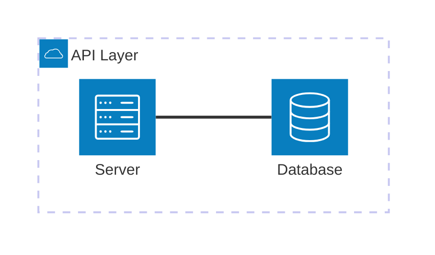
````

**Other supported types:** `sankey-beta`, `radar-beta`, `treemap-beta`, `C4Context`, `mindmap`

---

## D2

D2 produces structured diagrams with icons. Requires `d2` to be installed on the system.

### Basic usage

````markdown
```d2
---
title: Request Flow
width: 70vw
---
direction: right
user -> api -> db
```
````

### Frontmatter controls

| Key | Default | Description |
|-----|---------|-------------|
| `width` | `65vw` | Container width |
| `height` | `auto` | Container height |
| `title` | — | Shown in fullscreen and as caption |
| `layout` | `elk` | `elk` or `dagre` |
| `theme_id` | — | D2 theme ID (light) |
| `dark_theme_id` | — | D2 theme ID (dark) |
| `sketch` | `false` | Hand-drawn style |
| `animate_interval` | — | Enable composition animation (ms per step) |
| `animate` | — | Boolean shorthand for animation |

### Node with icon

```d2
web: {
  label: Web App
  icon: "https://api.iconify.design/mdi:web.svg"
}
api: {
  label: API Server
  icon: "https://api.iconify.design/mdi:api.svg"
}

web -> api: HTTP
```

### Grouped nodes

```d2
---
title: Service Groups
width: 85vw
layout: elk
---
direction: right
frontend: {
  web: { label: Web }
  mobile: { label: Mobile }
}
backend: {
  api: { label: API }
  db: { label: DB }
}

frontend.web -> backend.api
frontend.mobile -> backend.api
backend.api -> backend.db
```

### SQL table shape

```d2
users: {
  shape: sql_table
  id: int {constraint: primary_key}
  email: string {constraint: unique}
}

orders: {
  shape: sql_table
  id: int {constraint: primary_key}
  user_id: int {constraint: foreign_key}
}

orders.user_id -> users.id
```

### Sequence diagram

```d2
flow: {
  shape: sequence_diagram
  client: { shape: person }
  api: { shape: rectangle }

  client -> api: POST /login
  api -> client: 200 + token
}
```

### Composition animation

```d2
---
title: Deployment Steps
width: 85vw
animate_interval: 1200
---
direction: right
build -> test -> deploy -> monitor

scenarios: {
  step1: {
    title.label: Build
    (build -> test)[0].style.stroke: "#2563eb"
  }
  step2: {
    title.label: Test
    (test -> deploy)[0].style.stroke: "#16a34a"
  }
  step3: {
    title.label: Deploy
    (deploy -> monitor)[0].style.stroke: "#f59e0b"
  }
}
```

When `animate_interval` is set and no `target` is specified, Vyasa auto-targets all boards (`*`).

### Icon sources

- Iconify API: `https://api.iconify.design/{set}:{name}.svg`
  - Examples: `mdi:database`, `logos:postgresql`, `material-symbols:person`
- D2 icon catalog: `https://icons.terrastruct.com/`

### Tips

- Use `layout: elk` for complex graphs; `dagre` for simpler left-to-right flows.
- `width: 85vw` or `90vw` for large architecture diagrams.
- Split very dense diagrams into multiple blocks linked by headings.
- For animated compositions, keep labels short and scenario deltas minimal.

---

## Interactions (both Mermaid and D2)

- Mouse wheel or `+`/`−` buttons to zoom
- Click and drag to pan
- `Reset` button to restore zoom
- `⛶` button for fullscreen (ESC or click backdrop to close)
- Theme toggle re-renders both diagram types
