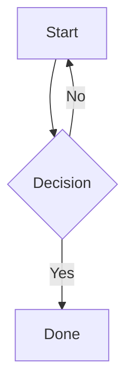

# Vyasa Markdown Features

All standard CommonMark markdown works. The following are Vyasa-specific or extended features.

## Frontmatter

```markdown
---
title: My Post Title
---

Post content starts here.
```

`title` overrides the default title (derived from filename). Other keys are stored but not used by Vyasa currently.

## Index / landing page

Place `index.md` or `README.md` (case-insensitive) in any folder to make it the landing page for that folder. `index.md` takes precedence over `README.md`.

## Raw markdown access

Append `.md` to any post URL to fetch its source: `/posts/my-note.md`

## Extended inline syntax

```markdown
~~strikethrough~~
==highlighted text==
E = mc^2^          (superscript)
H~2~O              (subscript)
{++inserted text++}
{--deleted text--}
```

## Footnotes / sidenotes

```markdown
Main text with a note.[^1]

[^1]: This appears as a sidenote on desktop, inline on mobile.
```

On desktop (xl breakpoint), footnotes render as interactive margin sidenotes. Clicking the reference highlights the sidenote.

## Tables

```markdown
| Column A | Column B |
|----------|----------|
| row 1    | data     |
| row 2    | data     |
```

## Definition lists

```markdown
Term
: Definition text here.
```

## Task lists

```markdown
- [x] Done
- [ ] Not done
```

## Abbreviation expansion

```markdown
The HTML spec defines how browsers work.

*[HTML]: HyperText Markup Language
```

Any occurrence of "HTML" in the document gets an `<abbr>` tooltip.

You can also configure site-wide abbreviations in `.vyasa` so certain words are always uppercased in auto-generated titles:

```toml
abbreviations = ["API", "UI", "CLI"]
```

## Tabbed content

:::tabs
::tab{title="Rendered"}
:::tabs
::tab{title="Python"}
```python
def hello():
    return "world"
```
::tab{title="JavaScript"}
```js
function hello() { return "world"; }
```
::tab{title="Output"}
```
world
```
:::
::tab{title="Markdown Source" copy-from="Rendered"}
:::

Tabs are interactive. Any content (code, prose, images) can go inside a tab.

## Table of contents

```markdown
[TOC]
```

Inserts a table of contents at that position based on all headings in the document.

## Custom heading IDs

```markdown
## My Section {#my-anchor}
```

Link to it with `[link text](#my-anchor)`.

## Math (KaTeX)

```markdown
Inline: $E = mc^2$

Block:
$$
\int_a^b f(x)\,dx = F(b) - F(a)
$$
```

Escape a literal dollar sign with `\$5`.

## Mermaid diagrams

````markdown

````

Optional frontmatter to control size:

````markdown

````

See `references/diagrams.md` for full Mermaid reference.

## D2 diagrams

````markdown
```d2
---
title: My System
width: 85vw
layout: elk
---
direction: right
web -> api -> db
```
````

See `references/diagrams.md` for full D2 reference.

## YouTube embed

```markdown
[yt:dQw4w9WgXcQ|Optional caption]
```

Renders as a responsive embedded video player.

## Inline code with CSS class

```markdown
`highlighted`{.highlight}
```

Renders as `<span class="highlight">highlighted</span>`. Useful with folder-level `custom.css`.

## Obsidian-style callouts

```markdown
> [!faq]- Can callouts be nested?
> > [!todo] Yes.
```

Supports aliases like `warn`, `error`, `faq`, `help`, `check`, `done`, `summary`, `tldr`, and `cite`, plus fold markers `+` and `-`, nesting, custom titles, and custom types. This is the preferred emitted form.

For richer task cards, prefer markdown task-list syntax instead of custom HTML:

```markdown
- [ ] Write a blog post | author: John Doe | deadline: 2024-12-31 | priority: high | status: in progress | project: Vyasa Blog
```

Recognized task metadata families:

- person: `owner`, `author`, `assignee`, `person`, `user`, `who`
- deadline: `deadline`, `due`, `date`, `when`, `eta`
- priority: `priority`, `urgency`, `severity`, `importance`
- status: `status`, `state`, `phase`
- project: `project`, `bucket`, `area`, `team`, `stream`

## Code snippet includes

```markdown
{* ../../docs_src/stream_json_lines/tutorial001_py310.py ln[1:24] hl[9:11,22] *}
```

Embeds a file as a code block. `ln[start:end]` slices by 1-based source lines, and `hl[...]` highlights original source lines or ranges.

## Explicit heading IDs and permalinks

```markdown
### My Title { #server-sent-events-sse }
```

Uses the explicit id for both the heading anchor and the `¶` permalink/TOC target.


Renders as styled callout boxes.

## Collapsible sections

```markdown
<details>
<summary>Click to expand</summary>

Hidden content here. Supports full markdown inside.

</details>
```

## Smart typography

```markdown
"Curly quotes auto-convert"
-- en-dash
--- em-dash
```

## Page break (print/PDF)

```markdown
\pagebreak
```

## Line block (preserves line breaks)

```markdown
| Roses are red
| Violets are blue
```

## Keyboard shortcuts

```markdown
Press <kbd>Ctrl</kbd> + <kbd>S</kbd> to save.
```

## Citation

```markdown
See Smith et al. [@smith2024].
```

## Cascading folder CSS

Place `custom.css` or `style.css` in any folder. Styles are scoped to that folder's section and cascade to subfolders. See `references/theming.md` for selectors and examples.

## Relative links

```markdown
[Other post](../other-folder/post.md)
[Home](/)
[Section](#heading-anchor)
```

Relative `.md` links are automatically resolved to the correct Vyasa post URLs with HTMX attributes for SPA navigation.

## Images

```markdown


```

Relative image paths are resolved relative to the post's folder.
