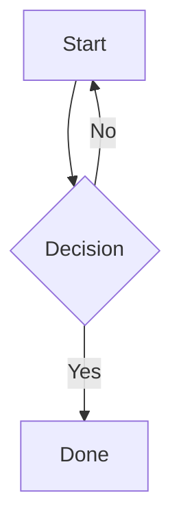
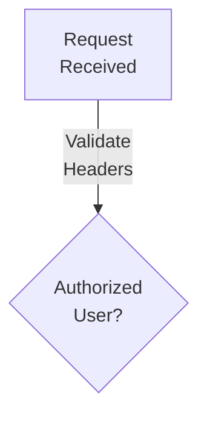

# Mermaid

Use fenced Mermaid blocks for Mermaid diagrams.
Read project syntax before adding new frontmatter controls.

## Basic

````markdown

````

## Frontmatter

````markdown

````

Controls:

- `width`: container width, default `65vw`
- `height`: container height, default `auto`
- `min-height`: minimum height, default `400px`
- `aspect_ratio`: useful for Gantt charts

## Labels

Use literal `<br/>` for Mermaid line breaks:



Do not use `\n` for label breaks.
Shorten labels before changing layout.

## Supported Types

- `flowchart` / `graph`
- `sequenceDiagram`
- `classDiagram`
- `erDiagram`
- `stateDiagram-v2`
- `gantt`
- `mindmap`
- `timeline`
- `architecture-beta`
- `sankey-beta`, `radar-beta`, `treemap-beta`, `C4Context`

## Guardrails

- Prefer standard Mermaid syntax unless Vyasa documents a wrapper option.
- Do not invent frontmatter keys.
- Split dense diagrams into multiple blocks linked by headings.
- Keep node text readable; Mermaid is not a database dump format.
