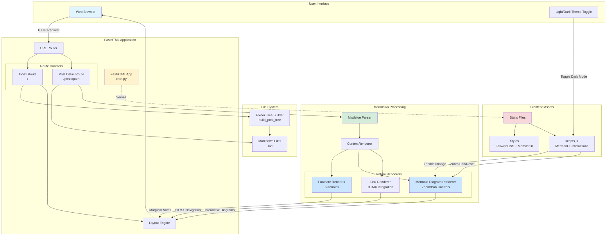
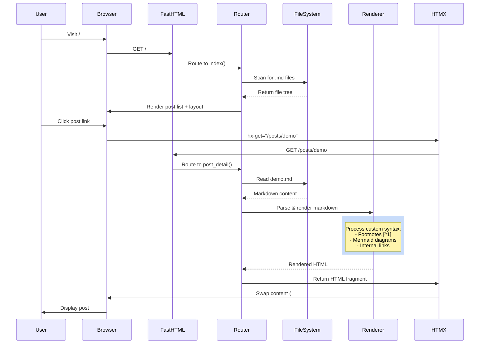
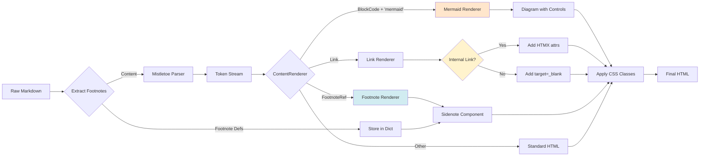
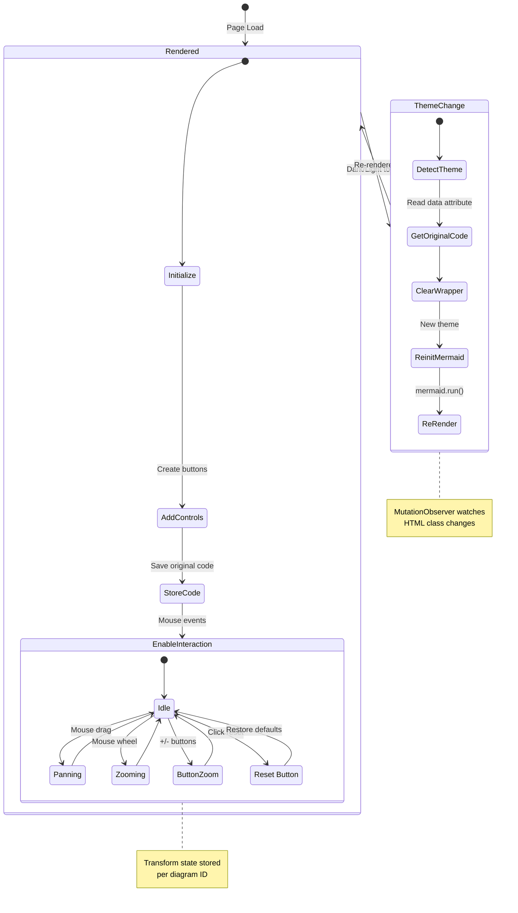
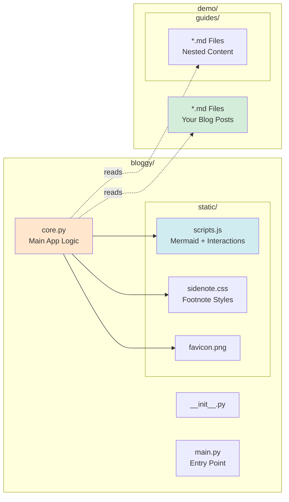

# Bloggy

A lightweight, elegant blogging platform built with FastHTML that renders Markdown files into beautiful web pages with advanced features.

## Architecture Overview



## How Bloggy Works

### 1. Request Flow



### 2. Markdown Processing Pipeline



### 3. Mermaid Diagram Lifecycle



## Key Features

### ✨ Advanced Markdown Features
- **Footnotes as Sidenotes**: `[^1]` references become elegant margin notes on desktop, expandable on mobile
- **Mermaid Diagrams**: Full support for flowcharts, sequence diagrams, state diagrams, etc.
- **Interactive Diagrams**: Built-in zoom, pan, and reset controls for all mermaid diagrams
- **Theme-aware Rendering**: Diagrams automatically re-render when switching light/dark mode

### 🎨 Modern UI
- **Responsive Design**: Works beautifully on all screen sizes
- **Dark Mode**: Automatic theme switching with localStorage persistence
- **HTMX Navigation**: Fast, SPA-like navigation without full page reloads
- **Collapsible Folders**: Organize posts in nested directories

### 🚀 Technical Highlights
- Built on **FastHTML** for modern Python web development
- Uses **Mistletoe** for extensible Markdown parsing
- **TailwindCSS** + **MonsterUI** for styling
- **Hyperscript** for interactive behaviors
- **Mermaid.js v11** for diagram rendering

## Project Structure



## Getting Started

1. Set your blog content root (optional):
   ```bash
   export BLOGGY_ROOT=/path/to/your/markdown/files
   ```

2. Run the app:
   ```bash
   python -m bloggy.main
   ```

3. Create markdown files in your content directory and they'll automatically appear in the post list!
