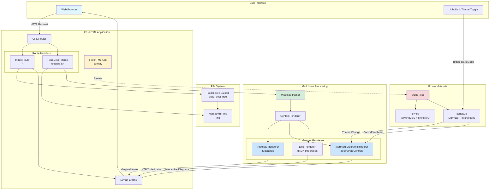
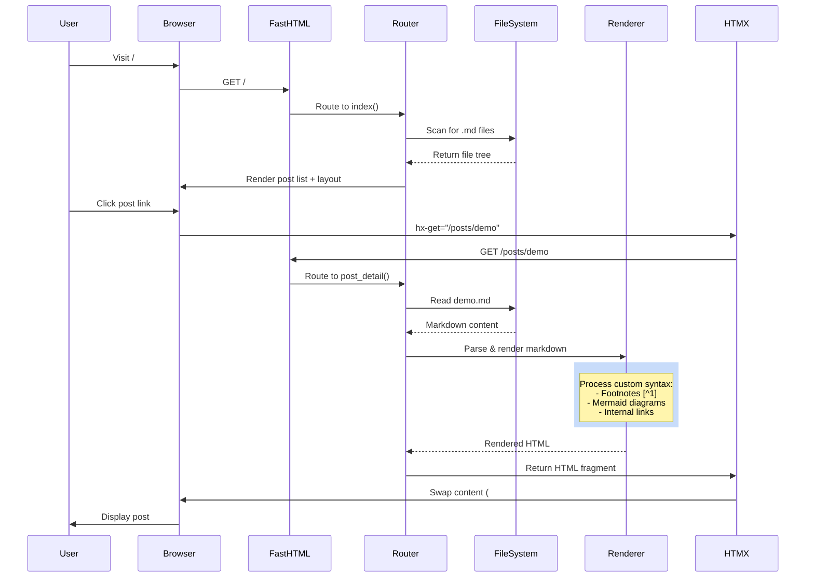
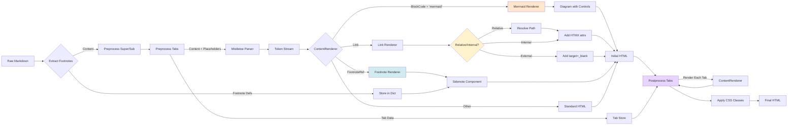
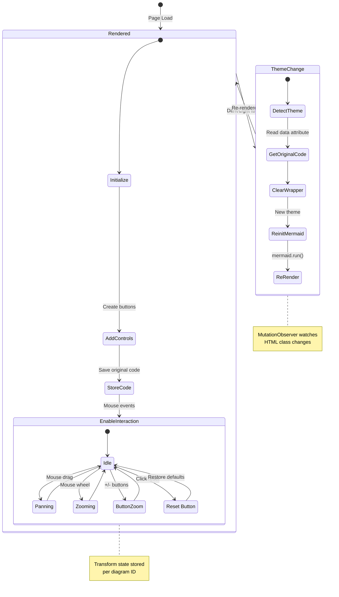
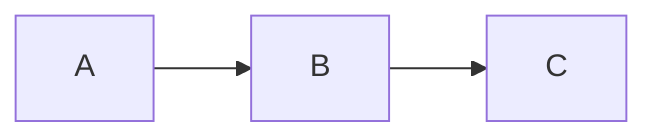
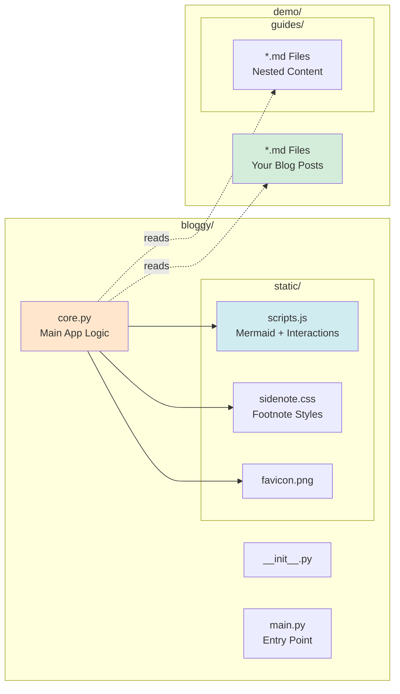

# Bloggy

A lightweight, elegant blogging platform built with FastHTML that renders Markdown files into beautiful web pages with advanced features.

Simple Table

| Feature                     | Description                                      |
|-----------------------------|--------------------------------------------------|
| FastHTML Integration        | Built on FastHTML for high performance and ease of use |
| Advanced Markdown Support   | Footnotes as sidenotes, YouTube embeds, task lists, Mermaid diagrams, math notation, tabbed content, and more |
| Modern UI                   | Responsive design, dark mode, three-panel layout, HTMX navigation |
| Interactive Diagrams       | Zoomable, pannable Mermaid diagrams with fullscreen support |

```typescript
interface CSVParserAPI {
  // Parse uploaded CSV file and return structured data
  parseCSVFile(file: File): Promise<ParseResult>;
}
```

## Architecture Overview



## How Bloggy Works

### 1. Request Flow



### 2. Markdown Processing Pipeline



### 3. Mermaid Diagram Lifecycle



## Key Features

### ✨ Advanced Markdown Features
- **Footnotes as Sidenotes**: `[^1]` references become elegant margin notes on desktop, expandable on mobile with smooth animations
- **YouTube Embeds**: Use `[yt:VIDEO_ID]` or `[yt:VIDEO_ID|Caption]` for responsive iframe cards with aspect-ratio containers
- **Task Lists**: `- [ ]` / `- [x]` render as custom styled checkboxes (green for checked, gray for unchecked) with SVG checkmarks
- **Mermaid Diagrams**: Full support for flowcharts, sequence diagrams, state diagrams, Gantt charts, etc.
- **Interactive Diagrams**: 
  - Zoom with mouse wheel (zooms towards cursor position)
  - Pan by dragging with mouse
  - Built-in controls: fullscreen, reset, zoom in/out buttons
  - Auto-scaling based on diagram aspect ratio (wide diagrams like Gantt charts get special handling)
  - Fullscreen modal viewer with dark mode support
- **Theme-aware Rendering**: Diagrams automatically re-render when switching light/dark mode via MutationObserver
- **Mermaid Frontmatter**: Configure diagram size with YAML frontmatter (width, height, min-height)
- **Tabbed Content**: Create multi-tab sections using `:::tabs` and `::tab{title="..."}` syntax with smooth transitions
- **Relative Links**: Full support for relative markdown links (`./file.md`, `../other.md`) with automatic path resolution
- **Plain-Text Headings**: Inline markdown in headings is stripped for clean display and consistent anchor slugs
- **Math Notation**: KaTeX support for inline `$E=mc^2$` and block `$$` math equations, auto-renders after HTMX swaps
- **Superscript & Subscript**: Use `^text^` for superscript and `~text~` for subscript (preprocessed before rendering)
- **Strikethrough**: Use `~~text~~` for strikethrough formatting
- **Pandoc-style Attributes**: Add classes to inline text with `` `text`{.class #id} `` syntax for semantic markup (renders as `<span>` tags, not `<code>`)
- **Cascading Custom CSS**: Add `custom.css` or `style.css` files at multiple levels (root, folders) with automatic scoping

### 🎨 Modern UI
- **Responsive Design**: Works beautifully on all screen sizes with mobile-first approach
- **Three-Panel Layout**: Posts sidebar, main content, and table of contents for easy navigation
- **Dark Mode**: Automatic theme switching with localStorage persistence and instant visual feedback
- **HTMX Navigation**: Fast, SPA-like navigation without full page reloads using `hx-get`, `hx-target`, and `hx-push-url`
- **Collapsible Folders**: Organize posts in nested directories with chevron indicators and smooth expand/collapse
- **Sidebar Search**: HTMX-powered filename search with results shown below the search bar (tree stays intact)
- **PDF Posts**: PDFs show up in the sidebar and open inline in the main content area
- **Auto-Generated TOC**: Table of contents automatically extracted from headings with scroll-based active highlighting
- **TOC Autoscroll + Accurate Highlights**: Active TOC item stays in view and highlight logic handles duplicate headings
- **Mobile Menus**: Slide-in panels for posts and TOC on mobile devices with smooth transitions
- **Sticky Navigation**: Navbar stays at top while scrolling, with mobile menu toggles
- **Active Link Highlighting**: Current post and TOC section highlighted with blue accents
- **Auto-Reveal in Sidebar**: Active post automatically expanded and scrolled into view when opening sidebar
- **Ultra-Thin Scrollbars**: Custom styled 3px scrollbars that adapt to light/dark theme
- **Frosted Glass Sidebars**: Backdrop blur and transparency effects on sidebar components

### 🚀 Technical Highlights
- Built on **FastHTML** for modern Python web development with integrated HTMX
- Uses **Mistletoe** for extensible Markdown parsing with custom token renderers
- **TailwindCSS** + **MonsterUI** for utility-first styling and UI components
- **Hyperscript** for declarative interactive behaviors (theme toggle, sidenote interactions)
- **Mermaid.js v11** for diagram rendering with custom zoom/pan/fullscreen controls via ES modules
- **KaTeX** for mathematical notation rendering with auto-render on content swaps
- **Smart Link Resolution**: Automatically converts relative links to proper routes with HTMX attributes
- **Frontmatter Caching**: LRU cache for parsed frontmatter based on file modification time
- **Lazy Sidebar Loading**: Posts sidebar loaded progressively via HTMX endpoint for faster initial load
- **Performance Logging**: Debug-level logging tracks render times and bottlenecks to `/tmp/bloggy_core.log`
- **Custom 404 Page**: Elegant error page with navigation options and helpful tips
- **Static File Serving**: Serves images and assets from blog directories via `/posts/{path}.{ext}` routes
- **Raw Markdown Access**: Append `.md` to any post URL (e.g. `/posts/demo.md`) to fetch source content
- **Optional Authentication**: Session-based auth with Beforeware when username/password configured

### Quick Usage Examples
- Sidebar search: type a filename fragment like `write up` or `write-up` to filter results without collapsing the tree
- Raw markdown: fetch a post's source via `/posts/demo.md`

## Content Writing Features

### Footnotes as Sidenotes
`[^1]` references compile into margin sidenotes on desktop (xl breakpoint: 1280px+) and touch-friendly expandables on smaller screens, powered by the `sidenote.css` stylesheet. On desktop, clicking a footnote reference highlights the corresponding sidenote with a temporary border animation. On mobile, clicking toggles the visibility with smooth fade-in/out. Continue to define footnotes with the standard `[^label]: ...` syntax—the renderer keeps the footnote text close to the reference and gracefully handles missing definitions with helpful placeholders. Sidenotes have amber/blue borders (light/dark) and appear in the right margin with proper spacing.

### Task Lists & YouTube Embeds
Checklists begin with `- [ ]` (open) or `- [x]` (done) and render as custom styled items with inline flex layout. Checked items display a green background with SVG checkmark, while unchecked items show a gray background. No bullet points are shown (`list-style: none`), and the checkbox is aligned to the start of the text. Embeds are just as easy: `[yt:VIDEO_ID]` or `[yt:VIDEO_ID|Caption]` drops in a responsive YouTube iframe with aspect-video ratio (16:9), rounded corners, and border. Optional captions appear below in smaller gray text. No extra HTML wrappers required—just use the simple bracket syntax.

### Tabbed Content
Group related snippets with the `:::tabs` container and `::tab{title="Label"}` blocks. Each tab is rendered into a fully interactive panel using `switchTab()` JavaScript function. Tabs feature:
- Clean header with active state (bold border-bottom, darker text)
- Smooth fade-in animation when switching tabs (0.2s ease-in)
- Height stabilization: all panels measured, container set to max height to prevent layout shifts
- Absolute positioning for inactive panels (hidden but measured for height calculation)
- Full markdown rendering support within each tab panel
- Frosted glass aesthetic matching the sidebar design

The client script stabilizes the height on DOMContentLoaded and after HTMX swaps, ensuring smooth transitions without content jumps.

````markdown
:::tabs
::tab{title="Rust"}
```rust
// tab content
```
::tab{title="Python"}
```python
# tab content
```
:::
````

### Relative Links & Asset Helpers
Relative references like `[Next chapter](../chapter-02.md)` automatically resolve to `/posts/...`, strip the `.md` extension, and gain `hx-get`, `hx-target="#main-content"`, `hx-push-url="true"`, and `hx-swap="innerHTML show:window:top"` attributes for seamless HTMX navigation. The renderer uses the current post's path to resolve relative links correctly, handling both `./` and `../` navigation. External links (starting with `http://`, `https://`, `mailto:`, etc.) automatically get `target="_blank"` and `rel="noopener noreferrer"` for security.

Images and other assets can live under the blog tree and are served through `/posts/{path}.{ext}` via the `serve_post_static` route. The `FrankenRenderer.render_image()` method rewrites relative image URLs based on the current post path (using `img_dir` calculated from `current_path`), so folder-specific assets stay tidy and work correctly. Images are styled with `max-w-full h-auto rounded-lg mb-6` classes for responsive display.

### Inline Formatting & Math
Use `^sup^`, `~sub~`, `~~strike~~`, and Pandoc-style `` `code`{.class #id lang=python} `` tokens for fine-grained styling. The preprocessing stage converts `^text^` to `<sup>text</sup>` and `~text~` to `<sub>text</sub>` before markdown parsing (but preserves `~~strikethrough~~`). The `InlineCodeAttr` token (precedence 8) parses backtick code with curly-brace attributes, supporting:
- Classes: `.variable`, `.emphasis`, `.keyword` 
- IDs: `#unique-id`
- Key-value pairs: `lang=python`

These render as `<span>` tags (not `<code>`) when attributes are present, making them perfect for semantic styling without monospace fonts.

KaTeX handles `$inline$` or `$$block$$` math with `renderMathInElement()` configured for both display styles. The bundled script at `bloggy/static/scripts.js` runs the auto-renderer on both `DOMContentLoaded` and `htmx:afterSwap` events, so math keeps rendering correctly even when HTMX swaps fragments or the theme flips. The configuration uses `throwOnError: false` for graceful degradation.

## Interactive Diagrams & Visualizations

### Mermaid Frontmatter & Controls
Mermaid blocks can opt into frontmatter to tweak the container size with YAML-style key-value pairs:



Supported frontmatter keys:
- **width**: Container width (default: `65vw`). Can use viewport units (`vw`), pixels (`px`), or percentages
- **height**: Container height (default: `auto`)
- **min-height**: Minimum container height (default: `400px`)

These hints set the wrapper dimensions; viewport-based widths (`vw`) trigger a CSS breakout that centers the diagram using `position: relative; left: 50%; transform: translateX(-50%)`.

Every diagram includes a control bar (top-right corner with frosted glass background):
- **⛶ Fullscreen**: Opens diagram in modal overlay with dark backdrop
- **Reset**: Restores original scale and pan position
- **+ / −**: Zoom in/out buttons (10% increments, clamped 0.1x to 15x)

The controls are wired to JavaScript functions in `bloggy/static/scripts.js`:
- `openMermaidFullscreen(id)`: Creates modal with close button and ESC key handler
- `resetMermaidZoom(id)`: Resets transform to `translate(0px, 0px) scale(1)`
- `zoomMermaidIn(id)` / `zoomMermaidOut(id)`: Adjusts scale by 1.1x / 0.9x factors

### Scripted Interaction & Resilience
`bloggy/static/scripts.js` drives the interactive layer with sophisticated features:

#### Mermaid Zoom & Pan
- **Mouse wheel zoom**: Zooms toward cursor position with 1% intensity per wheel event (prevents jarring jumps)
- **Mouse drag panning**: Click and drag to pan, cursor changes to `grabbing` during drag
- **Smart initial scaling**: 
  - Wide diagrams (aspect ratio > 3): Scale to fit width, allow vertical scroll
  - Normal diagrams: Fit to smaller dimension (width or height), max 3x upscaling
  - Accounts for padding: 32px total (16px each side from `p-4` class)
- **State management**: Per-diagram state stored in `mermaidStates` object with scale, translateX, translateY, isPanning, startX, startY
- **Transform origin**: Center-center for natural zoom behavior

#### Theme-Aware Re-rendering
- **MutationObserver** watches `<html>` class changes for dark mode toggle
- `reinitializeMermaid()` function:
  - Detects theme via `getCurrentTheme()` (checks for `.dark` class)
  - Preserves wrapper height before clearing to prevent layout shifts
  - Deletes old state and re-creates fresh diagram
  - Decodes HTML entities from `data-mermaid-code` attribute
  - Re-runs `mermaid.run()` and `initMermaidInteraction()` after 100ms delay
  - Skips reinit on initial load (uses `isInitialLoad` flag)

#### HTMX Integration
- **`htmx:afterSwap` event listener**: Re-runs Mermaid, updates active links, reinitializes mobile menus
- **Sidebar auto-reveal**: Expands parent `<details>` elements and scrolls active post into view
- **Active link highlighting**: Adds blue ring and background to current post in sidebar
- **TOC scroll tracking**: Updates active TOC link based on scroll position with `requestAnimationFrame` throttling

#### Mobile Menu Handling
- Slide-in panels for posts and TOC with `transform` transitions (`-translate-x-full` / `translate-x-full`)
- Auto-close panels when link clicked (100ms delay for smooth transition)
- Toggle buttons in navbar show/hide panels (only one open at a time)

#### Additional Features
- **Fullscreen modal**: Dark backdrop with blur, ESC key and background click to close
- **Tab height stabilization**: Measures all tab panels, sets container to max height on load and after swaps
- **Math rendering**: Auto-runs KaTeX after swaps and on initial load

## Navigation & Layout Details

The `layout()` helper builds the complete page structure with intelligent HTMX optimization:

### Layout Components
- **Navbar**: Sticky header with blog title, theme toggle, and mobile menu buttons (posts/TOC toggles)
- **Three-panel layout**: 
  - Left sidebar (72 width): Posts file tree with lazy HTMX loading
  - Main content (flex-1): Swappable content area with section-specific CSS classes
  - Right sidebar (72 width): Auto-generated TOC from headings
- **Mobile panels**: Fullscreen overlays for posts and TOC with smooth slide transitions
- **Footer**: "Powered by Bloggy" right-aligned in max-width container

### HTMX Optimization
When `htmx.request` is detected, `layout()` returns only swappable fragments:
- Main content container with `id="main-content"`
- TOC sidebar with `hx_swap_oob="true"` for out-of-band swap
- CSS container with `hx_swap_oob="true"` for scoped styles
- `Title` element for browser tab title
- Skips navbar, posts sidebar, footer, mobile panels (already in DOM)

### Sidebar Features
- **Left sidebar** (`build_post_tree`): 
  - Recursive folder tree with chevron indicators
  - Folders: Blue folder icon, clickable summary, nested `<ul>` with border
  - Files: Gray file-text icon, HTMX-enhanced links with `data-path` attribute
  - Cached via `@lru_cache` based on max modification time fingerprint
  - Lazy loaded via `/_sidebar/posts` endpoint with loading spinner placeholder
- **Right sidebar** (`extract_toc`):
  - Parses headings from markdown (excludes code blocks)
  - Generates anchor slugs matching heading IDs
  - Indentation based on heading level (`ml-{(level-1)*3}`)
  - Active tracking based on scroll position

### CSS Scoping
`get_custom_css_links()` discovers and loads custom CSS:
1. **Root CSS**: Applies globally (`/posts/custom.css` or `/posts/style.css`)
2. **Folder CSS**: Automatically scoped to section via wrapper class (e.g., `#main-content.section-demo-flat-land`)
3. Content wrapped in `<Style>` tag with scoped selector to prevent cross-section leakage
4. All CSS changes swapped via `#scoped-css-container` for HTMX compatibility

### Performance Logging
- Debug logs track timing for each phase (section class, TOC build, CSS resolution, container build)
- Logs written to `/tmp/bloggy_core.log` with rotation (10 MB, 10 days retention)
- Request start/complete markers for easy debugging

## Authentication (optional)

Set `username` and `password` in your `.bloggy` file or via `BLOGGY_USER` / `BLOGGY_PASSWORD` environment variables to enable session-based authentication. When enabled:

- **Beforeware middleware**: Intercepts all requests (except login page, static files, and CSS/JS)
- **Login flow**: 
  - Unauthenticated users redirected to `/login` with `next` URL saved in session
  - Login form uses MonsterUI styling (UK input classes, styled buttons)
  - Successful login stores username in `request.session["auth"]`
  - Redirects to original `next` URL after authentication
- **Error handling**: Invalid credentials show red error message below form
- **Route exclusions**: RegEx patterns skip auth for `^/login$`, `^/_sidebar/.*`, `^/static/.*`, `.*\.css`, `.*\.js`

Authentication is completely optional—if no credentials configured, Beforeware is set to `None` and all routes are publicly accessible.

## Project Structure



## Installation

### From PyPI (recommended)

```bash
pip install bloggy
```

### From source

```bash
git clone https://github.com/yeshwanth/bloggy.git
cd bloggy
pip install -e .
```

## Quick Start

1. Create a directory with your markdown files:
   ```bash
   mkdir my-blog
   cd my-blog
   echo "# Hello World" > hello.md
   ```

2. Run Bloggy:
   ```bash
   bloggy .
   ```

3. Open your browser at `http://127.0.0.1:5001`

## Configuration

Bloggy supports three ways to configure your blog (in priority order):

1. **`.bloggy` configuration file** (TOML format) - Highest priority
2. **Environment variables** - Fallback
3. **Default values** - Final fallback

### Using a `.bloggy` Configuration File

Create a `.bloggy` file in your blog directory or current directory:

```toml
# Blog title (default: derives from root folder name via slug_to_title)
title = "My Awesome Blog"

# Root folder containing markdown files (default: current directory)
root = "."

# Server host (default: 127.0.0.1)
# Use "0.0.0.0" to make the server accessible from network
host = "127.0.0.1"

# Server port (default: 5001)
port = 5001

# Optional authentication credentials (enables Beforeware middleware)
username = "admin"
password = "hunter2"
```

All settings in the `.bloggy` file are optional. The configuration is managed by the `Config` class in `bloggy/config.py`.

### Layout Width Configuration

Set a single `layout_max_width` to control overall width (applies to both sidebar and non-sidebar pages). Values accept Tailwind max-width classes (e.g. `max-w-7xl`) or raw CSS sizes (e.g. `90vw`, `1200px`). Default is `100vw`.

```toml
layout_max_width = "90vw"
```

Environment variable equivalent:

- `BLOGGY_LAYOUT_MAX_WIDTH`

Responsive behavior:
- At viewport widths below `1280px`, layout containers are effectively full width.
- Between `1280px` and `~1520px`, the max width eases from `100%` to your configured value to avoid a hard jump.
- Above that, the configured width is fully applied.

### Custom Sidebar Ordering

Place a `.bloggy` file in any folder to control the sidebar order for that folder. `.bloggy` uses TOML format. Use `order` to pin items first, then `sort` and `folders_first` for the remainder.

```toml
# Items listed in order are shown first. Use exact names (include extensions).
order = ["todo.md", "static-build.md", "docs"]

# Sorting for items not listed in order
sort = "name_asc"          # name_asc, name_desc, mtime_asc, mtime_desc
folders_first = true
folders_always_first = false
```

Notes:
- `folders_first` only affects the items not listed in `order`.
- `folders_always_first` moves all folders to the top after ordering/sorting, while preserving their relative order.

### Environment Variables

You can also use environment variables as a fallback:

- `BLOGGY_ROOT`: Path to your markdown files (default: current directory)
- `BLOGGY_TITLE`: Your blog's title (default: folder name converted via `slug_to_title()`)
- `BLOGGY_HOST`: Server host (default: 127.0.0.1)
- `BLOGGY_PORT`: Server port (default: 5001)
- `BLOGGY_USER`: Optional username to enable session-based authentication
- `BLOGGY_PASSWORD`: Optional password paired with `BLOGGY_USER`

### Examples

**Using a `.bloggy` file:**

```bash
# Create a .bloggy file in your blog directory
title = "My Tech Blog"
port = 8000
host = "0.0.0.0"
```

**Using environment variables:**

```bash
export BLOGGY_ROOT=/path/to/your/markdown/files
export BLOGGY_TITLE="My Awesome Blog"
export BLOGGY_PORT=8000
export BLOGGY_HOST="0.0.0.0"
bloggy
```

**Passing directory as argument:**

```bash
bloggy /path/to/your/markdown/files
```

**Enabling authentication:**

```.env
# Via .bloggy file
title = "Private Blog"
username = "admin"
password = "secret123"
```

```bash
# Or via environment variables
export BLOGGY_USER="admin"
export BLOGGY_PASSWORD="secret123"
```

**Configuration priority example:**

If you have both a `.bloggy` file with `port = 8000` and an environment variable `BLOGGY_PORT=9000`, the `.bloggy` file takes precedence and port 8000 will be used.

## Custom Styling with Cascading CSS

Bloggy supports **cascading custom CSS** at multiple levels, allowing you to style your entire blog globally or customize specific sections:

### CSS Loading Order

1. **Framework CSS** (`bloggy/static/custom.css`) - Core styling for Bloggy itself
2. **Blog-wide CSS** (`/your-blog-root/custom.css`) - Applies to all posts
3. **Folder-specific CSS** (`/your-blog-root/section/custom.css`) - Applies only to posts in that folder

Each level can override styles from previous levels, following standard CSS cascade rules.

### Pandoc-style Inline Attributes

Use backticks with attributes to add semantic classes to inline text:

:::tabs
::tab{title="Markdown Example"}
The variables `x`{.abcd}, `y`{.abcd}, and `z`{.abcd} represent coordinates.
Use `important`{.emphasis} for highlighted terms.
::tab{title="CSS"}
```css
span.abcd {
     font-family: monospace;
     background-color: #f0f0f0;
     padding: 2px 4px;
     border-radius: 4px;
 }
```
:::

Attributes support:
- **Classes**: `.variable`, `.emphasis`, `.keyword`
- **IDs**: `#unique-id`
- **Key-value pairs**: `lang=python`

Classes like `.variable`, `.emphasis`, and `.keyword` render as `<span>` tags (not `<code>`), making them perfect for semantic styling without monospace fonts.

### Example: Multi-level Custom CSS

**Root level** (`/blog/custom.css`) - Global styles:
```css
/* Base variable styling for all posts */
span.variable {
    color: #e06c75;
    font-weight: 500;
}

span.emphasis {
    background: linear-gradient(120deg, #84fab0 0%, #8fd3f4 100%);
    padding: 2px 6px;
    border-radius: 3px;
}
```

**Section level** (`/blog/tutorials/custom.css`) - Tutorial-specific (auto-scoped to `#main-content.section-tutorials`):
```css
/* Override for tutorial section - use blue variables */
span.variable {
    color: #61afef;
    position: relative;
}

/* Add overline to variables in tutorials */
span.variable::before {
    content: '';
    position: absolute;
    top: -3px;
    left: 50%;
    transform: translateX(-50%);
    width: 80%;
    height: 2px;
    background-color: currentColor;
}

span.emphasis {
    background: #ffd93d;
    color: #333;
    font-weight: bold;
}
```

**Chapter level** (`/blog/tutorials/advanced/custom.css`) - Advanced chapter styling (auto-scoped to `#main-content.section-tutorials-advanced`):
```css
/* Different style for advanced tutorials */
span.variable {
    color: #c678dd;
    font-style: italic;
}

/* Add special marker for keywords */
span.keyword {
    color: #e5c07b;
    text-transform: uppercase;
    font-size: 0.85em;
    letter-spacing: 1px;
}
```

Note: Folder-specific CSS is automatically wrapped by Bloggy with the appropriate section scope, so you don't need to write the `#main-content.section-*` wrapper yourself.

### Real Example from Demo

See the `demo/flat-land/` folder for a working example:

**Markdown** (`demo/flat-land/chapter-02.md`):
```markdown
The two Northern sides `RO`{.variable}, `OF`{.variable}, constitute the roof.
```

**CSS** (`demo/flat-land/custom.css`):
```css
span.variable {
    color: #e06c75;
    position: relative;
}

span.variable::before {
    content: '';
    position: absolute;
    top: -3px;
    left: 50%;
    transform: translateX(-50%);
    width: 80%;
    height: 2px;
    background-color: currentColor;
}
```

This renders `RO` and `OF` in red with a line above them, perfect for mathematical or geometric notation!

## Technical Implementation Details

### Markdown Processing Pipeline
1. **Frontmatter extraction**: `parse_frontmatter()` with file mtime-based caching
2. **Footnote extraction**: `extract_footnotes()` using regex to find `[^label]:` definitions
3. **Superscript/subscript preprocessing**: `preprocess_super_sub()` converts `^text^` and `~text~` to HTML
4. **Tab preprocessing**: `preprocess_tabs()` replaces `:::tabs` blocks with placeholders, stores tab data
5. **Mistletoe parsing**: Custom `ContentRenderer` with registered tokens:
   - `YoutubeEmbed` (precedence 6): `[yt:VIDEO_ID|caption]` syntax
   - `FootnoteRef`: `[^label]` references
   - `InlineCodeAttr` (precedence 8): `` `code`{.class} `` syntax
   - `Superscript` (precedence 7): `^text^` (if not preprocessed)
   - `Subscript` (precedence 7): `~text~` (if not preprocessed)
   - `Strikethrough` (precedence 7): `~~text~~`
6. **Token rendering**: Each token has custom `render_*` method in `ContentRenderer`
7. **Tab postprocessing**: `postprocess_tabs()` replaces placeholders with rendered tab HTML
8. **CSS class application**: `apply_classes()` adds Tailwind classes to HTML elements

### Custom Renderers
- **`render_list_item`**: Detects `[ ]` / `[x]` patterns, renders custom checkboxes
- **`render_youtube_embed`**: Creates responsive iframe with aspect-video container
- **`render_footnote_ref`**: Generates sidenote with hyperscript toggle behavior
- **`render_heading`**: Adds anchor ID using `text_to_anchor()` function
- **`render_block_code`**: Special handling for `mermaid` language, parses frontmatter
- **`render_link`**: Resolves relative paths, adds HTMX attributes or `target="_blank"`
- **`render_inline_code_attr`**: Parses Pandoc attributes, renders as `<span>` with classes
- **`render_image`**: Resolves relative image paths using `img_dir`

### Caching Strategy
- **Frontmatter cache**: `_frontmatter_cache` dict with `(mtime, data)` tuples
- **Posts tree cache**: `@lru_cache(maxsize=1)` on `_cached_build_post_tree(fingerprint)`
- **Sidebar HTML cache**: `@lru_cache(maxsize=1)` on `_cached_posts_sidebar_html(fingerprint)`
- **Fingerprint**: Max mtime of all `.md` files via `root.rglob("*.md")`
- Cache invalidation: Automatic when fingerprint changes (file modified)

### HTMX Integration
- **Main content swap**: `hx-get="/posts/path" hx-target="#main-content" hx-swap="innerHTML show:window:top"`
- **Out-of-band swaps**: TOC sidebar and CSS container use `hx_swap_oob="true"`
- **Push URL**: `hx-push-url="true"` updates browser history
- **Lazy loading**: Posts sidebar uses `hx-get="/_sidebar/posts" hx-trigger="load"`
- **Event handling**: JavaScript listens to `htmx:afterSwap` for re-initialization

### Logging & Debugging
- **Loguru**: Two handlers - stdout (INFO+) and file (DEBUG+)
- **Log file**: `/tmp/bloggy_core.log` with 10 MB rotation, 10 days retention
- **Performance tracking**: `time.time()` checkpoints throughout request handling
- **Debug groups**: `console.group()` in JavaScript for Mermaid operations
- **Request markers**: `########## REQUEST START/COMPLETE ##########` for easy grepping

### Security Features
- **HTML escaping**: Code blocks automatically escaped via `html.escape()`
- **External link protection**: `rel="noopener noreferrer"` on external links
- **Path validation**: Relative path resolution checks if resolved path is within root
- **Session-based auth**: Uses Starlette sessions, not exposed in URLs
- **CSRF protection**: Forms use POST with `enctype="multipart/form-data"`

### Responsive Breakpoints
- **Mobile**: < 768px (md breakpoint) - Shows mobile menu buttons, hides sidebars
- **Tablet**: 768px - 1279px - Shows sidebars but no sidenote margins
- **Desktop**: 1280px+ (xl breakpoint) - Full three-panel layout with sidenotes in margin

### Font Stack
- **Body text**: IBM Plex Sans (weights: 400, 500, 600, 700)
- **Code**: IBM Plex Mono (monospace)
- **Fallback**: System font stack via TailwindCSS defaults
- **Loading**: Preconnect to Google Fonts with `crossorigin` for speed

## Advanced Features

### Index/README Files
Place an `index.md` or `README.md` (case-insensitive) in your blog root directory to customize the home page. If neither exists, Bloggy shows a default welcome message. The index file:
- Takes precedence over README if both exist
- Renders with full sidebar and TOC support
- Uses the file's frontmatter `title` or blog title as page title
- Supports all markdown features (tabs, diagrams, footnotes, etc.)

### Smart 404 Page
When a route doesn't exist, Bloggy shows a custom 404 page with:
- Large "404" heading in gray
- Helpful error message explaining the situation
- Action buttons: "Go to Home" and "Go Back" with icons
- Tip section suggesting to check the sidebar
- Full sidebar included for easy navigation to correct page

### Code Highlighting
Code blocks are styled with proper language classes (`class="language-{lang}"`) for syntax highlighting. HTML/XML code is automatically escaped for display, while markdown code blocks preserve raw source. IBM Plex Mono font provides clear, readable monospace text.

### Heading Anchors
All headings (`h1` through `h6`) automatically get `id` attributes based on their text content using the `text_to_anchor()` function:
- Removes special characters
- Converts to lowercase
- Replaces spaces with hyphens
- Enables direct linking via `#anchor-slug`
- Powers TOC navigation with smooth scrolling (scroll margin 7rem for navbar offset)

### Image Handling
The `FrankenRenderer` class provides smart image handling:
- Responsive styling: `max-w-full h-auto rounded-lg mb-6`
- Relative path resolution: prepends `img_dir` based on post location
- Protocol detection: skips prepending for absolute URLs (`http://`, `https://`, `attachment:`, `blob:`, `data:`)
- Title attribute support: renders `title` if present in markdown
- Alt text: extracted from markdown image syntax

### Frontmatter Support
All markdown files support YAML frontmatter for metadata:
- `title`: Override default title (derived from filename)
- Parsed with `python-frontmatter` library
- Cached based on file modification time
- Missing frontmatter gracefully handled (empty dict + raw content)
