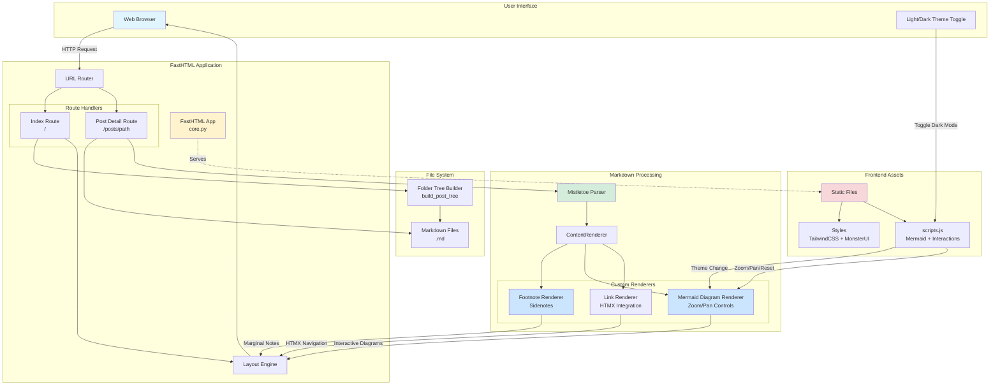
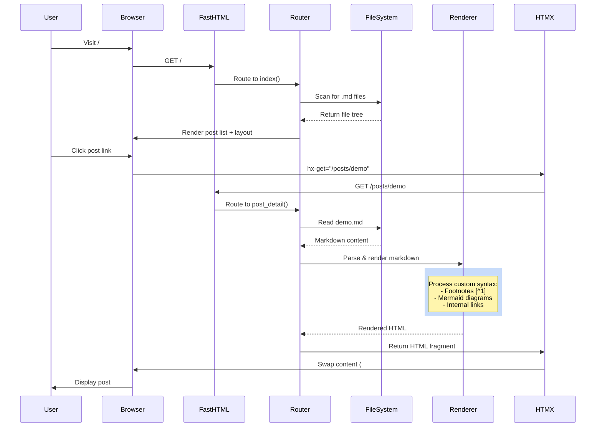
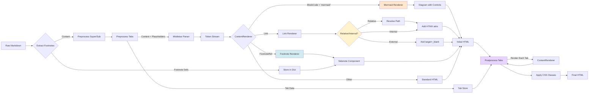
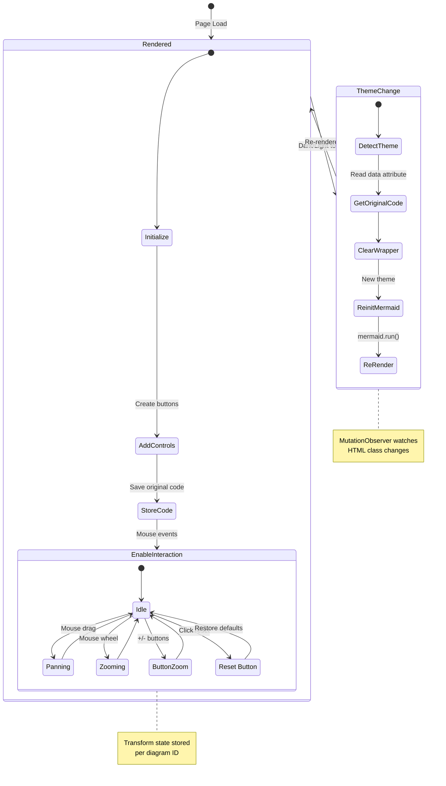
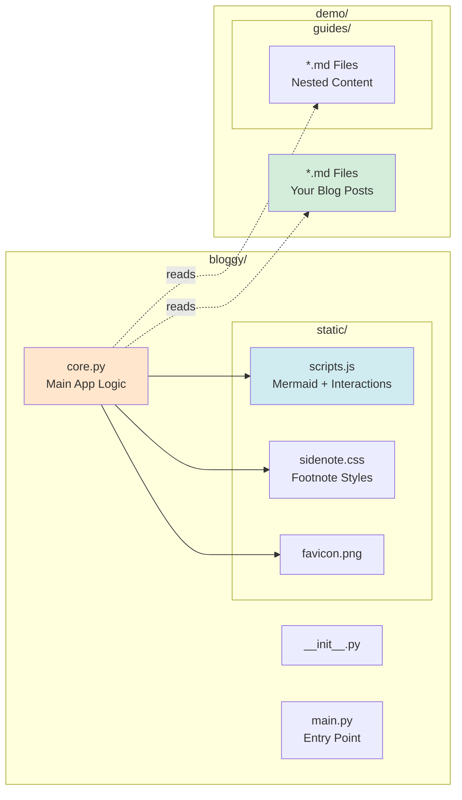

# Bloggy

A lightweight, elegant blogging platform built with FastHTML that renders Markdown files into beautiful web pages with advanced features.

## Architecture Overview



## How Bloggy Works

### 1. Request Flow



### 2. Markdown Processing Pipeline



### 3. Mermaid Diagram Lifecycle



## Key Features

### ✨ Advanced Markdown Features
- **Footnotes as Sidenotes**: `[^1]` references become elegant margin notes on desktop, expandable on mobile
- **Mermaid Diagrams**: Full support for flowcharts, sequence diagrams, state diagrams, etc.
- **Interactive Diagrams**: Built-in zoom, pan, and reset controls for all mermaid diagrams
- **Theme-aware Rendering**: Diagrams automatically re-render when switching light/dark mode
- **Tabbed Content**: Create multi-tab sections using `:::tabs` syntax for comparing code, showing examples, etc.
- **Relative Links**: Full support for relative markdown links (`./file.md`, `../other.md`) that work seamlessly with navigation
- **Math Notation**: KaTeX support for inline `$E=mc^2$` and block `$$` math equations
- **Superscript & Subscript**: Use `^text^` for superscript and `~text~` for subscript
- **Pandoc-style Attributes**: Add classes to inline text with `` `text`{.class} `` syntax for semantic markup (renders as `<span>` tags)
- **Cascading Custom CSS**: Add `custom.css` files at multiple levels (root, folders) for flexible styling

### 🎨 Modern UI
- **Responsive Design**: Works beautifully on all screen sizes
- **Three-Panel Layout**: Posts sidebar, main content, and table of contents for easy navigation
- **Dark Mode**: Automatic theme switching with localStorage persistence
- **HTMX Navigation**: Fast, SPA-like navigation without full page reloads
- **Collapsible Folders**: Organize posts in nested directories
- **Auto-Generated TOC**: Table of contents automatically extracted from headings

### 🚀 Technical Highlights
- Built on **FastHTML** for modern Python web development
- Uses **Mistletoe** for extensible Markdown parsing with custom renderers
- **TailwindCSS** + **MonsterUI** for styling
- **Hyperscript** for interactive behaviors
- **Mermaid.js v11** for diagram rendering with custom controls
- **KaTeX** for mathematical notation rendering
- **Smart Link Resolution**: Automatically converts relative links to proper routes

## Project Structure



## Installation

### From PyPI (recommended)

```bash
pip install bloggy
```

### From source

```bash
git clone https://github.com/yeshwanth/bloggy.git
cd bloggy
pip install -e .
```

## Quick Start

1. Create a directory with your markdown files:
   ```bash
   mkdir my-blog
   cd my-blog
   echo "# Hello World" > hello.md
   ```

2. Run Bloggy:
   ```bash
   bloggy .
   ```

3. Open your browser at `http://127.0.0.1:5001`

## Configuration

Bloggy supports three ways to configure your blog (in priority order):

1. **`.bloggy` configuration file** (TOML format)
2. **Environment variables**
3. **Default values**

### Using a `.bloggy` Configuration File

Create a `.bloggy` file in your blog directory or current directory:

```toml
# Blog title (default: derives from root folder name)
title = "My Awesome Blog"

# Root folder containing markdown files (default: current directory)
root = "."

# Server host (default: 127.0.0.1)
# Use "0.0.0.0" to make the server accessible from network
host = "127.0.0.1"

# Server port (default: 5001)
port = 5001
```

All settings in the `.bloggy` file are optional. See `.bloggy.example` for a full example.

### Environment Variables

You can also use environment variables as a fallback:

- `BLOGGY_ROOT`: Path to your markdown files (default: current directory)
- `BLOGGY_TITLE`: Your blog's title (default: folder name)
- `BLOGGY_HOST`: Server host (default: 127.0.0.1)
- `BLOGGY_PORT`: Server port (default: 5001)

### Examples

**Using a `.bloggy` file:**

```bash
# Create a .bloggy file in your blog directory
cd /path/to/your/blog
cat > .bloggy << EOF
title = "My Tech Blog"
port = 8000
EOF

bloggy
```

**Using environment variables:**

```bash
export BLOGGY_ROOT=/path/to/your/markdown/files
export BLOGGY_TITLE="My Awesome Blog"
export BLOGGY_PORT=8000
bloggy
```

**Passing directory as argument:**

```bash
bloggy /path/to/your/markdown/files
```

**Configuration priority example:**

If you have both a `.bloggy` file with `port = 8000` and an environment variable `BLOGGY_PORT=9000`, the `.bloggy` file takes precedence and port 8000 will be used.

## Custom Styling with Cascading CSS

Bloggy supports **cascading custom CSS** at multiple levels, allowing you to style your entire blog globally or customize specific sections:

### CSS Loading Order

1. **Framework CSS** (`bloggy/static/custom.css`) - Core styling for Bloggy itself
2. **Blog-wide CSS** (`/your-blog-root/custom.css`) - Applies to all posts
3. **Folder-specific CSS** (`/your-blog-root/section/custom.css`) - Applies only to posts in that folder

Each level can override styles from previous levels, following standard CSS cascade rules.

### Pandoc-style Inline Attributes

Use backticks with attributes to add semantic classes to inline text:

```markdown
The variables `x`{.variable}, `y`{.variable}, and `z`{.variable} represent coordinates.

Use `important`{.emphasis} for highlighted terms.

The function `console.log()`{.code} prints to console.
```

Attributes support:
- **Classes**: `.variable`, `.emphasis`, `.keyword`
- **IDs**: `#unique-id`
- **Key-value pairs**: `lang=python`

Classes like `.variable`, `.emphasis`, and `.keyword` render as `<span>` tags (not `<code>`), making them perfect for semantic styling without monospace fonts.

### Example: Multi-level Custom CSS

**Root level** (`/blog/custom.css`) - Global styles:
```css
/* Base variable styling for all posts */
span.variable {
    color: #e06c75;
    font-weight: 500;
}

span.emphasis {
    background: linear-gradient(120deg, #84fab0 0%, #8fd3f4 100%);
    padding: 2px 6px;
    border-radius: 3px;
}
```

**Section level** (`/blog/tutorials/custom.css`) - Tutorial-specific:
```css
/* Override for tutorial section - use blue variables */
span.variable {
    color: #61afef;
    position: relative;
}

/* Add overline to variables in tutorials */
span.variable::before {
    content: '';
    position: absolute;
    top: -3px;
    left: 50%;
    transform: translateX(-50%);
    width: 80%;
    height: 2px;
    background-color: currentColor;
}

span.emphasis {
    background: #ffd93d;
    color: #333;
    font-weight: bold;
}
```

**Chapter level** (`/blog/tutorials/advanced/custom.css`) - Advanced chapter styling:
```css
/* Different style for advanced tutorials */
span.variable {
    color: #c678dd;
    font-style: italic;
}

/* Add special marker for keywords */
span.keyword {
    color: #e5c07b;
    text-transform: uppercase;
    font-size: 0.85em;
    letter-spacing: 1px;
}
```

### Real Example from Demo

See the `demo/flat-land/` folder for a working example:

**Markdown** (`demo/flat-land/chapter-02.md`):
```markdown
The two Northern sides `RO`{.variable}, `OF`{.variable}, constitute the roof.
```

**CSS** (`demo/flat-land/custom.css`):
```css
span.variable {
    color: #e06c75;
    position: relative;
}

span.variable::before {
    content: '';
    position: absolute;
    top: -3px;
    left: 50%;
    transform: translateX(-50%);
    width: 80%;
    height: 2px;
    background-color: currentColor;
}
```

This renders `RO` and `OF` in red with a line above them, perfect for mathematical or geometric notation!
