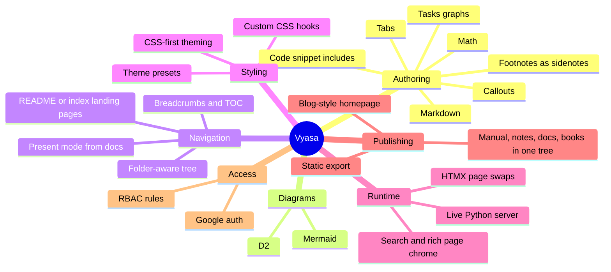

<p align="center">
  
</p>

<p class="vyasa-caption" style="text-align: center;">
  Markdown feeds Python<br>
  Instant sites, no code juggling<br>
  CSS reigns supreme
</p>

Vyasa turns a folder of Markdown into a navigable site served by Python. It is for people who want notes, docs, books, or a blog to feel like a real site without adding a JavaScript build stack. This README is the shortest path from `pip install vyasa` to a working local site. By the end, you should know how to run it, what it is good at, and which manual page to open next when the simple path stops being enough.

# Vyasa

Vyasa is a lightweight Markdown site engine built on FastHTML. It gives you a live local server, folder-aware navigation, rich Markdown features, CSS-first theming, and a static build path from the same content tree.

## Start Here

```bash
pip install vyasa
mkdir my-notes
cd my-notes
printf '# Hello\n\nThis is my first Vyasa page.\n' > index.md
vyasa .
```

Open `http://127.0.0.1:5001`.

If you want Google login later, install `pip install "vyasa[auth]"`. If you want a static export instead of a live server, run `vyasa build . -o ./dist`.

## The First Configuration Most People Add

```toml
title = "My Notes"
theme_preset = "serene-manuscript"
sidebars_open = true
```

Put that in a `.vyasa` file at the root of your content folder. Configuration precedence is CLI args > `.vyasa` > environment variables > defaults, so you can start simple and still override behavior when you need to.

## What It Buys You

- Write plain Markdown, then opt into Vyasa features like callouts, tabs, Mermaid, D2, math, footnotes as sidenotes, and code snippet includes only when the page needs them.
- Keep content organized as folders; `index.md` or `README.md` becomes the landing page for that branch.
- Use a blog-style homepage at `/` when you want the newest posts first, or set `home_sort = "name_asc"` / `home_sort = "name_desc"` to order homepage cards by filename instead.
- Style the site with normal CSS and bundled theme presets instead of introducing a component system.
- Use the same content tree for a live local server and a static export.
- Add auth and RBAC when the content stops being public or personal.

## Feature Map


```mermaid
mindmap
  root((Vyasa))
    Authoring
      Markdown
      Callouts
      Tabs
      Footnotes as sidenotes
      Math
      Code snippet includes
      Tasks graphs
    Diagrams
      Mermaid
      D2
    Navigation
      Folder-aware tree
      README or index landing pages
      Breadcrumbs and TOC
      Present mode from docs
    Styling
      CSS-first theming
      Theme presets
      Custom CSS hooks
    Runtime
      Live Python server
      HTMX page swaps
      Search and rich page chrome
    Publishing
      Static export
      Blog-style homepage
      Manual, notes, docs, books in one tree
    Access
      Google auth
      RBAC rules
```

## What A Content Tree Looks Like

```text
my-notes/
├── .vyasa
├── index.md
├── posts/
│   ├── first-post.md
│   └── second-post.md
└── manual/
    ├── README.md
    └── architecture.md
```

Folders become navigation groups. `index.md` or `README.md` gives a folder its own landing page, so a blog, a manual, and a notebook can live in the same tree without special routing setup.

## When You Need The Next Layer

If your next question is about shaping the site, open the [configuration guide](vyasa%20manual/configuration.md). If the question is about what the authoring surface can do, go to [Markdown writing features](vyasa%20manual/markdown-features.md). Diagram-specific behavior lives in the [Mermaid guide](vyasa%20manual/mermaid-diagrams.md) and the [D2 guide](vyasa%20manual/d2-diagrams.md), while shell styling and theme presets are covered in [theming](vyasa%20manual/theming.md).

Use [security](vyasa%20manual/security.md) when the site needs login or path rules, [architecture](vyasa%20manual/architecture.md) when you want the request and rendering model, and [advanced behavior](vyasa%20manual/advanced.md) when you are past the happy path and want the edges.

The manual itself starts at [vyasa manual/README.md](vyasa%20manual/README.md), but you should not need it before the quick start above works.
