<p align="center">
  
</p>

<p class="vyasa-caption" style="text-align: center;">
  Markdown feeds Python<br>
  Instant sites, no code juggling<br>
  CSS reigns supreme
</p>


---

Vyasa is a Python-first blogging platform designed to turn your Markdown files into a fully-featured website in seconds. Write your content in clean, simple Markdown—no boilerplate, no configuration hassles—and watch your site come alive instantly. Whether you're a minimalist who wants it just to work or a CSS enthusiast ready to craft pixel-perfect designs, Vyasa adapts to your needs. Start with zero configuration and customize every pixel when you're ready.[^1]

[^1]: If you're curious about how the intro was styled, [visit this page](https://github.com/sizhky/vyasa/blob/fa9a671931ad69b24139ba9d105bbadd8753b85b/custom.css#L36C1-L36C13).<br>
    Check out the [Theming & CSS](vyasa%20manual/theming.md) guide for details on customizing your blog's appearance.

---

## Quick Start
1. Install Vyasa:
   ```bash
   pip install vyasa
   ```

2. Create a directory with your markdown files:
   ```bash
   mkdir my-blog
   cd my-blog
   echo "# Hello World" > hello.md
   mkdir -p posts
   echo "# My First Post\nThis is a sample blog post." > posts/first-post.md
   ```

3. Run Vyasa:
   ```bash
   vyasa .
   ```

4. Open your browser at `http://127.0.0.1:5001`


## Key Features

```mermaid
mindmap
  root((🚀 Vyasa Features))
    📝 Markdown
      Footnotes as Sidenotes
      YouTube Embeds
      Task Lists
      Math Notation
      Superscript & Subscript
      Strikethrough
      Relative Links
      Plain-Text Headings
      Pandoc-style Attributes
      Title Abbreviations
      Folder Notes
    🎨 Interactive Elements
      Mermaid Diagrams
        Flowcharts
        Sequence Diagrams
        State Diagrams
        Gantt Charts
      D2 Diagrams
        Layouts & Themes
        Composition Animation
        Scenario/Layers Support
      Interactive Diagrams
        Zoom & Pan
        Fullscreen Mode
        Dark Mode Support
        Auto-scaling
      Tabbed Content
      Custom CSS Cascade
     UI/UX
      Responsive Design
      Dark Mode
      Three-Panel Layout
      HTMX Navigation
      Collapsible Folders
      Sidebar Search
      Auto-Generated TOC
      Mobile Menus
      Sticky Navigation
      Active Link Highlighting
      PDF Support
      Copy Button
    ⚙️ Technical
      FastHTML Foundation
      Configuration File Support
      CLI Arguments
      Environment Variables
      Security & Auth
      Advanced Customization
```



### ✨ Advanced Markdown Features
- **Footnotes as Sidenotes**: `[^1]` references become elegant margin notes on desktop, expandable on mobile with smooth animations
- **YouTube Embeds**: Use `[yt:VIDEO_ID]` or `[yt:VIDEO_ID|Caption]` for responsive iframe cards with aspect-ratio containers
- **Task Lists**: `- [ ]` / `- [x]` render as custom styled checkboxes (green for checked, gray for unchecked) with SVG checkmarks
- **Mermaid Diagrams**: Full support for flowcharts, sequence diagrams, state diagrams, Gantt charts, etc.
- **D2 Diagrams**: Supports architecture/process diagrams with interactive rendering and composition animation support.
- **Interactive Diagrams**: 
  - Zoom with mouse wheel (zooms towards cursor position)
  - Pan by dragging with mouse
  - Built-in controls: fullscreen, reset, zoom in/out buttons
  - Auto-scaling based on diagram aspect ratio
  - Fullscreen modal viewer with dark mode support
- **Theme-aware Rendering**: Diagrams automatically re-render when switching light/dark mode via MutationObserver
- **Mermaid Frontmatter**: Configure diagram size and metadata with YAML frontmatter (`width`, `height`, `aspect_ratio`, `title`)
- **D2 Frontmatter**: Configure rendering and animation with YAML frontmatter:
  - `width`, `height`, `title`
  - `layout` (`elk`, `dagre`, etc.; default is `elk`), `theme_id`, `dark_theme_id`, `sketch`
  - `pad`, `scale`
  - `target` (board/layer target), `animate_interval`/`animate-interval`, `animate`
  - Notes:
    - Composition animation is enabled with `animate_interval`
    - If animation is enabled and `target` is omitted, Vyasa auto-targets all boards (`*`)
    - If `title` is provided, it is used for fullscreen modal title and as a small centered caption under the diagram
- **Tabbed Content**: Create multi-tab sections using `:::tabs` and `::tab{title="..."}` syntax with smooth transitions
- **Relative Links**: Full support for relative markdown links (`./file.md`, `../other.md`) with automatic path resolution
- **Plain-Text Headings**: Inline markdown in headings is stripped for clean display and consistent anchor slugs
- **Math Notation**: KaTeX support for inline `$E=mc^2$` and block `$$` math equations, auto-renders after HTMX swaps
- **Superscript & Subscript**: Use `^text^` for superscript and `~text~` for subscript (preprocessed before rendering)
- **Strikethrough**: Use `~~text~~` for strikethrough formatting
- **Pandoc-style Attributes**: Add classes to inline text with `` `text`{.class #id} `` syntax for semantic markup (renders as `<span>` tags, not `<code>`)
- **Cascading Custom CSS**: Add `custom.css` or `style.css` files at multiple levels (root, folders) with automatic scoping
- **Title Abbreviations**: Configure `.vyasa` `abbreviations` to force uppercase acronyms in sidebar and slug-based titles (e.g., `ai-features` $\to$ `AI Features`)
- **Folder Notes**: `index.md`, `README.md`, or `<folder>.md` can act as a folder summary; clicking the folder name opens it

See the full list in [Markdown Writing Features](vyasa%20manual/markdown-features.md).

### 🎨 Modern UI
- **Responsive Design**: Works beautifully on all screen sizes with mobile-first approach
- **Three-Panel Layout**: Posts sidebar, main content, and table of contents for easy navigation
- **Dark Mode**: Automatic theme switching with localStorage persistence and instant visual feedback
- **HTMX Navigation**: Fast, SPA-like navigation without full page reloads using `hx-get`, `hx-target`, and `hx-push-url`
- **Collapsible Folders**: Organize posts in nested directories with chevron indicators and smooth expand/collapse
- **Sidebar Search**: HTMX-powered filename search with results shown below the search bar (tree stays intact)
- **PDF Posts**: PDFs show up in the sidebar and open inline in the main content area
- **Auto-Generated TOC**: Table of contents automatically extracted from headings with scroll-based active highlighting
- **TOC Autoscroll + Accurate Highlights**: Active TOC item stays in view and highlight logic handles duplicate headings
- **Inline Copy Button**: Copy raw markdown from a button placed right next to the post title
- **Mobile Menus**: Slide-in panels for posts and TOC on mobile devices with smooth transitions
- **Sticky Navigation**: Navbar stays at top while scrolling, with mobile menu toggles
- **Active Link Highlighting**: Current post and TOC section highlighted with blue accents
- **Auto-Reveal in Sidebar**: Active post automatically expanded and scrolled into view when opening sidebar
- **Ultra-Thin Scrollbars**: Custom styled 3px scrollbars that adapt to light/dark theme
- **Frosted Glass Sidebars**: Backdrop blur and transparency effects on sidebar components

| Feature                     | Description                                      |
|-----------------------------|--------------------------------------------------|
| FastHTML Integration        | Built on FastHTML for high performance and ease of use |
| Advanced Markdown Support   | Footnotes as sidenotes, YouTube embeds, task lists, Mermaid + D2 diagrams, math notation, tabbed content, and more |
| Modern UI                   | Responsive design, dark mode, three-panel layout, HTMX navigation |
| Interactive Diagrams       | Zoomable, pannable Mermaid and D2 diagrams with fullscreen support |

## Installation

### From PyPI (recommended)

```bash
pip install vyasa
```

### From source

```bash
git clone https://github.com/yeshwanth/vyasa.git
cd vyasa
pip install -e .
```

## Configuration

Vyasa supports four ways to configure your blog (in priority order):

1. cli arguments (e.g. `vyasa /path/to/markdown`) - Highest priority
1. **[`.vyasa` configuration file](vyasa%20manual/configuration.md)** (TOML format)
2. **Environment variables** - Fallback
3. **Default values** - Final fallback

## Vyasa Manual

Short, focused guides for deeper topics. Start with configuration and writing content, then dive into architecture and advanced details.

- [Configuration & CLI](vyasa%20manual/configuration.md)
- [Markdown Writing Features](vyasa%20manual/markdown-features.md)
- [Mermaid Diagrams](vyasa%20manual/mermaid-diagrams.md)
- [D2 Diagrams](vyasa%20manual/d2-diagrams.md)
- [Architecture Overview](vyasa%20manual/architecture.md)
- [Theming & CSS](vyasa%20manual/theming.md)
- [Security & Auth](vyasa%20manual/security.md)
- [Advanced Behavior](vyasa%20manual/advanced.md)
