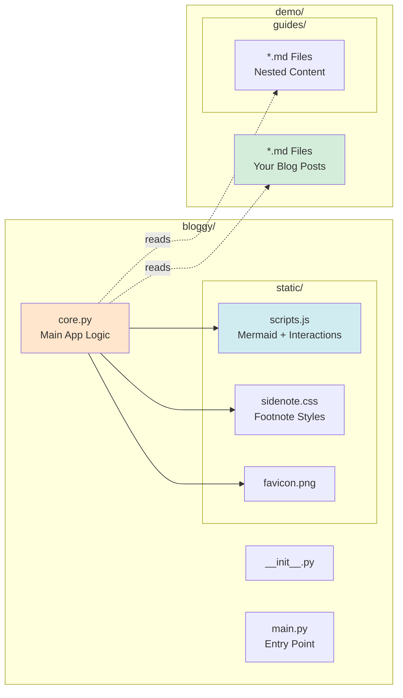
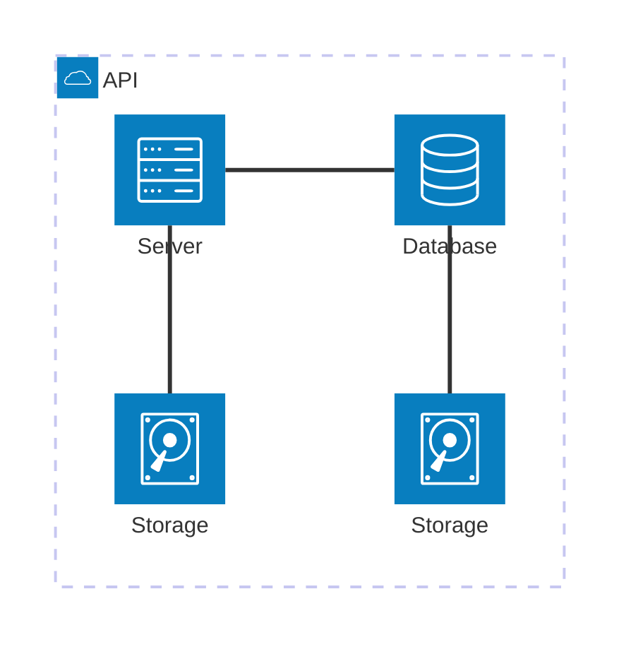

```mermaid
graph LR
    subgraph bloggy/
        A[__init__.py]
        B[core.py<br/>Main App Logic]
        C[main.py<br/>Entry Point]
        
        subgraph static/
            D[scripts.js<br/>Mermaid + Interactions]
            E[sidenote.css<br/>Footnote Styles]
            F[favicon.png]
        end
    end
    
    subgraph demo/
        G[*.md Files<br/>Your Blog Posts]
        
        subgraph guides/
            H[*.md Files<br/>Nested Content]
        end
    end
    
    B --> D
    B --> E
    B --> F
    B -.reads.-> G
    B -.reads.-> H
    
    style B fill:#ffe6cc
    style D fill:#d1ecf1
    style G fill:#d4edda
```

```mermaid
architecture-beta
    group api(cloud)[API]

    service db(database)[Database] in api
    service disk1(disk)[Storage] in api
    service disk2(disk)[Storage] in api
    service server(server)[Server] in api

    db:L -- R:server
    disk1:T -- B:server
    disk2:T -- B:db
```

