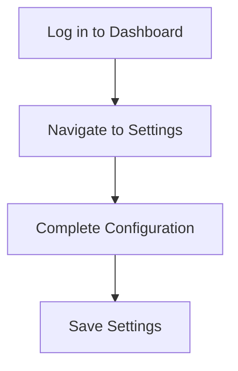

# Getting Started with Our Platform

Welcome to our official documentation! This guide will walk you through the initial setup and basic concepts you need to know to start using our platform effectively[^1].

> [!NOTE]
> This guide assumes you're setting up a new workspace. If you're migrating from another platform, please refer to our [Migration Guide](/docs/migration).

## Prerequisites

Before you begin, make sure you have the following:

- An active account with administrator access[^2]
## Step 1: Initial Setup

1. Log in to your account dashboard
2. Navigate to **Settings** → **Configuration**
3. Complete the required fields:
   - Organization Name
   - Primary Domain
   - Admin Contact Email

> [!WARNING]
> Ensure your **Primary Domain** is unique across the platform. Domain changes require a support ticket after initial setup.

## Step 2: Team Invitation
   - Admin Contact Email



## Step 2: Team Invitation

Invite your team members to collaborate:

```
Go to Team Management → Invite Members
```

## Step 3: Basic Configuration
| Setting | Recommended Value | Description |
|---------|-------------------|-------------|
| Access Level | Public | Allow team members to access resources |
| Data Retention | 90 days | Automatic cleanup of old data |
| Notifications | Enabled | Receive important alerts |

> [!TIP]
> For enterprise deployments, we recommend enabling **Advanced Logging** (found in **Settings** → **Security**) to maintain detailed audit trails.

## Next Steps

- Review our [Integration Guide](/docs/integrations)
- Set up [API Keys](/docs/api-keys)[^3]
- Join our community Slack channel

---

**Last Updated:** December 11, 2025 | **Version:** 1.0

[^1]: Our platform is built on modern web technologies and follows industry best practices for security and scalability.

[^2]: Administrator access is required for initial setup. You can invite additional users with different permission levels after completing the setup process.

[^3]: API keys are essential for programmatic access to your platform resources. Keep them secure and rotate them regularly for optimal security.
