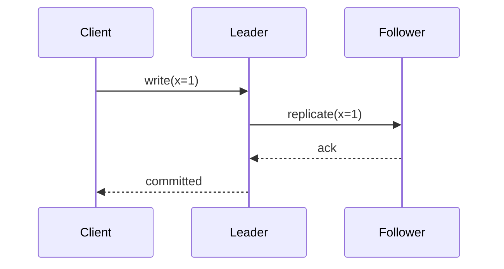

# The Philosophy of Distributed Systems

# Core Concepts
We will cover the fundamental concepts of distributed systems, including consistency models, fault tolerance, and building resilient APIs.

## Consistency Models

> [!info]
> Distributed systems are just computers arguing over whose clock is lying.[^clock]

### Strong Consistency

#### Linearizability

Linearizability guarantees that every operation appears to take effect instantaneously at some point between its invocation and completion.

:::tabs
::tab{title="Rendered"}
- Reads see the latest committed write.
- Clients do not need to reason about replica lag.
- The price is coordination.
::tab{title="Pseudo-code"}
```python
def write(value):
    quorum = await replicate_to_majority(value)
    return {"ok": quorum >= 3}
```
:::



##### Practical Implications

In practice, strong consistency requires coordination between nodes, which limits throughput and increases latency under network partitions.

###### Trade-offs in Banking Systems

Banks historically chose consistency over availability — a double-spend is worse than a brief outage.

###### Trade-offs in Social Media

Social feeds tolerate eventual consistency; showing a post 200ms late is acceptable.

##### Implementation Approaches

Two-phase commit and Paxos are the canonical protocols for achieving strong consistency across distributed nodes.

#### Sequential Consistency

Sequential consistency relaxes the real-time requirement while still preserving program order within each process.

Inline math still works: $W + R > N$ is the quorum overlap rule.

#### Causal Consistency

Causal consistency ensures that operations causally related are seen in the same order by all nodes.

##### Causal vs Sequential

Causal consistency is strictly weaker than sequential — it only orders events that are causally linked, not all events globally.

###### Vector Clocks

Vector clocks track causal history by assigning each process a logical counter, allowing nodes to determine if two events are causally related or concurrent.

### Eventual Consistency


Eventual consistency guarantees that, given no new updates, all replicas converge to the same value over time.

#### Conflict Resolution Strategies

##### Last Write Wins

Last Write Wins uses wall-clock timestamps to resolve conflicts — simple but vulnerable to clock skew.

###### Clock Skew Risks

In a distributed system, clocks drift. Two events written 1ms apart on different nodes can appear in the wrong order when clocks differ by more than 1ms.

##### Merge Functions

CRDTs (Conflict-free Replicated Data Types) define merge functions that are commutative, associative, and idempotent — so order of merging doesn't matter.

#### Read Repair

Read repair detects stale replicas at read time and patches them in the background.

### Read-Your-Writes Consistency

A session-level guarantee: after a client writes a value, subsequent reads by the same client will reflect that write.

#### Implementation via Sticky Sessions

##### Load Balancer Affinity

Routing the same client to the same replica ensures read-your-writes without cross-node coordination.

###### Session Tokens

Encode a minimum-version token in the session cookie; replicas refuse to serve reads below that version.

## Fault Tolerance

```d2
client -> api: request
api -> replica_a: write
api -> replica_b: write
replica_b -> api: timeout
```

### Failure Modes

#### Crash Failures

The node stops responding entirely. The simplest failure mode — dead nodes don't lie.

- [x] Easy to detect
- [ ] Easy to recover from
- [ ] Easy to explain to leadership

[^clock]: A Lamport clock is still a clock. It is just honest about being fake.

#### Byzantine Failures

The node responds with arbitrary or malicious data. Byzantine fault tolerance requires 3f+1 nodes to tolerate f traitors.

##### Byzantine Generals Problem

Lamport, Shostak, and Pease (1982) formalized the problem: generals must agree on a battle plan despite traitors sending conflicting messages.

###### Practical Byzantine Fault Tolerance

PBFT achieves Byzantine fault tolerance in O(n²) message complexity — too expensive for large clusters, practical for small trusted federations.

### Replication Strategies

#### Leader-Follower Replication

One leader accepts writes; followers replicate asynchronously or synchronously.

##### Synchronous Followers

At least one follower is synchronous — the leader waits for acknowledgment before confirming a write to the client.

###### Semi-Synchronous Replication

MySQL's semi-sync: the leader waits for one follower before responding, then lets the rest replicate asynchronously.

#### Leaderless Replication

Any replica can accept writes; conflicts resolved by quorum reads.

##### Quorum Rules

With N replicas, W write quorum, and R read quorum: if W + R > N, reads and writes overlap and consistency is guaranteed.

# Building Resilient APIs

## Rate Limiting

### Token Bucket Algorithm

The token bucket allows bursting up to a maximum capacity while enforcing a sustained average rate.

#### Burst Capacity

Burst capacity lets clients absorb short spikes without being throttled — tokens accumulate when the client is idle.

##### Token Refill Rate

The refill rate defines the sustained throughput ceiling. Burst capacity is a credit; the refill rate is the income.

###### Per-User vs Global Buckets

Per-user buckets prevent one client from starving others. Global buckets protect the server but allow noisy-neighbor problems.

### Sliding Window Algorithm

The sliding window tracks request counts within a rolling time window, avoiding the boundary spikes of fixed-window counters.

#### Fixed Window vs Sliding Window

A fixed window resets at a hard boundary — a client can send 2× the rate limit by frontloading two windows. The sliding window eliminates this by computing the window from the current timestamp.

##### Redis Implementation

Store request timestamps in a sorted set; prune entries older than the window on each request; count remaining entries.

## Circuit Breaker Pattern

### States

#### Closed

Normal operation. Requests pass through. Failures are counted.

#### Open

The circuit has tripped. Requests fail immediately without hitting the downstream service.

##### Timeout Before Half-Open

After a cooldown period, the circuit transitions to half-open to probe whether the downstream has recovered.

###### Probe Request Strategy

Send one request. If it succeeds, close the circuit. If it fails, reopen and restart the cooldown.

#### Half-Open

A limited number of requests are allowed through as a recovery probe.

### Failure Thresholds

#### Error Rate Threshold

Trip the circuit when the error rate exceeds a percentage over a rolling window, not a raw count — raw counts penalize high-traffic services unfairly.

##### Minimum Request Volume

Don't trip on 1 failure out of 1 request. Require a minimum volume before evaluating the error rate.

###### Hystrix Defaults

Netflix Hystrix defaults: 20 requests minimum, 50% error rate, 5s rolling window, 5s sleep window before half-open.

## Retry Strategies

### Exponential Backoff

Exponential backoff doubles the wait time after each failure, spreading retry load across time rather than concentrating it into a storm.

#### Jitter

Without jitter, synchronized clients retry at the same moment after a failure — coordinated thundering herds. Add random jitter to decorrelate retries.

##### Full Jitter vs Equal Jitter

Full jitter: `sleep = random(0, base * 2^attempt)`. Equal jitter: `sleep = base * 2^attempt / 2 + random(0, base * 2^attempt / 2)`. Equal jitter keeps a minimum floor.

###### AWS Recommendations

AWS documented these jitter strategies in 2015 after observing retry storms in S3 clients. Full jitter reduces contention the most.

### Idempotency Keys

#### Why Idempotency Matters

Retries are only safe if the operation is idempotent. Non-idempotent retries can double-charge users, send duplicate emails, or corrupt state.

##### Idempotency Key Design

Generate the key client-side before the first attempt. A UUID derived from the request's logical identity works; a random UUID does not — it changes on retry.

###### Server-Side Deduplication Window

Servers store idempotency keys for a bounded window (e.g., 24 hours). Keys older than the window are evicted — the client must not retry stale operations.
