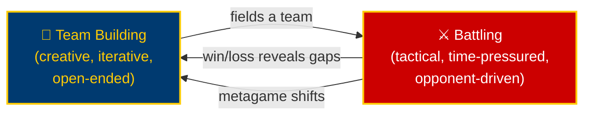
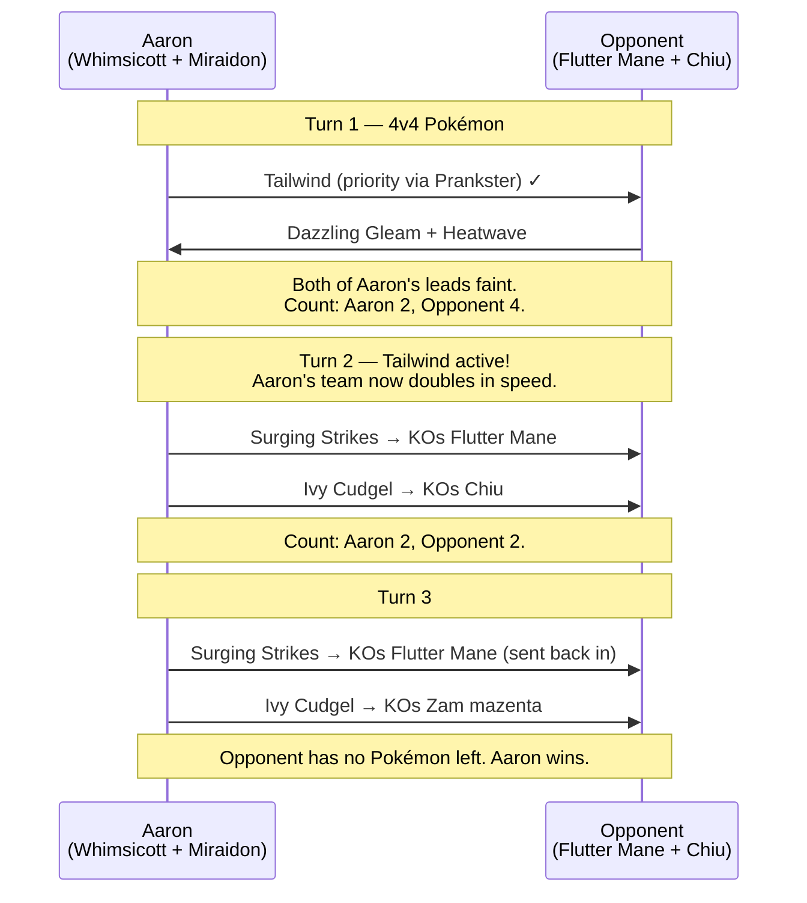
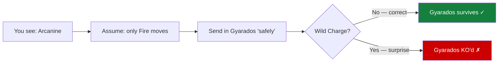
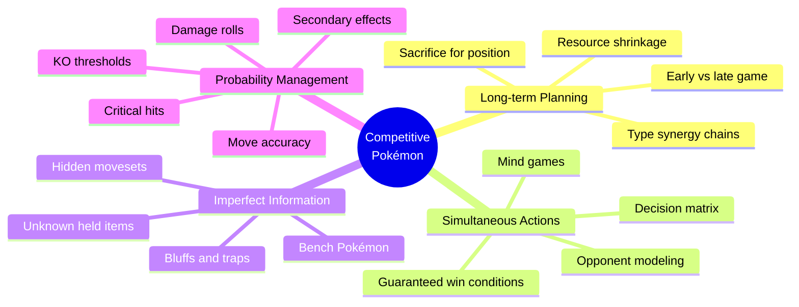
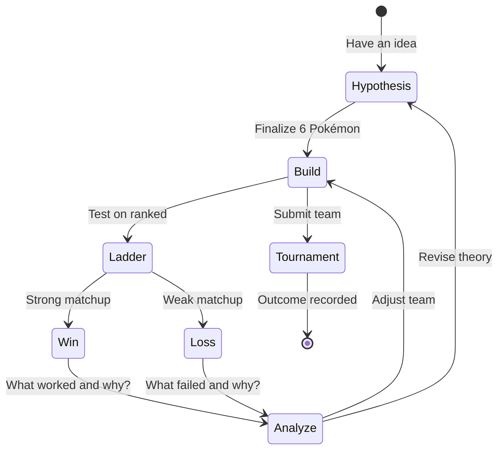

<div style="text-align:center; padding: 2.5rem 0 1.5rem;">


# The Game Theory of Competitive Pokémon

</div>
</div>

`By Aaron Trailer · VGC World Championship Top 8 · PhD Computer Science`{.subtitle-badge}

> *"If you solved that, I would give you a PhD on the spot."*  
> — A Professor of Computer Science, hearing about team building for the first time

</div>

## Why Is Competitive Pokémon Hard? {#intro}

If you've only ever played the single-player campaign, competitive Pokémon seems easy. Teach your level 100 `Charizard`{.pokemon-badge} `Earthquake`{.move-badge} and win, right?

As it turns out, winning at multiplayer Pokémon - beating another human player, becoming world champion - is **extraordinarily difficult**. Answering *why* is also difficult, because competitive Pokémon is so complex it's hard to even put into words.

> [!note] The scale
> There are over **1,000 different Pokémon species** and **900 different moves** to choose from.
> Selecting the right team is tough enough - but then you actually have to battle someone with their own carefully trained team.

The strategy is like a tangled web: answer one question and many more follow. This document untangles it by identifying the **fundamental building blocks** that make competitive Pokémon what it is as a strategic game.

## The Two Phases {#two-phases}

Competitive Pokémon consists of exactly two phases. They are deeply coupled, and you can't understand one without the other.

Team Building: Choose and fully customize six Pokémon - species, moves, held items, stats, and tera types. The art side.

Battling: Use those six Pokémon to reduce all of your opponent's to zero. The science side.



> [!tip] Why we cover battling first
> You need to know how to **win battles** to know which Pokémon are worth building.
> Also: battling is hard. Team building is ==harder==. We get there at the end.

## Strategic Element 1: Long-Term Planning {#long-term-planning}

Resources shrink as a battle progresses. Once a Pokémon faints, it almost never returns.[^fainting] This creates a hard asymmetry between the early game and the late game.

[^fainting]: The move Revival Blessing exists but appears on essentially no competitive teams. For all practical purposes, fainted = gone.

:::tabs
::tab{title="VGC Doubles"}
Usually **8--12 turns**. Fast, high-stakes. One mistake can end the game outright.
Your lead determines your first-turn momentum; your back two determine your endgame.
::tab{title="Singles"}
Usually **50+ turns** - can reach hundreds. Early positioning accumulates.
Setup moves (Swords Dance, Calm Mind) pay off over many subsequent turns.
::tab{title="Gen 2 Stall (torture)"}
Revolves around Perish Song, Leech Seed, and PP stalling. The goal is to exhaust your opponent's moves entirely. Mechanically valid. Psychologically cruel.
:::

The early game is an investment, not just an exchange. Knocking out your opponent's `Arcanine`{.pokemon-badge} on turn two means your `Venusaur`{.pokemon-badge} has one fewer Fire-type threat to worry about for the rest of the game. That's not damage - that's ==positioning==.

### The Whimsicott Game {#whimsicott-game}


This is a real tournament game that demonstrates long-term planning in full. `Whimsicott`{.pokemon-badge} has terrible base stats - but its `Prankster`{.ability-badge} ability gives all non-attacking moves +1 priority.

<div style="clear: both;"></div>



> [!cite] The Lesson
> Whimsicott did **zero damage** and fainted in one turn. It was undeniably the MVP.
> Long-term planning means building ==conditions for later victory==, not maximizing this turn's immediate output.

This is where Pokémon most resembles chess. In both games, resources decrease over time, and early sacrifice for positional advantage is a legitimate - sometimes optimal - strategy. As in chess, the late game is won or lost by decisions made in the opening.

## Strategic Element 2: Simultaneous Action Selection {#simultaneous}

In chess, players alternate. After your move, the board is a known state. Pokémon offers ==no such luxury==.

Both players choose their moves **at the same time**. Then the game executes them in speed order. This one mechanic changes the entire character of the game.

> [!warning] Not just a flavor detail
> Because you commit to your action before seeing your opponent's, the ==value of any given move is opponent-dependent==. There is no "best move in a vacuum" - only best moves in response to what your opponent is doing, which you cannot know.

### The Decision Matrix {#decision-matrix}

`Annihilape`{.pokemon-badge} (Ghost/Fighting) vs `Gengar`{.pokemon-badge} (Ghost/Poison). Ghost attacks are super effective against Ghost types. The faster attacker likely wins outright.

| | Terry: no Terastallize (stays Ghost) | Terry: Terastallize → Normal |
|---|---|---|
| **Shadow Claw** (Ghost) | ✓ Super effective — you KO Gengar | ✗ Normal is immune to Ghost — zero damage, you lose |
| **Close Combat** (Fighting) | ✗ Ghost is immune to Fighting — zero damage, you lose | ✓ Super effective on Normal — you KO Gengar |

**This feels like rock-paper-scissors.** And in this isolated late-game example, it kind of is. But in a real double battle on turn three:

- Each player has 2 active Pokémon with 4 moves each
- Both can switch to 2 benched Pokémon
- Every combination produces a different probability distribution of outcomes

The actual decision grid isn't 2×2. It isn't even a grid - it's a ==wall of combinatorial explosions==. No human can enumerate it fully. This is why skilled play is about avoiding the mind game entirely: navigating toward board states where you have a ==guaranteed win condition== regardless of what the opponent does.

The Tailwind game above was one such state. With Tailwind active and a healthy attacking pair, there was literally nothing the opponent could do. Aaron had escaped the mind game through long-term planning.

## Strategic Element 3: Imperfect Information {#imperfect-info}

In chess, both players see all pieces. In rock-paper-scissors, you know the three possible choices. Pokémon usually guarantees ==neither==.

> [!faq]- What do you know at the start of a ladder battle?
> On the public ranked ladder (Scarlet/Violet), you see only your opponent's **six Pokémon species**. No moves, no items, no stats, no tera types.
>
> At official tournaments (Regionals, Worlds), you see everything *except* stats - and you still don't know which two Pokémon are benched until they're revealed.

### Assumption Traps {#assumption-traps}

You see `Arcanine`{.pokemon-badge} (Fire type). You think: *Fire type → fire moves → my Water-type Gyarados is safe.*



`Wild Charge`{.move-badge} is an Electric-type move that `Arcanine`{.pokemon-badge} can legitimately learn. Your logic was sound. Your assumption was wrong.

> [!tip] The Whimsicott trick room counterplay
> If you expect `Tailwind`{.move-badge} from Whimsicott, you set your own Tailwind with `Zapdos`{.pokemon-badge}.
> But Whimsicott uses ==Trick Room== instead - reversing speed order for five turns.
> Your Tailwind now *hurts* you.
>
> The bluff only works because **you didn't know Trick Room was possible**. Clever opponents weaponize your ignorance.

The amount of unknown information decreases as the battle progresses and each player's Pokémon take actions, revealing their moves. But you still have to make decisions before you have full information - under time pressure, against an opponent doing the same thing.

## Strategic Element 4: Probability Management {#probability}

Even with perfect information and perfect reasoning, ==random outcomes== remain. Variance is built into the engine.

Move Accuracy: Most moves are 100% accurate - but not all. `Will-O-Wisp`{.move-badge} burns at **85%**. Miss at the wrong moment and an entire strategy collapses.

Secondary Effects: `Flamethrower`{.move-badge} deals damage *and* has a **10%** chance to also burn the target. Free value; never guaranteed.

Critical Hits: Every attack has a $\frac{1}{24} \approx 4.17\%$ chance to crit, dealing $ 1.5 \times$ base damage **and** ignoring your attack drops and their defense boosts.

Damage Rolls: The deepest source of variance. Every attack's final damage is multiplied by a random integer $r$ drawn uniformly from $\{85, 86, \ldots, 100\}$, producing ==up to 16 distinct damage values per move==.

### The Damage Formula {#damage-formula}

$$
\text{Damage} =
\left\lfloor
  \left\lfloor
    \left\lfloor \frac{2 \times \text{Level}}{5} + 2 \right\rfloor
    \times \frac{A}{D} \times \text{BasePower} \div 50 + 2
  \right\rfloor
  \times \text{Modifiers}
  \times \frac{r}{100}
\right\rfloor
$$

Where $r \sim \text{Uniform}\{85, \ldots, 100\}$.

> [!error] The low-roll nightmare
> Your attack deals just over 50% of their HP. One more hit wins the game. Next turn: the move deals just ==under== 50%. You low-rolled. The situation is reversed.[^lowroll]
>
> This is not bad luck in an isolated sense. At tournament level, players memorize **exact damage ranges** and avoid situations where a low roll costs them the match.

[^lowroll]: High-level players use tools like Pikalytics, Damage Calculator, and Showdown's damage display to pre-compute every relevant KO threshold before a tournament. The goal: never rely on a damage roll you can't guarantee.

### Simulated Damage Distribution {#damage-sim}

The `turn_resolution.py` script in this folder computes the exact distribution empirically. Core logic:

{* ./turn_resolution.py ln[1:35] hl[13:16,21:25] *}

### Accuracy Reference Table {#accuracy-table}

| Move | Type | Accuracy | Secondary Effect |
|------|------|----------|-----------------|
| `Earthquake`{.move-badge} | Ground | 100% | None |
| `Flamethrower`{.move-badge} | Fire | 100% | 10% burn |
| `Will-O-Wisp`{.move-badge} | Fire | 85% | Burns target |
| `Thunder`{.move-badge} | Electric | 70% | 30% paralysis |
| `Blizzard`{.move-badge} | Ice | 70% | 10% freeze |
| `Hypnosis`{.move-badge} | Psychic | 60% | Sleep |
| `Dynamic Punch`{.move-badge} | Fighting | 50% | 100% confusion on hit |

The best players choose moves with the ==highest floor==, not just the highest ceiling. Missing Dynamic Punch at a critical moment is not a freak event - it's 50% of the time.

## The Strategic Web {#strategic-web}

The four elements don't operate independently. They ==compound==.



<details>
<summary>How the four elements multiply each other</summary>

**Long-term + Probability**: Randomness makes futures branch into trees, not straight lines. A missed `Will-O-Wisp`{.move-badge} creates a timeline where your entire burn-based strategy fails. You had to plan for both worlds.

**Simultaneous + Imperfect**: You don't know your opponent's moves *and* you're choosing at the same time. These aren't additive difficulties - they're multiplicative. Every possible action you take must be evaluated against every possible thing they might do, including options you didn't know existed.

**Probability + Imperfect**: Your `Will-O-Wisp`{.move-badge} has 85% accuracy. But does their `Gyarados`{.pokemon-badge} hold a `Lum Berry`{.move-badge} (cures status once)? Unknown. Your 85% just became substantially worse in expectation, by an amount you can't calculate because you don't know the item.

**All four together**: The possible outcomes of one turn in a real double battle aren't a grid. They aren't a cube. They're a ==skyscraper of probability distributions==, each floor its own contingent universe.

</details>

### Interactive Strategy Map {#strategy-map}

```cytograph
---
source: ./competitive-pokemon.cytree
layout: vyasa
height: 55vh
initial_depth: 2
---
```

## How Pokémon Compares {#comparison}

```d2
---
title: Strategic Dimensions Across Competitive Games
width: 88vw
layout: elk
---
direction: right

elements: {
  ltp: { label: Long-term Planning }
  sim: { label: Simultaneous Actions }
  imp: { label: Imperfect Information }
  prob: { label: Probability Management }
}

games: {
  chess: {
    label: Chess
    icon: https://api.iconify.design/mdi:chess-king.svg
  }
  rps: {
    label: Rock Paper Scissors
    icon: https://api.iconify.design/mdi:hand-back-right.svg
  }
  poker: {
    label: Poker
    icon: https://api.iconify.design/mdi:cards-playing-spade-multiple.svg
  }
  mtg: {
    label: Magic the Gathering
    icon: https://api.iconify.design/mdi:cards.svg
  }
  pokemon: {
    label: Competitive Pokémon
    icon: https://api.iconify.design/mdi:pokeball.svg
  }
}

games.chess   -> elements.ltp
games.rps     -> elements.sim
games.poker   -> elements.ltp
games.poker   -> elements.imp
games.poker   -> elements.prob
games.mtg     -> elements.ltp
games.mtg     -> elements.imp
games.mtg     -> elements.prob
games.pokemon -> elements.ltp
games.pokemon -> elements.sim
games.pokemon -> elements.imp
games.pokemon -> elements.prob
```

Only competitive Pokémon connects to ==all four==. This isn't a coincidence. The design of simultaneous move selection, combined with customizable teams, imperfect information, and deep probability variance, produces a game that cannot be fully solved by any one strategic framework.

## Team Building {#team-building}


If battling is science, team building is art - and art has no solved strategy.

> [!note] The number
> In 2019, Smogon Forums user Deli Bird Hart calculated the total possible distinct teams in the Ultra Sun/Moon era:
>
> $$N_{\text{teams}} = 6.08701 \times 10^{218}$$
>
> The observable universe contains roughly $10^{80}$ atoms. The number of possible Pokémon teams is ==incomprehensibly larger==. More than there are stars in the sky, more than there are atoms in the universe.

### Speed Creep: One Number Wins Tournaments {#speed-creep}

Tournaments with prize pools in the thousands of dollars have been decided by training a Pokémon to be **one speed stat point faster** than the opponent's Pokémon.

Why? If a Pokémon is knocked out before it can act, its move never executes. Speed is not just "act sooner" - it is the ==gating condition on whether you get to play at all==.

$$
\text{Final Speed} = \left\lfloor \text{BaseStat} \times \frac{\text{Nature}}{1} \times \frac{2 \times \text{IV} + \text{EV}/4 + \text{Base} \times 2 + 5}{100 + 5} \right\rfloor
$$

A single EV allocation decision - 4 EVs is 1 stat point - can flip an entire matchup. Every speed tier in the metagame is a known threshold, and players deliberately park their Pokémon one point above the most common benchmarks.

### The Metagame {#metagame}

Metagame
: The game *about* the game. What teams are other players running? What are the dominant strategies? What counters them?

> [!note] Metagame as a social construct
> Unlike the four battle mechanics above, metagame is ==emergent from player behavior==, not the rules engine. Change the players, change the metagame. A brand-new format has no metagame yet - and the first week is pure exploration, with no data, no benchmarks, no tier lists. Finding a winning team in that void is one of the purest expressions of creative strategy in any game.

## The Iterative Loop {#loop}

Team building and battling form a feedback loop that ==never fully closes==.



> [!warning] The attribution problem
> If you win 10 ladder games, how much is ==your skill== and how much is ==your team==? If you lose, was the team wrong, or were you outplayed?
>
> Feedback in this loop is noisy, opponent-dependent, and influenced by luck. Systematic improvement is ==structurally difficult== in a way that most games don't have to contend with.

What makes this worse: practice games are usually against known opponents. Tournament opponents make decisions in entirely different ways. And if you happen to freeze several opponents in a row with `Blizzard`{.move-badge} in testing, your six Ice-type team looks like a genius idea - right up until the tournament, where you play against Fire and Rock teams and your Pokémon are stationary boulders.

## Conclusion {#conclusion}

<div style="text-align:center; padding: 1.5rem 0 0.5rem;">

</div>

Competitive Pokémon is unique because no other mainstream game combines all four strategic dimensions in the same package:

- [x] Long-term planning across 8--200 turns | priority: high | project: Battling
- [x] Simultaneous decision-making without mind game losses | priority: high | project: Battling
- [x] Processing incomplete information about an opponent's team | priority: medium | project: Battling
- [x] Managing probability: accepting variance, minimizing avoidable risk | priority: medium | project: Battling
- [ ] Build a winning team from $ 6.08 \times 10^{218}$ possible options | priority: critical | project: Team Building
- [ ] Understand the metagame as a social, not just mechanical, construct | priority: medium | project: Team Building

> [!cite] Brooks on irreducible complexity
> *"The bearing of a child takes nine months, no matter how many women are assigned."* - Fred Brooks, *The Mythical Man-Month*
>
> Some problems don't compress. Team building in Pokémon is one of them. You have to play the games, lose the games, and iterate. There is no shortcut.

When somebody asks *why is competitive Pokémon hard* - this is what we mean. Not just "lots of Pokémon" or "it takes practice." The mechanics themselves produce a game where:

| You must... | Because... |
|---|---|
| Plan turns ahead | Resources shrink and can't be recovered |
| Read your opponent | You're choosing moves at the same time |
| Model unknown information | You can't see their team until it acts |
| Manage risk precisely | Every move has probabilistic variance |
| Choose a team from 10^218^ options | Without knowing what you'll face |

None of these games or any other, as far as we know, does all five quite the same way.
