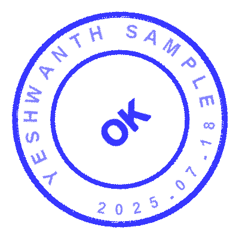

## Migration Status Snapshot

Deterministic capabilities implemented in the current codebase:

- Artifact discovery and classification for files.
- Process parsing for starter/activity metadata, transitions, subprocess calls, and control-flow hints.
- Mule scaffold generation with connector configs and dependency hints.
- Placeholder-driven config generation in `config.yaml` plus inferred defaults.
- Static validation and gap analysis with machine-readable reports.

### Inline emphasis still works

Use inline HTML styling together with regular **Markdown**, `code`, and [links](./demo.md).

> Mixed markdown + inline CSS is useful for fast callouts, status boxes, and visual highlights.

### Accordions can also be styled with inline CSS for a more polished look:

Process Health Accordion

- ✅ Parsing and inventory completed for core artifacts
- 🧭 Flow hints inferred where transitions are partial
- 🔁 Subprocess relationships linked for call graph generation

Mapping Confidence Accordion

- High confidence mappings are emitted directly
- Medium confidence mappings include rationale text
- Low confidence mappings produce explicit `TODO` fallbacks

Validation Checks Accordion

- XML well-formedness
- Placeholder coverage audit
- Packaging checks for generated Mule project

