- The current file is in reading view at [/posts/demo/reveal-slides](/posts/demo/reveal-slides)
- The same file can be viewed as a slide show at <a href="/slides/demo/reveal-slides" target="_blank" rel="noopener noreferrer">/slides/demo/reveal-slides</a>

---

## 1) Enable Slide Mode
Add this to frontmatter:

````yaml
title: My Deck
slides: true
````

`slides: true` shows the **Present** button in Vyasa beside the post title.

---

## 2) Configure Reveal.js
Use a nested `reveal:` block like so

```yaml
reveal:
  theme: white
  transition: fade
  backgroundTransition: slide
  controls: true
  progress: true
  slideNumber: true
  center: false
  margin: 0.14
  slidePadding: 2rem
```

These values are passed to `Reveal.initialize(...)`.

---

## 3) Alternative: Top-Level Keys
You can also use `reveal_*` keys:

```yaml
reveal_theme: white
reveal_transition: zoom
reveal_controls: true
reveal_slideNumber: true
```

Top-level keys and `reveal:` both work.
If both define the same key, `reveal_*` overrides the value from `reveal:`.

---

## 4) Slide Separators
Defaults in Vyasa:
- Horizontal: `---`
- Vertical: `--`

You can override separators:

```yaml
reveal:
  separator: "^---$"
  separatorVertical: "^--$"
  separatorNotes: "^Note:"
```

--

### Vertical Example Child
This slide exists because the separator above is `--`.

--

### Another Child
Use this pattern to group related details under one parent topic.

---

## 5) Syntax Highlight Theme
```python
def hello():
    return "Choose highlight theme via reveal.highlightTheme"
```

Set with:
```yaml
reveal:
  highlightTheme: atom-one-dark
```

---

## 6) Starter Template
Copy this into a new markdown file:

```
[three-dashes]
title: Team Update
slides: true
reveal:
  theme: white
  transition: fade
  controls: true
  progress: true
  slideNumber: true
[three-dashes]
```

Then add content separated by `---`.

---

## 7) LaTeX Math Support
Inline math: $f(x)=\sin(x)+\log(x)$

Block math:
$$
\int_0^1 x^2\,dx = \frac{1}{3}
$$

Common functions:
- $\frac{a}{b}$, $\sqrt{x}$, $x^{2}$, $x_{i}$
- $\sum_{i=1}^{n} i$, $\prod_{k=1}^{m} k$, $\lim_{x\to0}\frac{\sin x}{x}$

---

## 8) Mermaid Works in Slides

```mermaid
flowchart LR
  User(["👤 User"])
  Editor["Editor"]

  subgraph FS["File System 💾"]
    MD["Markdown Files"]
    CFG["Config / settings.ini"]
    LOGS["Build Logs"]
  end

  subgraph VYASA["Vyasa Engine ⚙️"]
    PARSER["Markdown Parser"]
    FM["Frontmatter Reader"]
    RENDER["HTML Renderer"]
    ROUTER["URL Router"]
  end

  subgraph ASSETS["Static Assets 🎨"]
    CSS["CSS Files"]
    JS["JS Bundles"]
    FONTS["Fonts"]
  end

  subgraph OUT["Browser Output 🌐"]
    READ["Reading View"]
    API["REST API"]
    subgraph SLIDES["Slide View"]
      REVEAL["Reveal.js"]
      MERMAID["Mermaid.js"]
      D2["D2 Renderer"]
      MATH["KaTeX"]
    end
  end

  User -->|writes markdown| Editor
  Editor -->|saves| MD
  MD -->|reads| PARSER
  PARSER -->|extracts| FM
  PARSER -->|AST| RENDER
  FM -->|metadata| RENDER
  RENDER -->|HTML page| READ
  RENDER -->|slide deck| SLIDES
  RENDER -->|writes| LOGS
  ROUTER -->|/posts/...| READ
  ROUTER -->|/slides/...| SLIDES
  CSS --> READ
  JS --> SLIDES
  REVEAL --> MERMAID
  REVEAL --> D2
  REVEAL --> MATH
  API -->|read/write| CFG
  User -->|views| READ
  User -->|presents| SLIDES
```


---

## 9) D2 Works in Slides
```d2
direction: right

user: User {
  shape: person
}

editor: Editor {
  shape: rectangle
  style.fill: "#e8f4fd"
}

vyasa: Vyasa Engine {
  shape: rectangle
  style.fill: "#fff3cd"

  parser: Markdown Parser
  frontmatter: Frontmatter Reader
  renderer: HTML Renderer
  router: URL Router
}

assets: Static Assets {
  shape: rectangle
  style.fill: "#d4edda"

  css: CSS Files
  js: JS Bundles
  fonts: Fonts
}

output: Browser Output {
  shape: rectangle
  style.fill: "#f8d7da"

  reading: Reading View
  slides: Slide View {
    reveal: Reveal.js
    mermaid: Mermaid.js
    d2: D2 Renderer
    math: KaTeX
  }
  api: REST API
}

storage: File System {
  shape: cylinder
  style.fill: "#e2d9f3"

  md: Markdown Files
  config: Config / settings.ini
  logs: Build Logs
}

user -> editor: writes markdown
editor -> storage.md: saves
storage.md -> vyasa.parser: reads
vyasa.frontmatter -> vyasa.renderer: metadata
vyasa.parser -> vyasa.frontmatter: extracts
vyasa.parser -> vyasa.renderer: AST
vyasa.renderer -> output.reading: HTML page
vyasa.renderer -> output.slides: slide deck
vyasa.router -> output.reading: /posts/...
vyasa.router -> output.slides: /slides/...
assets.css -> output.reading: styles
assets.js -> output.slides: scripts
output.slides.reveal -> output.slides.mermaid: init
output.slides.reveal -> output.slides.d2: init
output.slides.reveal -> output.slides.math: init
output.api -> storage.config: read/write
user -> output.reading: views
user -> output.slides: presents
vyasa.renderer -> storage.logs: writes
```

---

# Your Turn
Try changing one value:
- `theme`: `white`, `beige`, `simple`
- `transition`: `none`, `fade`, `slide`, `convex`, `concave`, `zoom`

Refresh `/slides/...` and compare.
