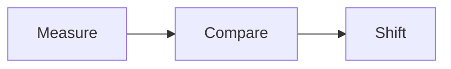

## One short line

Centered.

## Heading and paragraph

We trained our own model, based on a free, openly licensed 8-billion-parameter vision model (Qwen3-VL-8B). That is small enough to run on a single graphics card, so it can run inside a customer's own systems, and their documents never leave them.

## Three paragraph groups

The first group is one sentence.

The second group is a little longer, so the ink box widens when it appears and the right gap shrinks.

The third group closes the slide with a final, medium-length sentence.

## Bullet list

- First bullet with a short line
- Second bullet that runs much longer than the first so it wraps onto a second line in most windows
- Third bullet
  - Nested bullet one
  - Nested bullet two

## Ordered list

1. Measure the ink box
2. Compare top with bottom
3. Compare left with right

## Task cards

- [ ] Write the deck | owner: Jane | due: 2026-10-10 | priority: high
- [x] Measure margins | status: done | project: Vyasa

## Code block

```python
def gaps(ink, frame):
    """Return the four margins of an ink box.

    >>> gaps((10, 20, 90, 80), (0, 0, 100, 100))
    {'top': 20, 'right': 10, 'bottom': 20, 'left': 10}
    """
    left, top, right, bottom = ink
    return {"top": top, "right": frame[2] - right, "bottom": frame[3] - bottom, "left": left}
```

## Table

| Edge | Owner | Rule |
|---|---|---|
| Top | navbar | navbar bottom + reserve |
| Bottom | window | window bottom - reserve |
| Left | stage | stage padding |
| Right | stage | stage padding |

## Callouts

> [!note] Note callout
> A callout has a border and a background, so its box is its ink.

> [!warning] Warning callout
> Second callout under the first.

## Collapsed callout

> [!faq]- Closed question
> This body starts collapsed.

## Blockquote

> The purpose of abstraction is not to be vague, but to create a new semantic level in which one can be absolutely precise.

## Math

The margin rule is $t = b$ and $l = r$.

$$
\text{offset} = \frac{(H_{band} - h_{ink})}{2} - (y_{ink} - y_{band})
$$

## Tabs

:::tabs
::tab{title="First"}
Tab one has a single short line.
::tab{title="Second"}
Tab two has a longer line so the panel height changes when the tab switches.
:::

## Image


## Mermaid



## D2

```d2
measure -> compare -> shift
```

## Definition list

Ink box
: The union of visible text line boxes and replaced elements.

Band
: The area between the top and bottom reserves.

## Mixed content

A lead paragraph introduces the slide.

- One bullet
- Two bullets

```bash
vyasa --port 21299
```

## Tall slide

Paragraph one of a slide that is taller than the band, so it must scroll.

Paragraph two of a slide that is taller than the band, so it must scroll.

Paragraph three of a slide that is taller than the band, so it must scroll.

Paragraph four of a slide that is taller than the band, so it must scroll.

Paragraph five of a slide that is taller than the band, so it must scroll.

Paragraph six of a slide that is taller than the band, so it must scroll.

Paragraph seven of a slide that is taller than the band, so it must scroll.

Paragraph eight of a slide that is taller than the band, so it must scroll.

Paragraph nine of a slide that is taller than the band, so it must scroll.

Paragraph ten of a slide that is taller than the band, so it must scroll.

Paragraph eleven of a slide that is taller than the band, so it must scroll.

Paragraph twelve of a slide that is taller than the band, so it must scroll.

### Detail slide

A downward slide under the tall slide.
