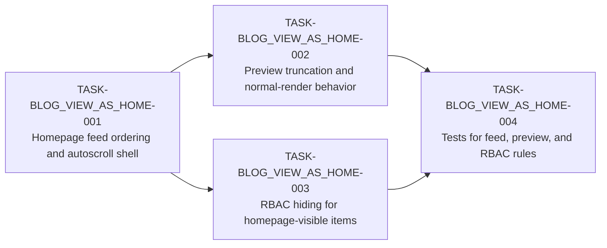

# Blog View As Home Tasks
This task list breaks the approved `BLOG_VIEW_AS_HOME` TRD into tickets that can be picked up by the team without a design meeting.
It is for the TL and implementers who need a sequenced plan for homepage feed rendering, preview truncation, RBAC hiding, and test coverage.

## Task Summary
The table below is the execution spine for the module. It keeps the work small enough to own in one sprint and shows the dependency order at a glance.

| ID | Summary | Points | Sprint | Assignee role | Depends on |
|---|---|---:|---|---|---|
| TASK-BLOG_VIEW_AS_HOME-001 | Build homepage feed ordering and autoscroll shell | 5 | Sprint 1 | Senior | none |
| TASK-BLOG_VIEW_AS_HOME-002 | Implement preview truncation and normal-render behavior | 5 | Sprint 1 | Mid | TASK-BLOG_VIEW_AS_HOME-001 |
| TASK-BLOG_VIEW_AS_HOME-003 | Apply RBAC hiding to homepage-visible items | 3 | Sprint 1 | Mid | TASK-BLOG_VIEW_AS_HOME-001 |
| TASK-BLOG_VIEW_AS_HOME-004 | Add tests for homepage feed, preview, and RBAC rules | 3 | Sprint 1 | Junior | TASK-BLOG_VIEW_AS_HOME-002, TASK-BLOG_VIEW_AS_HOME-003 |

## Dependency Graph
The flow is intentionally linear. The feed shell comes first because the preview and RBAC work both need a stable homepage list to target.

## Detailed Task List

#### TASK-BLOG_VIEW_AS_HOME-001: Build homepage feed ordering and autoscroll shell

- **Type:** Task
- **Epic:** BLOG_VIEW_AS_HOME
- **Sprint:** Sprint 1
- **Points:** 5
- **Assignee:** Senior
- **Assigned to:** 
- **Traces to:** [US-BLOG_VIEW_AS_HOME-004](prd.md#us-blog_view_as_home-004), [US-BLOG_VIEW_AS_HOME-005](prd.md#us-blog_view_as_home-005), [US-BLOG_VIEW_AS_HOME-006](prd.md#us-blog_view_as_home-006)
- **Depends on:** none
- **Description:** Build the root-route feed layer described in [§Architecture Overview](trd.md#architecture-overview) and [§Data Flow](trd.md#data-flow). The task should load visible files, sort them by created date descending, and render a multi-post homepage feed that can grow with autoscroll.
- **Decision budget:**
  - Junior can decide: pagination batch size, viewport trigger threshold, and DOM wrapper names for the feed cards.
  - Escalate to TL/PTL: whether the autoscroll is infinite or paged, and how ties on created date are broken.
- **Acceptance criteria:**
  - [ ] Homepage lists multiple posts in newest-first order.
  - [ ] Feed can load additional content without leaving `/`.
  - [ ] Existing post routes still render normally.
- **Definition of Done:**
  - [ ] Jira ticket updated to Done
  - [ ] Tests passing per [§Testing Strategy](trd.md#testing-strategy)
  - [ ] PR reviewed and merged to module branch
  - [ ] Relevant doc section updated if behavior changed

#### TASK-BLOG_VIEW_AS_HOME-002: Implement preview truncation and normal-render behavior

- **Type:** Task
- **Epic:** BLOG_VIEW_AS_HOME
- **Sprint:** Sprint 1
- **Points:** 5
- **Assignee:** Mid
- **Assigned to:** 
- **Traces to:** [US-BLOG_VIEW_AS_HOME-001](prd.md#us-blog_view_as_home-001), [US-BLOG_VIEW_AS_HOME-002](prd.md#us-blog_view_as_home-002), [US-BLOG_VIEW_AS_HOME-003](prd.md#us-blog_view_as_home-003)
- **Depends on:** TASK-BLOG_VIEW_AS_HOME-001
- **Description:** Implement homepage preview extraction so `%% more %%` truncates only the homepage card while normal article rendering keeps the full post and hides the token. Follow [§Security Design](trd.md#security-design) only insofar as preview rendering must not leak alternate content paths.
- **Decision budget:**
  - Junior can decide: how to split blocks by blank lines, and how preview cards mark continuation affordances.
  - Escalate to TL/PTL: whether nested markdown blocks count as one block or multiple blocks for the 5-block fallback.
- **Acceptance criteria:**
  - [ ] Homepage preview stops at `%% more %%`.
  - [ ] Normal post render does not expose the token.
  - [ ] Documents without `%% more %%` preview the first 5 blocks.
- **Definition of Done:**
  - [ ] Jira ticket updated to Done
  - [ ] Tests passing per [§Testing Strategy](trd.md#testing-strategy)
  - [ ] PR reviewed and merged to module branch
  - [ ] Relevant doc section updated if behavior changed

#### TASK-BLOG_VIEW_AS_HOME-003: Apply RBAC hiding to homepage-visible items

- **Type:** Task
- **Epic:** BLOG_VIEW_AS_HOME
- **Sprint:** Sprint 1
- **Points:** 3
- **Assignee:** Mid
- **Assigned to:** 
- **Traces to:** [US-BLOG_VIEW_AS_HOME-007](prd.md#us-blog_view_as_home-007)
- **Depends on:** TASK-BLOG_VIEW_AS_HOME-001
- **Description:** Wire the homepage feed to the existing RBAC helpers so unauthorized items are filtered out before render. Follow [§Security Design](trd.md#security-design) and keep the policy hide-only, with no placeholder cards or denied-state labels.
- **Decision budget:**
  - Junior can decide: where the filter sits in the feed pipeline and how the filtered collection is represented internally.
  - Escalate to TL/PTL: any change that would surface denied items, placeholders, or counts for hidden content.
- **Acceptance criteria:**
  - [ ] Logged-in users only see items allowed by RBAC.
  - [ ] Unauthorized items do not appear as placeholders.
  - [ ] Public browsing still works when auth is absent.
- **Definition of Done:**
  - [ ] Jira ticket updated to Done
  - [ ] Tests passing per [§Testing Strategy](trd.md#testing-strategy)
  - [ ] PR reviewed and merged to module branch
  - [ ] Relevant doc section updated if behavior changed

#### TASK-BLOG_VIEW_AS_HOME-004: Add tests for homepage feed, preview, and RBAC rules

- **Type:** Task
- **Epic:** BLOG_VIEW_AS_HOME
- **Sprint:** Sprint 1
- **Points:** 3
- **Assignee:** Junior
- **Assigned to:** 
- **Traces to:** [US-BLOG_VIEW_AS_HOME-001](prd.md#us-blog_view_as_home-001), [US-BLOG_VIEW_AS_HOME-002](prd.md#us-blog_view_as_home-002), [US-BLOG_VIEW_AS_HOME-003](prd.md#us-blog_view_as_home-003), [US-BLOG_VIEW_AS_HOME-006](prd.md#us-blog_view_as_home-006), [US-BLOG_VIEW_AS_HOME-007](prd.md#us-blog_view_as_home-007)
- **Depends on:** TASK-BLOG_VIEW_AS_HOME-002, TASK-BLOG_VIEW_AS_HOME-003
- **Description:** Add tests that prove the feed is newest-first, the `%% more %%` preview logic behaves correctly, the 5-block fallback works, and RBAC hides unauthorized items. Follow [§Testing Strategy](trd.md#testing-strategy) and keep the assertions at the behavior level.
- **Decision budget:**
  - Junior can decide: test fixtures, sample markdown content, and assertion style.
  - Escalate to TL/PTL: any fixture or test change that implies a product-rule interpretation rather than a straight verification.
- **Acceptance criteria:**
  - [ ] Tests cover `%% more %%` truncation.
  - [ ] Tests cover 5-block fallback previews.
  - [ ] Tests cover newest-first ordering and RBAC hiding.
- **Definition of Done:**
  - [ ] Jira ticket updated to Done
  - [ ] Tests passing per [§Testing Strategy](trd.md#testing-strategy)
  - [ ] PR reviewed and merged to module branch
  - [ ] Relevant doc section updated if behavior changed

## Parallel Work Plan
`TASK-BLOG_VIEW_AS_HOME-001` is the only hard starting point.
Once the feed shell exists, `TASK-BLOG_VIEW_AS_HOME-002` and `TASK-BLOG_VIEW_AS_HOME-003` can run in parallel because they touch separate behavior layers.
`TASK-BLOG_VIEW_AS_HOME-004` should start after both implementation tasks have landed enough code for stable assertions.

## Open Questions
What batch size should autoscroll request on each load?
Should the feed preserve a deterministic order when created dates tie?

## Approval

Approved by: yeshwanth
Role:        PTL
Date:        2026-04-15
Hash:        ebf1e7e8ec24…
