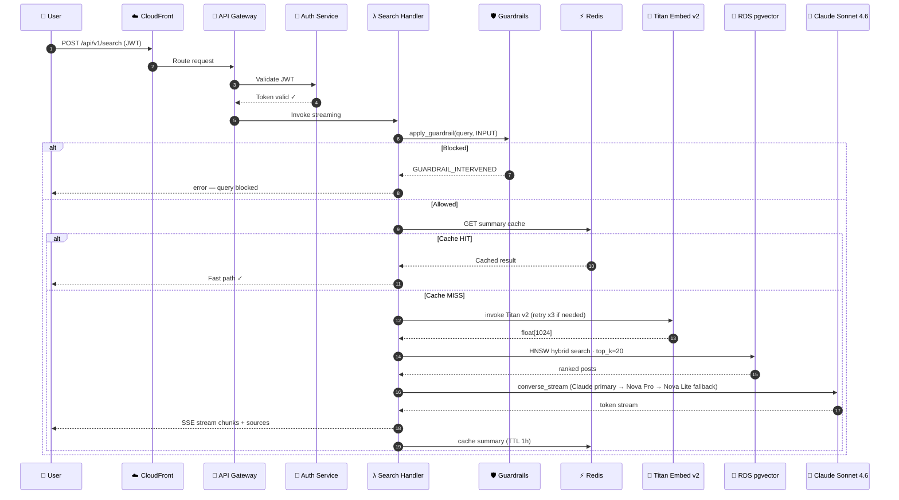
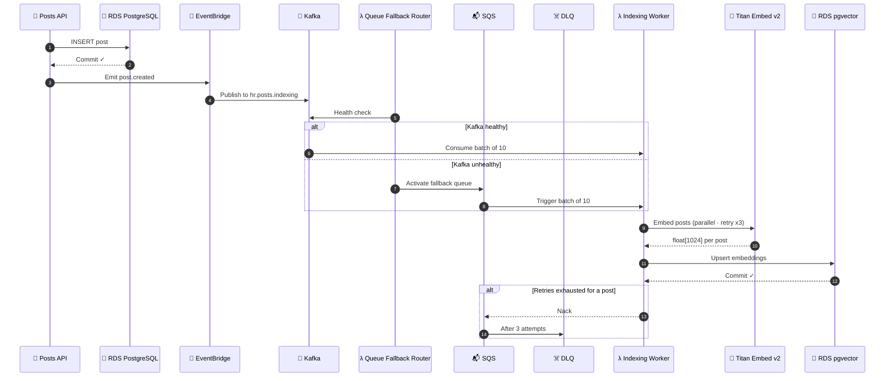
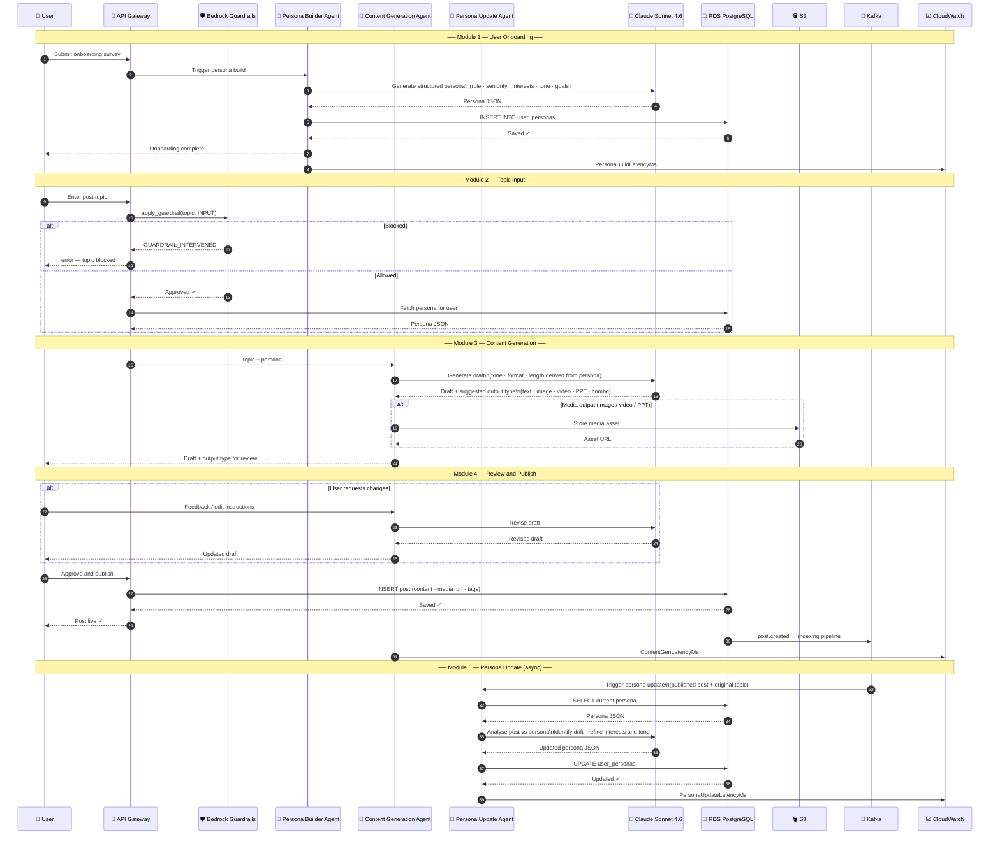
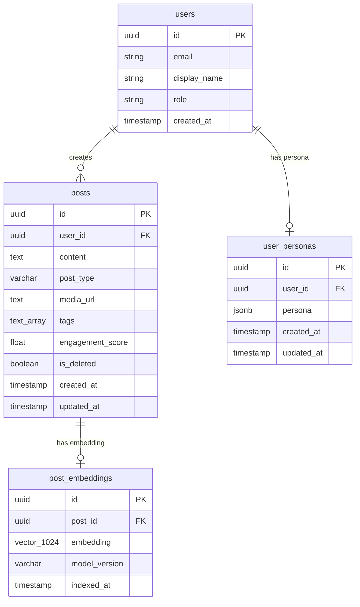
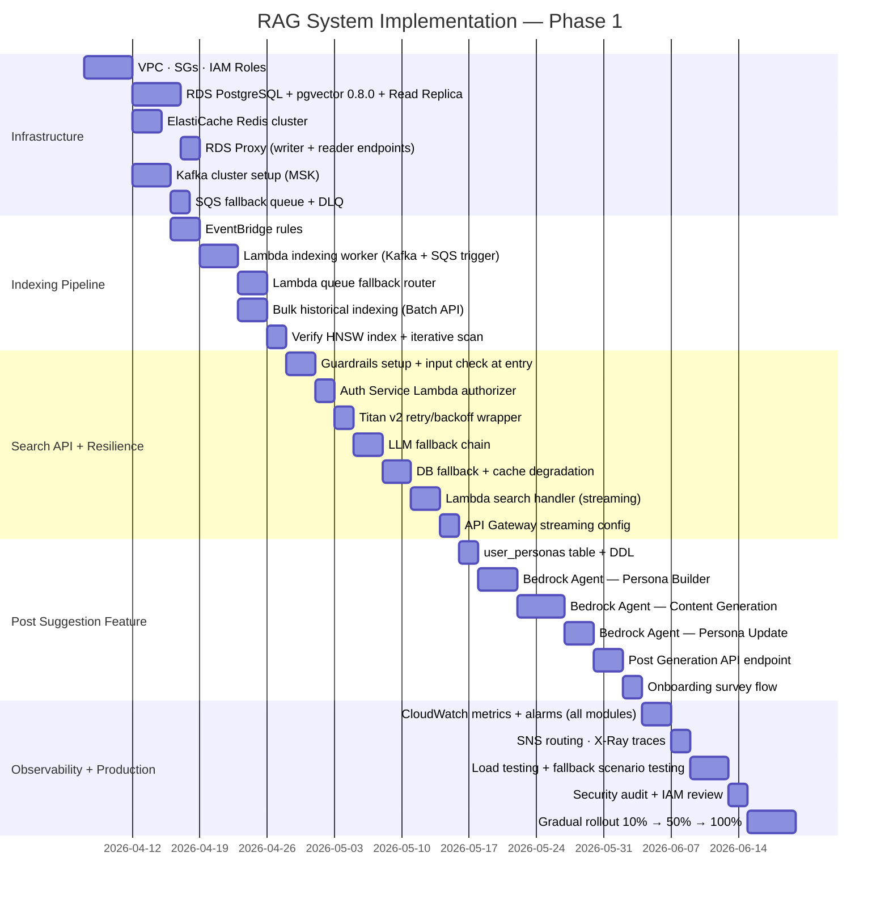
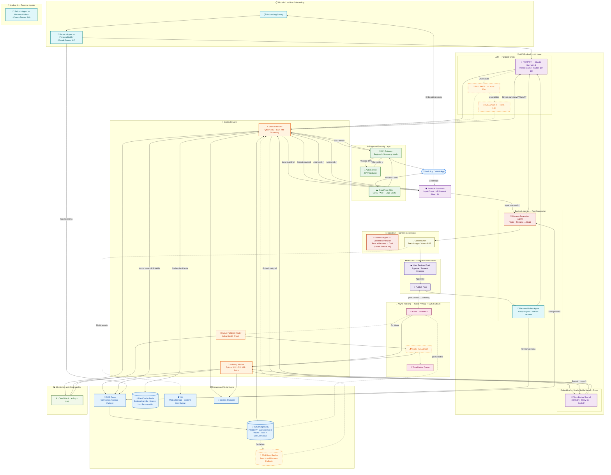

# Production-Ready AI Platform — High-Level Design

## HR Professional Network · Semantic Search · Persona Management · Post Enhancement

> **Version:** 3.2 (Final) · **Date:** April 2026
> **Stack:** AWS Bedrock · Lambda · RDS PostgreSQL + pgvector 0.8.0 · ElastiCache Redis · API Gateway Streaming · Kafka (Primary Queue) · SQS (Fallback Queue)
> **Scope:** Phase 1 — Text Posts · Designed for multimodal extensibility (Phase 2)
> **Updates in v3.1:** Removed Cohere Embed v3 fallback — replaced with Titan v2 retry + exponential backoff. Embedding model is single, stable, and consistent across indexing and search. LLM multi-model fallback chain retained unchanged.
> **Updates in v3.2:** Added Post Suggestion Feature — User Onboarding, Persona Builder, Content Generation Agent, Review & Publish, Persona Update Agent. Persona stored in existing RDS PostgreSQL. Agents use AWS Bedrock Agent orchestration.

---

## Table of Contents

1. [System Overview](#1-system-overview)
2. [Design Principles](#2-design-principles)
3. [Overall Architecture Diagram](#3-overall-architecture-diagram)
4. [Component Breakdown](#4-component-breakdown)
   - 4.1 [Edge and API Layer](#41-edge-and-api-layer)
   - 4.2 [Compute Layer - Lambda Functions](#42-compute-layer---lambda-functions)
   - 4.3 [AWS Bedrock AI Layer](#43-aws-bedrock-ai-layer)
   - 4.4 [Post Suggestion Agents](#44-post-suggestion-agents)
   - 4.5 [Vector Storage Layer and DB Fallback](#45-vector-storage-layer-and-db-fallback)
   - 4.6 [Caching Layer and Cache Fallback](#46-caching-layer-and-cache-fallback)
   - 4.7 [Async Indexing Pipeline - Kafka Primary and SQS Fallback](#47-async-indexing-pipeline---kafka-primary-and-sqs-fallback)
   - 4.8 [Security and IAM](#48-security-and-iam)
   - 4.9 [Monitoring, Observability and Fallback Alerting](#49-monitoring-observability-and-fallback-alerting)
5. [Data Flow Diagrams](#5-data-flow-diagrams)
   - 5.1 [Search Request Flow](#51-search-request-flow)
   - 5.2 [Indexing Pipeline Flow](#52-indexing-pipeline-flow)
   - 5.3 [Post Suggestion Module Flow](#53-post-suggestion-module-flow)
6. [Fallback Strategy Summary](#6-fallback-strategy-summary)
7. [Database Schema](#7-database-schema)
8. [API Contract](#8-api-contract)
9. [Cost Estimation](#9-cost-estimation)
10. [Phase 2 - Multimodal Extensibility](#10-phase-2---multimodal-extensibility)
11. [Implementation Roadmap](#11-implementation-roadmap)
12. [Technology Stack Summary](#12-technology-stack-summary)
13. [Post Suggestion Feature](#13-post-suggestion-feature)

---

## 1. System Overview

### Business Context

| Attribute              | Detail                                                                                                                                                                                                                                                                                                                              |
| ---------------------- | ----------------------------------------------------------------------------------------------------------------------------------------------------------------------------------------------------------------------------------------------------------------------------------------------------------------------------------- |
| **Platform**           | HR-focused professional social network (LinkedIn for HR)                                                                                                                                                                                                                                                                            |
| **Core AI Features**   | 1. **Semantic Search** — RAG pipeline over posts with LLM-generated summary + citations · 2. **Persona Management** — Onboarding survey → structured user persona, refined after every published post · 3. **Post Enhancement** — Topic + persona → AI-generated draft (text / image / video / PPT), reviewed and published by user |
| **User Flow (Search)** | User types query → Input guardrail check → Retrieve relevant posts → LLM streams summary with sources                                                                                                                                                                                                                               |
| **User Flow (Post)**   | User enters topic → Persona loaded → Agent generates draft → User reviews → Publish → Persona updated                                                                                                                                                                                                                               |
| **Phase 1 Scope**      | Text posts · Semantic search · Persona management · Post generation                                                                                                                                                                                                                                                                 |
| **Phase 2 Scope**      | Images, videos — multimodal embeddings (architecture already accommodates this)                                                                                                                                                                                                                                                     |
| **AWS Constraint**     | 100% AWS-native services only (Bedrock, Lambda, RDS, etc.)                                                                                                                                                                                                                                                                          |

### Key Architecture Decisions

| Decision                   | Choice                                                      | Rationale                                                                                                                                                        |
| -------------------------- | ----------------------------------------------------------- | ---------------------------------------------------------------------------------------------------------------------------------------------------------------- |
| Orchestration              | **Lambda** (not AgentCore)                                  | RAG is a deterministic pipeline, not an autonomous agent                                                                                                         |
| Embedding (Phase 1)        | **Titan Embed Text v2 — single model, retry/backoff**       | Embedding vectors are model-specific; switching models at runtime produces meaningless similarity scores. One stable model with retries is the correct approach. |
| Embedding resilience       | **Exponential backoff (max 3 retries)**                     | Bedrock throttling is transient; retries resolve it. For indexing failures, DLQ handles retry. For search failures, graceful error is returned.                  |
| Embedding (Phase 2)        | **Nova Multimodal Embeddings** (planned migration)          | Unified text + image + video + audio — entire corpus re-embedded as a coordinated migration, not a runtime switch                                                |
| LLM Primary                | **Claude Sonnet 4.6**                                       | Best citation accuracy; $3/$15 per 1M tokens                                                                                                                     |
| LLM Fallback 1             | **Amazon Nova Pro**                                         | Auto-failover on Claude unavailability — LLMs are stateless per call; switching is safe                                                                          |
| LLM Fallback 2             | **Amazon Nova Lite**                                        | Last-resort fallback; faster and cheaper                                                                                                                         |
| Vector DB                  | **RDS PostgreSQL + pgvector 0.8.0** + read replica fallback | Already in stack; identical pgvector perf to Aurora; no new infra needed                                                                                         |
| Cache                      | **ElastiCache Redis** + graceful degradation                | Cache miss → proceed without cache; alert on Redis failure                                                                                                       |
| Async Queue                | **Kafka (primary)** + **SQS (fallback)**                    | Kafka for throughput + ordering; SQS as managed AWS fallback                                                                                                     |
| Streaming                  | **API Gateway Regional + Lambda Streaming**                 | Nov 2025 native REST streaming; bypasses 29s timeout wall                                                                                                        |
| Auth                       | **Generic Auth Service**                                    | Decoupled from specific provider; pluggable JWT validation                                                                                                       |
| Input Safety               | **Guardrails applied at request entry**                     | Reject bad input before any compute or DB cost is incurred                                                                                                       |
| **Post Suggestion Agents** | **AWS Bedrock Agents**                                      | Multi-step orchestration, memory, tool use — not plain Lambda invocations                                                                                        |
| **Persona Storage**        | **Existing RDS PostgreSQL**                                 | No new DB; reuses existing primary + read replica + RDS Proxy fallback                                                                                           |

---

## 2. Design Principles

```
✅ Simplicity First     — Deterministic pipeline, not an agent. No unnecessary abstraction.
✅ AWS-Native Only      — Bedrock, Lambda, RDS, ElastiCache, EventBridge, SQS, CloudWatch.
✅ Modular              — Each component (embed, retrieve, rerank, summarize) is independently replaceable.
✅ Resilient            — Every critical path has a defined fallback. No single point of failure.
✅ Embedding Stability  — One embedding model (Titan v2) across all indexing and search. No runtime
                          model switching. Resilience via retry + backoff, not model substitution.
✅ Extensible           — Phase 2 multimodal adds components; Phase 1 components are untouched.
✅ Cost-Optimized       — Prompt caching, multi-layer Redis cache, batch indexing at 50% discount.
✅ Observable           — X-Ray tracing + CloudWatch custom metrics on every pipeline stage.
✅ Secure               — Least-privilege IAM, Secrets Manager, Bedrock Guardrails, Auth Service JWT.
✅ Production-Ready     — Streaming responses, RDS Proxy connection pooling, DLQ for indexing failures.
✅ Fail-Safe            — Guardrails applied at input entry point before any downstream cost is incurred.
```

---

## 3. Overall Architecture Diagram

```mermaid
flowchart TD
    classDef user fill:#e8f4fd,stroke:#1a73e8,stroke-width:2px,color:#0d47a1
    classDef edge fill:#e8f5e9,stroke:#2e7d32,stroke-width:2px,color:#1b5e20
    classDef compute fill:#fff3e0,stroke:#e65100,stroke-width:2px,color:#bf360c
    classDef bedrock fill:#f3e5f5,stroke:#6a1b9a,stroke-width:2px,color:#4a148c
    classDef storage fill:#e3f2fd,stroke:#1565c0,stroke-width:2px,color:#0d47a1
    classDef async fill:#fce4ec,stroke:#880e4f,stroke-width:2px,color:#880e4f
    classDef monitor fill:#f1f8e9,stroke:#33691e,stroke-width:2px,color:#1b5e20
    classDef fallback fill:#fff8e1,stroke:#f57f17,stroke-width:2px,stroke-dasharray:5 5,color:#e65100
    classDef persona fill:#e0f7fa,stroke:#00838f,stroke-width:2px,color:#004d57
    classDef contentgen fill:#fbe9e7,stroke:#bf360c,stroke-width:2px,color:#7f0000
    classDef review fill:#ede7f6,stroke:#4527a0,stroke-width:2px,color:#1a0033
    classDef output fill:#f9fbe7,stroke:#827717,stroke-width:2px,color:#4e3b00

    %% Post Suggestion Modules
    subgraph ONBOARD["📋 Module 1 — User Onboarding"]
        SURVEY["📋 Onboarding Survey"]:::persona
        PERSONA_BUILD["🧠 Bedrock Agent — Persona Builder\n(Claude Sonnet 4.6)"]:::persona
    end

    subgraph CONTENT_MOD["🤖 Module 2 — Content Generation"]
        CONTENT_AGENT["🤖 Bedrock Agent — Content Generation\nTopic + Persona → Draft\n(Claude Sonnet 4.6)"]:::contentgen
        DRAFT["📄 Content Draft\nText · Image · Video · PPT"]:::output
    end

    subgraph REVIEW_MOD["👁️ Module 3 — Review and Publish"]
        USER_REVIEW["👁️ User Reviews Draft\nApprove / Request Changes"]:::review
        PUBLISH["🚀 Publish Post"]:::review
    end

    subgraph PERSONA_UPDATE_MOD["🔄 Module 4 — Persona Update"]
        PERSONA_AGENT["🔄 Bedrock Agent — Persona Update\n(Claude Sonnet 4.6)"]:::persona
    end

    %% User Layer
    UA(["👤 Web App / Mobile App"]):::user

    %% Edge & Security Layer
    subgraph EDGE["🌐 Edge & Security Layer"]
        CF["☁️ CloudFront CDN\nDDoS · WAF · Edge Cache"]:::edge
        APIGW["🔀 API Gateway\nRegional · Streaming Mode\nResponseTransferMode: STREAM"]:::edge
        AUTH["🔐 Auth Service\nJWT Validation\nToken Verification"]:::edge
    end

    %% Guardrails — applied at entry
    BGR["🛡️ Bedrock Guardrails\nInput Check at Entry Point\nHR Content Filter · PII Redaction\nTopic Deny · Output Filter"]:::bedrock

    %% Compute Layer
    subgraph COMPUTE["⚡ Compute Layer"]
        LSEARCH["λ Search Handler\nPython 3.12 · 1024 MB\nTimeout: 300s · Streaming\nFallback Orchestration Logic"]:::compute
        LINDEX["λ Indexing Worker\nPython 3.12 · 512 MB\nTimeout: 60s · Batch"]:::compute
        LCBK["λ Queue Fallback Router\nKafka Health Check\nRoute to SQS on Failure"]:::compute
    end

    %% Bedrock AI Layer
    subgraph BEDROCK["🤖 AWS Bedrock — AI Layer"]
        subgraph EMBED_GRP["Embedding — Single Stable Model + Retry"]
            BTE["📐 Titan Embed Text v2\namazon.titan-embed-text-v2:0\n1024-dim · normalize=true\nRetry: 3x · Exponential Backoff\n$0.00002 per 1K tokens"]:::bedrock
        end
        subgraph LLM_GRP["LLM — Fallback Chain"]
            BCLAUDE["💬 PRIMARY\nClaude Sonnet 4.6\nus.anthropic.claude-sonnet-4-6\n$3/$15 per 1M · Prompt Cache"]:::bedrock
            BNOVA_PRO["💬 FALLBACK 1\nAmazon Nova Pro\namazon.nova-pro-v1:0\n$0.80/$3.20 per 1M"]:::fallback
            BNOVA_LITE["💬 FALLBACK 2\nAmazon Nova Lite\namazon.nova-lite-v1:0\n$0.06/$0.24 per 1M"]:::fallback
        end
        subgraph AGENTS_GRP["Bedrock Agents — Post Suggestion"]
            AGT_CGA["🤖 Content Generation Agent\nTopic + Persona → Draft"]:::contentgen
            AGT_PA["🔄 Persona Update Agent\nAnalyses post · Refines persona"]:::persona
        end
        BNOVA_MM["🎯 Nova Multimodal Embed\n[Phase 2 — Planned Migration]\namazon.nova-2-multimodal-embeddings-v1:0\n3072-dim · Full corpus re-embed"]:::bedrock
    end

    %% Storage Layer
    subgraph STORAGE["🗄️ Storage & Vector Layer"]
        RDS[("🐘 RDS PostgreSQL\n[PRIMARY WRITE + READ]\n+ pgvector 0.8.0\nHNSW Index · relaxed_order")]:::storage
        RDS_RR[("🐘 RDS Read Replica\n[SEARCH FALLBACK]\nVector search on primary failure")]:::fallback
        RDSP["🔗 RDS Proxy\nConnection Pooling\nFailover Transparent"]:::storage
        REDIS[("⚡ ElastiCache Redis\n[PRIMARY CACHE]\nEmbedding 24h · Search 1h\nSummary 6h")]:::storage
        S3["🪣 S3 Bucket\nMedia Storage\n[Phase 2: Images · Videos]"]:::storage
        SM["🔑 Secrets Manager\nDB Credentials\nRotation Enabled"]:::storage
    end

    %% Async Indexing Pipeline
    subgraph ASYNC["📨 Async Indexing Pipeline — Kafka Primary + SQS Fallback"]
        KAFKA["📨 Kafka\n[PRIMARY QUEUE]\npost.created · post.updated\nHigh Throughput · Ordered"]:::async
        SQS["📬 SQS Queue\n[FALLBACK QUEUE]\nActivated on Kafka failure\nBatch Size: 10 · Visibility: 60s"]:::fallback
        DLQ["☠️ SQS Dead Letter\n3 Retries · 4-Day Retention\nAlert on any message arrival"]:::async
    end

    %% Monitoring Layer
    subgraph MONITOR["📊 Monitoring & Observability"]
        CW["📈 CloudWatch\nCustom Metrics · Dashboards\nAlarms · Fallback Trigger Alerts\nCost Tracking"]:::monitor
        XRAY["🔍 AWS X-Ray\nDistributed Tracing\nFallback Path Visibility"]:::monitor
        SNS["🔔 SNS\nAlert Routing\nPagerDuty · Slack · Email"]:::monitor
    end

    %% Main Search Flow
    UA -->|"HTTPS Request + JWT"| CF
    CF -->|"Route to API"| APIGW
    APIGW -->|"Validate JWT"| AUTH
    AUTH -->|"Token valid ✓"| APIGW
    APIGW -->|"Invoke Streaming"| LSEARCH

    LSEARCH -->|"1st: Validate input query"| BGR
    BGR -->|"Input approved ✓"| LSEARCH

    LSEARCH <-->|"Cache check/write\nFallback: proceed without cache"| REDIS

    LSEARCH -->|"Generate embedding\nRetry x3 · backoff 1s/2s/4s"| BTE
    BTE -->|"float[1024] or\ngraceful error after retries"| LSEARCH

    LSEARCH -->|"Vector search [PRIMARY]"| RDSP
    RDSP -->|"HNSW search"| RDS
    RDS -.->|"On primary failure\n→ FALLBACK"| RDS_RR
    RDS_RR -.->|"Search results"| LSEARCH
    RDS -->|"Search results"| LSEARCH

    LSEARCH -->|"Stream summary [PRIMARY]"| BCLAUDE
    BCLAUDE -.->|"On unavailability\n→ FALLBACK 1"| BNOVA_PRO
    BNOVA_PRO -.->|"On unavailability\n→ FALLBACK 2"| BNOVA_LITE
    BCLAUDE -->|"Stream chunks"| LSEARCH
    BNOVA_PRO -.->|"Stream chunks"| LSEARCH
    BNOVA_LITE -.->|"Stream chunks"| LSEARCH

    LSEARCH -->|"Filter output"| BGR
    BGR -->|"Output approved ✓"| LSEARCH
    LSEARCH -->|"SSE token stream"| APIGW
    APIGW -->|"Token stream"| UA

    LSEARCH -->|"Get DB creds"| SM
    LINDEX -->|"Get DB creds"| SM

    RDS -.->|"post.created event"| KAFKA
    KAFKA -->|"Consume batch"| LINDEX
    KAFKA -.->|"On Kafka failure\nroute via fallback"| LCBK
    LCBK -->|"Activate SQS fallback"| SQS
    SQS -->|"Trigger batch\n[FALLBACK PATH]"| LINDEX
    SQS -.->|"On 3 retries failed"| DLQ

    LINDEX -->|"Embed · Retry x3 · Backoff"| BTE
    BTE -->|"float[1024] or DLQ on exhaustion"| LINDEX
    LINDEX -->|"Upsert embedding"| RDSP

    S3 -.->|"[Phase 2] media events"| KAFKA
    BNOVA_MM -.->|"[Phase 2] planned migration"| LINDEX

    LSEARCH -->|"Traces + Metrics"| XRAY
    LINDEX -->|"Traces + Metrics"| XRAY
    LCBK -->|"Fallback trigger alert"| CW
    XRAY --> CW
    LSEARCH -->|"Custom metrics + fallback events"| CW
    LINDEX -->|"Custom metrics"| CW
    CW -->|"Alarms"| SNS

    %% Post Suggestion flows
    UA -->|"Onboarding survey"| SURVEY
    SURVEY --> PERSONA_BUILD
    PERSONA_BUILD --> BCLAUDE
    PERSONA_BUILD -->|"Save persona"| RDSP

    UA -->|"Enter topic"| BGR
    BGR -->|"Input approved ✓"| AGT_CGA
    RDSP -->|"Load persona"| AGT_CGA
    AGT_CGA --> BCLAUDE
    AGT_CGA --> DRAFT
    DRAFT -.->|"Media assets"| S3

    DRAFT --> USER_REVIEW
    USER_REVIEW -->|"Approved"| PUBLISH
    PUBLISH -->|"post.created → indexing"| KAFKA

    PUBLISH --> AGT_PA
    AGT_PA --> BCLAUDE
    AGT_PA -->|"Refresh persona"| RDSP
```



---

## 4. Component Breakdown

### 4.1 Edge and API Layer

#### Amazon CloudFront

- **Purpose:** Global CDN, edge caching for non-personalized results, WAF + DDoS protection via AWS Shield
- **Config:** Regional distribution → API Gateway origin; TTL 0 for search (dynamic), TTL 3600 for static assets
- **Fallback:** Multi-region by default — no additional fallback needed at this layer

#### Amazon API Gateway (Regional — NOT Edge-Optimized)

> ⚠️ **Critical:** Must use **Regional** endpoint, not Edge-Optimized. Edge-Optimized has a 30-second idle timeout that breaks LLM streaming.

- **Type:** REST API with **Response Streaming** (`ResponseTransferMode: STREAM`) — GA November 2025
- **Integration:** Lambda proxy with streaming invocation (`response-streaming-invocations`)
- **Timeout:** 300,000ms (5 min) — well within the 15-min stream limit
- **Auth:** JWT authorizer backed by the Auth Service (300s cache TTL)
- **Throttle:** 10 requests/sec per user, burst 50

```yaml
# CloudFormation / CDK snippet for streaming
StreamMethod:
  Type: AWS::ApiGateway::Method
  Properties:
    Integration:
      Type: AWS_PROXY
      IntegrationHttpMethod: POST
      Uri: !Sub 'arn:aws:apigateway:${AWS::Region}:lambda:path/2021-11-15/functions/${SearchLambda.Arn}/response-streaming-invocations'
      ResponseTransferMode: STREAM
      TimeoutInMillis: 300000
```

#### Auth Service (Generic Placeholder)

The system uses a **decoupled Auth Service** for JWT token validation. This is kept as a generic placeholder, independent of any specific identity provider. The Auth Service is invoked by API Gateway via a Lambda authorizer.

- **Contract:** Accepts `Authorization: Bearer <jwt>` header; returns allow/deny IAM policy
- **Implementation options:** Auth0, Okta, custom JWT validator, or any OAuth2-compliant IdP
- **Caching:** API Gateway caches the authorizer response for 5 minutes to reduce latency
- **Fallback:** Auth Service failure → API Gateway returns `401 Unauthorized` immediately; no downstream compute is invoked

```python
# lambda/authorizer.py — Auth Service Lambda authorizer (provider-agnostic)
import jwt

def lambda_handler(event, context):
    token = event['authorizationToken'].replace('Bearer ', '')
    try:
        payload = jwt.decode(token, get_public_key(), algorithms=['RS256'],
                             audience=AUTH_SERVICE_AUDIENCE)
        return generate_policy(payload['sub'], 'Allow', event['methodArn'])
    except jwt.ExpiredSignatureError:
        return generate_policy('user', 'Deny', event['methodArn'])
    except Exception:
        return generate_policy('user', 'Deny', event['methodArn'])

def generate_policy(principal_id, effect, resource):
    return {
        'principalId': principal_id,
        'policyDocument': {
            'Version': '2012-10-17',
            'Statement': [{'Action': 'execute-api:Invoke',
                           'Effect': effect, 'Resource': resource}]
        }
    }
```

---

### 4.2 Compute Layer - Lambda Functions

#### Lambda: Search Handler

| Parameter   | Value                         | Reason                                 |
| ----------- | ----------------------------- | -------------------------------------- |
| Runtime     | Python 3.12                   | Latest LTS, native async support       |
| Memory      | 1024 MB                       | Embedding + pgvector result processing |
| **Timeout** | **300 seconds**               | LLM streaming safety margin            |
| Invoke Mode | `RESPONSE_STREAM`             | Required for token streaming           |
| VPC         | Same VPC as RDS + ElastiCache | Private network access                 |
| Concurrency | Reserved: 100                 | Prevent DB connection exhaustion       |

```python
# lambda/search_handler.py — core pipeline (simplified)
import json, hashlib, boto3, redis, psycopg_pool, logging
from aws_xray_sdk.core import xray_recorder, patch_all

patch_all()
logger = logging.getLogger()
bedrock = boto3.client('bedrock-runtime')
cloudwatch = boto3.client('cloudwatch')

redis_client = redis.Redis(host=ELASTICACHE_ENDPOINT, port=6379,
                           decode_responses=True, socket_timeout=1.0)

pool = psycopg_pool.ConnectionPool(
    conninfo=f"host={RDS_PROXY_ENDPOINT} dbname=hr_network user=search_user password={get_secret()}",
    min_size=1, max_size=5
)

def lambda_handler(event, responseStream, context):
    body = json.loads(event['body'])
    query = preprocess_query(body['query'])
    filters = body.get('filters', {})

    http_stream = awslambda.HttpResponseStream.from(responseStream, {
        'statusCode': 200,
        'headers': {'Content-Type': 'text/event-stream', 'Cache-Control': 'no-cache'}
    })

    # ── STEP 1: GUARDRAIL CHECK ON INPUT (before any compute cost) ──
    if apply_input_guardrail(query) == 'BLOCKED':
        http_stream.write(f"data: {json.dumps({'type':'error','code':'GUARDRAIL_BLOCKED','message':'Query blocked by content policy'})}\n\n")
        http_stream.end()
        return

    # ── STEP 2: CACHE CHECK ──
    cache_key = f"summary:{hashlib.sha256((query + json.dumps(filters, sort_keys=True)).encode()).hexdigest()[:16]}"
    cached = safe_cache_get(cache_key)
    if cached:
        http_stream.write(cached)
        http_stream.end()
        return

    # ── STEP 3: EMBEDDING — single model, retry/backoff ──
    try:
        embedding = generate_embedding_with_retry(query)
    except RuntimeError as e:
        logger.error(f"Embedding failed after all retries: {e}")
        http_stream.write(f"data: {json.dumps({'type':'error','code':'EMBEDDING_UNAVAILABLE','message':'Search temporarily unavailable. Please try again shortly.'})}\n\n")
        http_stream.end()
        return

    # ── STEP 4: VECTOR SEARCH (with DB fallback) ──
    posts = vector_search_with_fallback(embedding, filters, top_k=20)
    top_posts = rerank_by_score(posts, top_k=5)

    # ── STEP 5: LLM STREAM (with multi-model fallback) ──
    full_response = ""
    for chunk in stream_summary_with_fallback(query, top_posts):
        http_stream.write(f"data: {json.dumps({'type':'chunk','text':chunk})}\n\n")
        full_response += chunk

    # ── STEP 6: RESPOND + CACHE ──
    http_stream.write(f"data: {json.dumps({'type':'sources','data':format_sources(top_posts)})}\n\n")
    http_stream.write("data: [DONE]\n\n")
    http_stream.end()
    safe_cache_set(cache_key, full_response, ttl=3600)

lambda_handler = awslambda.streamifyResponse(lambda_handler)
```

#### Lambda: Indexing Worker

| Parameter   | Value                                                                            |
| ----------- | -------------------------------------------------------------------------------- |
| Runtime     | Python 3.12                                                                      |
| Memory      | 512 MB                                                                           |
| Timeout     | 60 seconds                                                                       |
| Trigger     | Kafka (primary) or SQS (fallback) — same handler, different event source mapping |
| Concurrency | Unreserved (scales with queue backlog)                                           |

#### Lambda: Queue Fallback Router

| Parameter | Value                                                                 |
| --------- | --------------------------------------------------------------------- |
| Runtime   | Python 3.12                                                           |
| Memory    | 256 MB                                                                |
| Timeout   | 30 seconds                                                            |
| Trigger   | EventBridge scheduled rule (every 60s)                                |
| Purpose   | Monitors Kafka health; activates SQS fallback if Kafka is unavailable |

```python
# lambda/queue_fallback_router.py
import boto3, logging
from kafka.admin import KafkaAdminClient

logger = logging.getLogger()
cloudwatch = boto3.client('cloudwatch')
lambda_client = boto3.client('lambda')

def lambda_handler(event, context):
    kafka_healthy = check_kafka_health()
    if not kafka_healthy:
        logger.warning("Kafka unhealthy — activating SQS fallback queue")
        emit_metric('KafkaFallbackActivated', 1)
        toggle_event_source(KAFKA_ESM_UUID, enabled=False)
        toggle_event_source(SQS_ESM_UUID, enabled=True)
    else:
        toggle_event_source(KAFKA_ESM_UUID, enabled=True)
        toggle_event_source(SQS_ESM_UUID, enabled=False)

def check_kafka_health() -> bool:
    try:
        admin = KafkaAdminClient(bootstrap_servers=KAFKA_BROKERS, request_timeout_ms=3000)
        admin.list_topics()
        admin.close()
        return True
    except Exception as e:
        logger.error(f"Kafka health check failed: {e}")
        return False

def emit_metric(name, value):
    cloudwatch.put_metric_data(
        Namespace='RAG/Fallbacks',
        MetricData=[{'MetricName': name, 'Value': value, 'Unit': 'Count'}]
    )
```

---

### 4.3 AWS Bedrock AI Layer

#### Embedding Model — Amazon Titan Embed Text v2 (Single Stable Model)

> **Design decision (v3.1):** Titan Embed Text v2 is the **only** embedding model used across both indexing and search. There is no runtime model switching. Resilience is achieved through **retry with exponential backoff**. Switching embedding models at runtime would produce vectors in different geometric spaces, making cosine similarity scores meaningless and HNSW search results corrupt. If all retries are exhausted on the search path, a graceful error is returned to the user. On the indexing path, the SQS DLQ handles retry.

| Attribute                          | Value                                                                                                       |
| ---------------------------------- | ----------------------------------------------------------------------------------------------------------- |
| **Model ID**                       | `amazon.titan-embed-text-v2:0`                                                                              |
| **Dimensions**                     | 1024 (used consistently across all indexing and search)                                                     |
| **Max Input**                      | 8,192 tokens / 50,000 characters                                                                            |
| **Normalization**                  | L2 (`"normalize": true`) — required for cosine similarity with pgvector `<=>`                               |
| **Price**                          | $0.00002 per 1K input tokens                                                                                |
| **Resilience**                     | Retry × 3 with exponential backoff (1s → 2s → 4s)                                                           |
| **On retry exhaustion (search)**   | Return graceful error to user: "Search temporarily unavailable"                                             |
| **On retry exhaustion (indexing)** | Message goes to SQS DLQ; retried later; post indexed asynchronously                                         |
| **Phase 2 migration**              | Full corpus re-embed with Nova Multimodal Embeddings — coordinated planned migration, not runtime switching |

```python
# lib/embedding.py — Single model with retry + exponential backoff

import time, json, boto3, logging
from botocore.exceptions import ClientError
from aws_xray_sdk.core import xray_recorder

logger = logging.getLogger()
bedrock = boto3.client('bedrock-runtime')

EMBEDDING_MODEL_ID = 'amazon.titan-embed-text-v2:0'
MAX_RETRIES = 3
RETRIABLE_ERROR_CODES = {
    'ThrottlingException',
    'ServiceUnavailableException',
    'ModelTimeoutException',
    'RequestTimeout',
    'InternalServerException'
}

@xray_recorder.capture('generate_embedding_with_retry')
def generate_embedding_with_retry(text: str) -> list[float]:
    last_error = None

    for attempt in range(MAX_RETRIES):
        try:
            resp = bedrock.invoke_model(
                modelId=EMBEDDING_MODEL_ID,
                body=json.dumps({
                    "inputText": text,
                    "dimensions": 1024,
                    "normalize": True
                }),
                contentType='application/json',
                accept='application/json'
            )
            return json.loads(resp['body'].read())['embedding']

        except ClientError as e:
            error_code = e.response['Error']['Code']
            if error_code in RETRIABLE_ERROR_CODES:
                last_error = e
                wait_secs = 2 ** attempt
                logger.warning(
                    f"Titan embed attempt {attempt + 1}/{MAX_RETRIES} failed "
                    f"({error_code}). Retrying in {wait_secs}s."
                )
                emit_retry_metric(attempt + 1)
                time.sleep(wait_secs)
            else:
                logger.error(f"Non-retriable embedding error: {error_code} — {e}")
                raise

    logger.error(f"Titan embed failed after {MAX_RETRIES} retries. Last error: {last_error}")
    emit_retry_exhausted_metric()
    raise RuntimeError(f"Embedding service unavailable after {MAX_RETRIES} attempts: {last_error}")
```

#### LLM — Claude Sonnet 4.6 (Primary)

| Attribute                                | Value                                                                        |
| ---------------------------------------- | ---------------------------------------------------------------------------- |
| **Model ID (cross-region, recommended)** | `us.anthropic.claude-sonnet-4-6-20260217-v1:0`                               |
| **Model ID (single-region)**             | `anthropic.claude-sonnet-4-6`                                                |
| **Model ID (global)**                    | `global.anthropic.claude-sonnet-4-6`                                         |
| **Price**                                | $3/1M input · $15/1M output                                                  |
| **Prompt caching**                       | ✅ Enabled on system prompt (0.1x read rate = 90% savings on repeated calls) |
| **Temperature**                          | 0.3 (factual summaries)                                                      |
| **Max tokens**                           | 1024                                                                         |

#### LLM — Amazon Nova Pro (Fallback 1)

| Attribute          | Value                                                                          |
| ------------------ | ------------------------------------------------------------------------------ |
| **Model ID**       | `amazon.nova-pro-v1:0`                                                         |
| **Price**          | $0.80/1M input · $3.20/1M output                                               |
| **When triggered** | Claude ThrottlingException, ModelTimeoutException, ServiceUnavailableException |

#### LLM — Amazon Nova Lite (Fallback 2)

| Attribute          | Value                                               |
| ------------------ | --------------------------------------------------- |
| **Model ID**       | `amazon.nova-lite-v1:0`                             |
| **Price**          | $0.06/1M input · $0.24/1M output                    |
| **When triggered** | Both Claude and Nova Pro unavailable                |
| **Trade-off**      | Faster, cheaper; summary quality lower than primary |

```python
# lib/llm.py — LLM fallback chain

LLM_MODELS = [
    {
        'model_id': 'us.anthropic.claude-sonnet-4-6-20260217-v1:0',
        'name': 'claude-sonnet-4-6',
        'supports_prompt_cache': True,
        'max_tokens': 1024,
        'temperature': 0.3
    },
    {
        'model_id': 'amazon.nova-pro-v1:0',
        'name': 'nova-pro',
        'supports_prompt_cache': False,
        'max_tokens': 1024,
        'temperature': 0.3
    },
    {
        'model_id': 'amazon.nova-lite-v1:0',
        'name': 'nova-lite',
        'supports_prompt_cache': False,
        'max_tokens': 512,
        'temperature': 0.3
    }
]

RETRIABLE_LLM_ERRORS = (
    'ThrottlingException', 'ServiceUnavailableException',
    'ModelTimeoutException', 'ModelNotReadyException'
)

@xray_recorder.capture('stream_summary_with_fallback')
def stream_summary_with_fallback(query: str, posts: list):
    context = build_context(posts)
    last_error = None

    for model in LLM_MODELS:
        try:
            system = build_system_prompt(model)
            response_stream = bedrock.converse_stream(
                modelId=model['model_id'],
                messages=[{'role': 'user', 'content': [{'text': f"Query: {query}\n\nPosts:\n{context}"}]}],
                system=system,
                inferenceConfig={'maxTokens': model['max_tokens'], 'temperature': model['temperature']},
                guardrailConfig={'guardrailIdentifier': GUARDRAIL_ID, 'guardrailVersion': '1', 'trace': 'enabled'}
            )

            if model['name'] != 'claude-sonnet-4-6':
                emit_llm_fallback_metric(model['name'])
                logger.warning(f"LLM fallback activated: using {model['name']}")

            for event in response_stream['stream']:
                if 'contentBlockDelta' in event:
                    delta = event['contentBlockDelta']['delta']
                    if 'text' in delta:
                        yield delta['text']
                elif 'metadata' in event:
                    log_token_usage(event['metadata']['usage'], model['name'])
            return

        except Exception as e:
            if any(err in type(e).__name__ for err in RETRIABLE_LLM_ERRORS):
                last_error = e
                logger.warning(f"LLM {model['name']} failed: {type(e).__name__}. Trying next.")
                continue
            raise

    raise RuntimeError(f"All LLM models failed. Last error: {last_error}")
```

#### Bedrock Guardrails — HR Content Filter

Applied **first on raw user input** (Step 1, before any compute), then again on LLM output before streaming to the user.

```python
def apply_input_guardrail(query: str) -> str:
    try:
        response = bedrock.apply_guardrail(
            guardrailIdentifier=GUARDRAIL_ID,
            guardrailVersion='1',
            source='INPUT',
            content=[{'text': {'text': query}}]
        )
        if response.get('action') == 'GUARDRAIL_INTERVENED':
            emit_guardrail_block_metric()
            return 'BLOCKED'
        return 'ALLOWED'
    except Exception as e:
        logger.error(f"Guardrail check failed: {e}. Proceeding without input filter.")
        emit_metric('GuardrailCheckFailed', 1)
        return 'ALLOWED'

guardrail_config = bedrock_control.create_guardrail(
    name='hr-rag-content-filter',
    topicPolicyConfig={'topicsConfig': [
        {'name': 'Hiring Discrimination', 'type': 'DENY',
         'definition': 'Content promoting age/gender/race/disability discrimination in hiring'},
        {'name': 'Confidential Employee Data', 'type': 'DENY',
         'definition': 'SSN, salary details, disciplinary records, medical records'},
        {'name': 'Workplace Harassment', 'type': 'DENY',
         'definition': 'Sexual harassment, bullying, hostile workplace content'},
    ]},
    contentPolicyConfig={'filtersConfig': [
        {'type': 'HATE',       'inputStrength': 'HIGH',   'outputStrength': 'HIGH'},
        {'type': 'SEXUAL',     'inputStrength': 'HIGH',   'outputStrength': 'HIGH'},
        {'type': 'VIOLENCE',   'inputStrength': 'MEDIUM', 'outputStrength': 'MEDIUM'},
        {'type': 'MISCONDUCT', 'inputStrength': 'MEDIUM', 'outputStrength': 'MEDIUM'},
    ]},
    sensitiveInformationPolicyConfig={'piiEntitiesConfig': [
        {'type': 'EMAIL', 'action': 'ANONYMIZE'},
        {'type': 'PHONE', 'action': 'ANONYMIZE'},
        {'type': 'SSN',   'action': 'BLOCK'},
        {'type': 'NAME',  'action': 'ANONYMIZE'},
    ]},
    blockedInputMessaging='Your query contains content that violates our HR network policy.',
    blockedOutputsMessaging='This response was filtered by our content safety guidelines.'
)
```

---

### 4.4 Post Suggestion Agents

All three post suggestion agents are implemented as **AWS Bedrock Agents** — not plain Lambdas. Bedrock Agents provide multi-step orchestration, memory across turns, and tool use, which are required for persona reasoning and iterative content generation loops. All agents use Claude Sonnet 4.6 as the underlying model and share the existing RDS PostgreSQL instance (via RDS Proxy) for persona reads and writes.

#### Bedrock Agent: Persona Builder

| Parameter   | Value                                                               |
| ----------- | ------------------------------------------------------------------- |
| **Trigger** | User completes onboarding survey — `POST /api/v1/onboarding/survey` |
| **Input**   | Survey answers (role, seniority, interests, goals)                  |
| **Action**  | Generates structured persona JSON via Claude Sonnet 4.6             |
| **Output**  | `INSERT INTO user_personas` via RDS Proxy                           |
| **Runs**    | Once per user at onboarding                                         |

#### Bedrock Agent: Content Generation

| Parameter     | Value                                                                                  |
| ------------- | -------------------------------------------------------------------------------------- |
| **Trigger**   | User enters a post topic — `POST /api/v1/posts/generate`                               |
| **Input**     | Topic + persona loaded from `user_personas` via RDS Proxy                              |
| **Action**    | Generates personalised draft; decides output type (text / image / video / PPT / combo) |
| **Output**    | Draft returned to user for review; media assets stored in S3                           |
| **Iteration** | User can request changes — agent revises draft in a multi-turn loop                    |

#### Bedrock Agent: Persona Update

| Parameter   | Value                                                                                              |
| ----------- | -------------------------------------------------------------------------------------------------- |
| **Trigger** | User publishes a post — async, fired post-publish                                                  |
| **Input**   | Published post content + original topic + current persona from RDS                                 |
| **Action**  | Analyses post against existing persona; identifies drift in tone, interests, or format preferences |
| **Output**  | `UPDATE user_personas SET persona = ?` via RDS Proxy                                               |
| **Runs**    | After every published post — keeps persona fresh over time                                         |

#### Shared Agent Config

| Parameter           | Value                                                                                                                |
| ------------------- | -------------------------------------------------------------------------------------------------------------------- |
| **Model**           | `us.anthropic.claude-sonnet-4-6-20260217-v1:0`                                                                       |
| **Persona storage** | Existing RDS PostgreSQL — `user_personas` JSONB table                                                                |
| **DB access**       | Via RDS Proxy (writer endpoint) — same primary + read replica fallback as search                                     |
| **Observability**   | CloudWatch `RAG/PostSuggestion` namespace — `PersonaBuildLatencyMs`, `ContentGenLatencyMs`, `PersonaUpdateLatencyMs` |

---

### 4.5 Vector Storage Layer and DB Fallback

#### RDS PostgreSQL + pgvector 0.8.0

| Attribute              | Value                                           |
| ---------------------- | ----------------------------------------------- |
| **Engine**             | PostgreSQL 16.x (required for pgvector 0.8.0)   |
| **pgvector version**   | 0.8.0                                           |
| **Index type**         | HNSW with `vector_cosine_ops`                   |
| **HNSW params**        | `m=16`, `ef_construction=256`                   |
| **Iterative scan**     | `relaxed_order` — 9x faster on filtered queries |
| **Connection pooling** | RDS Proxy (Lambda → Proxy → RDS)                |
| **Instance**           | db.r6g.large (start), scale up as needed        |
| **Multi-AZ**           | Yes — RDS Proxy handles failover transparently  |

#### DB Fallback — Read Replica for Search

```python
# lib/db.py — DB primary → read replica fallback

PRIMARY_POOL = psycopg_pool.ConnectionPool(
    conninfo=f"host={RDS_PROXY_WRITER_ENDPOINT} ...", min_size=1, max_size=5
)
REPLICA_POOL = psycopg_pool.ConnectionPool(
    conninfo=f"host={RDS_PROXY_READER_ENDPOINT} ...", min_size=1, max_size=5
)

@xray_recorder.capture('vector_search_with_fallback')
def vector_search_with_fallback(embedding, filters, top_k=20) -> list:
    for pool, pool_name in [(PRIMARY_POOL, 'primary'), (REPLICA_POOL, 'read-replica')]:
        try:
            with pool.connection() as conn:
                conn.execute("SET hnsw.iterative_scan = 'relaxed_order'")
                conn.execute("SET hnsw.max_scan_tuples = 20000")
                conn.execute("SET hnsw.ef_search = 100")
                results = conn.execute(HYBRID_SEARCH_SQL,
                                       [embedding, filters.get('tags'), top_k]).fetchall()
                if pool_name != 'primary':
                    emit_db_fallback_metric(pool_name)
                return [dict(row) for row in results]
        except Exception as e:
            logger.error(f"DB pool '{pool_name}' failed: {e}. Trying next.")
            continue
    raise RuntimeError("All database connections failed.")
```

#### Hybrid Search Query

```sql
SET hnsw.iterative_scan = 'relaxed_order';
SET hnsw.max_scan_tuples = 20000;
SET hnsw.ef_search = 100;

SELECT * FROM (
    SELECT
        p.id, p.content, p.user_id, p.created_at, p.tags, p.engagement_score,
        1 - (pe.embedding <=> $1::vector)                            AS similarity_score,
        (0.7 * (1 - (pe.embedding <=> $1::vector)) +
         0.3 * LEAST(p.engagement_score / 100.0, 1.0))              AS hybrid_score
    FROM posts p
    JOIN post_embeddings pe ON p.id = pe.post_id
    WHERE
        p.is_deleted = FALSE
        AND p.post_type = 'text'
        AND p.created_at >= NOW() - INTERVAL '30 days'
        AND ($2::text[] IS NULL OR p.tags && $2)
    ORDER BY hybrid_score DESC
    LIMIT 20
) ranked
ORDER BY hybrid_score DESC;
```

---

### 4.6 Caching Layer and Cache Fallback

#### Amazon ElastiCache Redis

| Cache Object        | Key Pattern                            | TTL | Rationale                               |
| ------------------- | -------------------------------------- | --- | --------------------------------------- |
| Query embeddings    | `emb:{md5(query)}`                     | 24h | Same text → same Titan v2 vector always |
| Full search results | `search:{sha256(query+filters)[:16]}`  | 1h  | Post landscape changes slowly           |
| LLM summaries       | `summary:{sha256(query+filters)[:16]}` | 6h  | Balance freshness vs cost               |
| User session        | `session:{user_id}:{session_id}`       | 30m | Multi-turn context                      |

**Config:** `cache.r6g.large` · 2 replicas (HA) · Cluster mode enabled · TLS in-transit + KMS at-rest

```python
def safe_cache_get(key: str) -> str | None:
    try:
        return redis_client.get(key)
    except (redis.ConnectionError, redis.TimeoutError) as e:
        logger.warning(f"Redis GET failed — proceeding without cache: {e}")
        emit_cache_fallback_metric('get-failure')
        return None

def safe_cache_set(key: str, value: str, ttl: int):
    try:
        redis_client.setex(key, ttl, value)
    except (redis.ConnectionError, redis.TimeoutError) as e:
        logger.warning(f"Redis SET failed — result not cached: {e}")
        emit_cache_fallback_metric('set-failure')
```

---

### 4.7 Async Indexing Pipeline - Kafka Primary and SQS Fallback

#### Architecture

```
Posts API
    │
    ├─→ RDS (INSERT post) ─→ Kafka [PRIMARY] ─→ Lambda Indexer ─→ Titan v2 (retry x3) ─→ RDS pgvector
    │                              │
    │                              └─(health check fails)─→ Queue Fallback Router Lambda
    │                                                                  │
    └──────────────────────────────────────────────────────→ SQS [FALLBACK] ─→ Lambda Indexer
                                                                       │
                                                                 (3 retries fail)
                                                                       └─→ SQS DLQ ─→ CloudWatch Alarm
```

#### Kafka Configuration

| Parameter          | Value                             |
| ------------------ | --------------------------------- |
| Topic              | `hr.posts.indexing`               |
| Partitions         | 10                                |
| Replication factor | 3                                 |
| Retention          | 7 days                            |
| Consumer group     | `rag-indexing-workers`            |
| Batch size         | 10 messages per Lambda invocation |

#### SQS Fallback Configuration

| Parameter          | Value     |
| ------------------ | --------- |
| Queue type         | Standard  |
| Visibility timeout | 60s       |
| Batch size         | 10        |
| Message retention  | 4 days    |
| DLQ redrive        | 3 retries |
| DLQ retention      | 14 days   |

---

### 4.8 Security and IAM

```json
{
  "Version": "2012-10-17",
  "Statement": [
    {
      "Sid": "BedrockInference",
      "Effect": "Allow",
      "Action": [
        "bedrock:InvokeModel",
        "bedrock:InvokeModelWithResponseStream",
        "bedrock:ApplyGuardrail"
      ],
      "Resource": [
        "arn:aws:bedrock:us-east-1::foundation-model/amazon.titan-embed-text-v2:0",
        "arn:aws:bedrock:us-east-1::foundation-model/anthropic.claude-sonnet-4-6",
        "arn:aws:bedrock:us-east-1::foundation-model/amazon.nova-pro-v1:0",
        "arn:aws:bedrock:us-east-1::foundation-model/amazon.nova-lite-v1:0",
        "arn:aws:bedrock:us-east-1:*:guardrail/hr-rag-content-filter"
      ]
    },
    {
      "Sid": "SecretsAccess",
      "Effect": "Allow",
      "Action": ["secretsmanager:GetSecretValue"],
      "Resource": "arn:aws:secretsmanager:us-east-1:ACCOUNT_ID:secret:hr-rds-search-*"
    },
    {
      "Sid": "ObservabilityWrite",
      "Effect": "Allow",
      "Action": ["xray:PutTraceSegments", "xray:PutTelemetryRecords", "cloudwatch:PutMetricData"],
      "Resource": "*"
    }
  ]
}
```

---

### 4.9 Monitoring, Observability and Fallback Alerting

#### CloudWatch Custom Metrics

| Namespace            | Metric                      | Meaning                        |
| -------------------- | --------------------------- | ------------------------------ |
| `RAG/Search`         | `SearchLatencyMs`           | End-to-end latency per request |
| `RAG/Search`         | `CacheHit`                  | Binary cache hit               |
| `RAG/Embedding`      | `EmbeddingRetryAttempt`     | Retry attempt number (1, 2, 3) |
| `RAG/Embedding`      | `EmbeddingRetriesExhausted` | All retries failed             |
| `RAG/Fallbacks`      | `LLMModelFallback`          | LLM fallback activations       |
| `RAG/Fallbacks`      | `DBFallbackActivated`       | DB read replica activations    |
| `RAG/Fallbacks`      | `CacheFallbackActivated`    | Redis failure events           |
| `RAG/Fallbacks`      | `KafkaFallbackActivated`    | Kafka → SQS reroutes           |
| `RAG/PostSuggestion` | `PersonaBuildLatencyMs`     | Persona generation time        |
| `RAG/PostSuggestion` | `ContentGenLatencyMs`       | Draft generation time          |
| `RAG/PostSuggestion` | `PersonaUpdateLatencyMs`    | Persona refresh time           |

#### CloudWatch Alarms

| Alarm                 | Threshold                            | Action                        |
| --------------------- | ------------------------------------ | ----------------------------- |
| `RAG-HighLatency-p95` | SearchLatencyMs avg > 3000ms (2 min) | SNS → PagerDuty               |
| `RAG-ErrorRate`       | Lambda error rate > 1% (5 min)       | SNS → Slack                   |
| `RAG-DailyCost`       | EstimatedDailyCost > $30             | SNS → Engineering lead        |
| `RAG-IndexingDLQ`     | DLQ MessageCount > 0                 | SNS → Engineering (immediate) |
| `RAG-EmbedExhausted`  | EmbeddingRetriesExhausted > 0        | SNS → PagerDuty               |
| `RAG-KafkaFallback`   | KafkaFallbackActivated > 0 (5 min)   | SNS → PagerDuty + Kafka team  |
| `RAG-DBFallback`      | DBFallbackActivated > 0 (5 min)      | SNS → PagerDuty               |

---

## 5. Data Flow Diagrams

### 5.1 Search Request Flow



**Latency Budget (Cache Miss — All Primary Services Available)**

| Step                       | Service                   | Time       |
| -------------------------- | ------------------------- | ---------- |
| Auth + guardrail           | Auth Service + Guardrails | ~50ms      |
| Cache check                | Redis                     | ~5ms       |
| Query embedding            | Titan Embed v2            | ~150ms     |
| HNSW vector search         | pgvector via RDS Proxy    | ~50-80ms   |
| Rerank                     | In-memory Lambda          | ~5ms       |
| LLM first token (TTFT)     | Claude Sonnet 4.6         | ~600ms     |
| Full streaming response    | Claude Sonnet 4.6         | ~1.5-2s    |
| **Total p95 (cache miss)** |                           | **~2.5s**  |
| **Total p95 (cache hit)**  |                           | **~200ms** |

---

### 5.2 Indexing Pipeline Flow



---

### 5.3 Post Suggestion Module Flow



---

## 6. Fallback Strategy Summary

| Component                | Strategy                                      | Failure Response                             | Alert                                 |
| ------------------------ | --------------------------------------------- | -------------------------------------------- | ------------------------------------- |
| **Embedding (Titan v2)** | Single model · Retry ×3 · Exponential backoff | Search: graceful error · Indexing: DLQ       | `RAG-EmbedExhausted` → PagerDuty      |
| **LLM Step 1**           | Claude Sonnet 4.6 → Nova Pro                  | Auto-failover                                | `LLMModelFallback(nova-pro)` → Slack  |
| **LLM Step 2**           | Nova Pro → Nova Lite                          | Auto-failover                                | `LLMModelFallback(nova-lite)` → Slack |
| **Async queue**          | Kafka → SQS                                   | Router activates SQS on health check failure | `KafkaFallbackActivated` → PagerDuty  |
| **DB (search)**          | Primary → Read Replica                        | Proxy reroutes on primary failure            | `DBFallbackActivated` → PagerDuty     |
| **DB (persona)**         | Primary → Read Replica (same RDS Proxy)       | Transparent failover                         | `DBFallbackActivated` → PagerDuty     |
| **Cache**                | Redis → No cache (degrade)                    | Proceed without cache                        | `CacheFallbackActivated` → Slack      |
| **Auth**                 | Auth Service → Hard reject                    | 401 returned; zero downstream cost           | API Gateway `4xxError` alarm          |
| **Guardrails**           | Block + reject → log + allow on API failure   | Guardrail failure never blocks search        | `GuardrailCheckFailed` → Slack        |
| **Indexing failures**    | Lambda retry → DLQ (3 attempts)               | Post indexed later; no data loss             | `RAG-IndexingDLQ > 0` → PagerDuty     |

---

## 7. Database Schema



#### user_personas Table DDL

```sql
CREATE TABLE IF NOT EXISTS user_personas (
    id          UUID PRIMARY KEY DEFAULT gen_random_uuid(),
    user_id     UUID NOT NULL REFERENCES users(id) ON DELETE CASCADE,
    persona     JSONB NOT NULL,
    created_at  TIMESTAMPTZ NOT NULL DEFAULT NOW(),
    updated_at  TIMESTAMPTZ NOT NULL DEFAULT NOW(),
    CONSTRAINT uq_user_personas_user_id UNIQUE (user_id)
);

CREATE INDEX IF NOT EXISTS idx_user_personas_user_id ON user_personas(user_id);
```

**Persona JSON structure (example):**

```json
{
  "role": "HR Business Partner",
  "seniority": "Senior",
  "interests": ["talent acquisition", "employee engagement", "DEI"],
  "tone": "professional yet approachable",
  "goals": ["thought leadership", "peer networking"],
  "preferred_formats": ["text", "carousel"],
  "posting_frequency": "weekly"
}
```

---

## 8. API Contract

```
POST /api/v1/search
Authorization: Bearer <jwt_token>
Content-Type: application/json
```

**Request**

```json
{
  "query": "best practices for remote employee onboarding",
  "filters": {
    "post_type": "text",
    "date_range": "last_30_days",
    "tags": ["onboarding", "remote"]
  },
  "limit": 5,
  "stream": true
}
```

**Response — SSE Stream (success)**

```
data: {"type": "sources", "data": [
  {"post_id": "uuid", "author": "@hr_expert", "preview": "We rolled out...", "score": 0.92}
]}
data: {"type": "chunk", "text": "Based on recent discussions in the HR community"}
data: {"type": "meta", "latency_ms": 1840, "cache_hit": false, "model_used": "claude-sonnet-4-6"}
data: [DONE]
```

```
POST /api/v1/posts/generate
Authorization: Bearer <jwt_token>
Content-Type: application/json
```

**Request**

```json
{
  "topic": "Why psychological safety drives team performance",
  "output_type": "auto"
}
```

**Response**

```json
{
  "draft": "Psychological safety isn't a soft concept — it's a measurable driver...",
  "output_type": "text",
  "media_url": null,
  "persona_used": { "tone": "professional yet approachable", "format": "text" }
}
```

```
POST /api/v1/onboarding/survey
Authorization: Bearer <jwt_token>
Content-Type: application/json
```

**Request**

```json
{
  "role": "HR Business Partner",
  "seniority": "Senior",
  "interests": ["DEI", "talent acquisition"],
  "goals": ["thought leadership"]
}
```

**Response**

```json
{ "persona_id": "uuid", "status": "created" }
```

---

## 9. Cost Estimation

**Assumptions:** 100K posts indexed · 50K searches/month · 40% cache hit rate · avg 50 query tokens · avg 1,250 context tokens · avg 400 output tokens · 95% requests served by Claude Sonnet 4.6 · 10K post generation requests/month

### Bedrock Costs

| Component                                       | Calculation                                               | Monthly Cost |
| ----------------------------------------------- | --------------------------------------------------------- | ------------ |
| Titan Embed v2 — Indexing (batch, 50% discount) | 100K posts × 200 tokens × $0.00001/1K                     | **$0.20**    |
| Titan Embed v2 — Search (60% cache miss)        | 30K queries × 50 tokens × $0.00002/1K                     | **$0.03**    |
| Claude Sonnet 4.6 — Search Input (prompt cache) | 28.5K req × 1,300 tokens × $3/1M × 0.5                    | **~$55**     |
| Claude Sonnet 4.6 — Search Output               | 30K req × 400 tokens × $15/1M                             | **$180**     |
| Claude Sonnet 4.6 — Post Generation (10K req)   | 10K req × 800 tokens in × $3/1M + 600 tokens out × $15/1M | **~$114**    |
| Claude Sonnet 4.6 — Persona Build + Update      | 5K events × 500 tokens × $3/1M                            | **~$7**      |
| Nova Pro — Fallback LLM (~5% of calls)          | 1,500 req × 1,300 tokens × $0.80/1M                       | **$1.56**    |
| Bedrock Guardrails                              | 30K req × 3 text units × $0.30/1K                         | **$27**      |
| **Bedrock Total**                               |                                                           | **~$385**    |

### Infrastructure Costs

| Service                             | Configuration                        | Monthly Cost |
| ----------------------------------- | ------------------------------------ | ------------ |
| RDS PostgreSQL (Primary)            | db.r6g.large · 200 GB GP3 · Multi-AZ | ~$180        |
| RDS Read Replica                    | db.r6g.large                         | ~$90         |
| RDS Proxy                           | Per endpoint + connection hours      | ~$18         |
| ElastiCache Redis                   | cache.r6g.large · 2 replicas         | ~$220        |
| Lambda (Search + Post Gen + Agents) | ~50K inv × avg 3s × 1024MB           | ~$8          |
| Lambda (Indexing + Fallback Router) | as before                            | ~$2          |
| API Gateway                         | 60K requests                         | ~$4          |
| Kafka (MSK)                         | 2 broker · mq.m5.large               | ~$140        |
| EventBridge + SQS + DLQ             | Standard                             | ~$3          |
| S3                                  | Media assets (post gen)              | ~$5          |
| CloudWatch + X-Ray + SNS            | Logs + metrics + traces              | ~$25         |
| Secrets Manager                     | 2 secrets                            | ~$1          |
| **Infrastructure Total**            |                                      | **~$696**    |

### Grand Total

| Scenario                             | Monthly Cost      |
| ------------------------------------ | ----------------- |
| **Full stack incl. Post Suggestion** | **~$1,081/month** |
| At 60% cache hit rate                | ~$900/month       |
| Cost per search                      | ~$0.019           |
| Cost per post generated              | ~$0.011           |

---

## 10. Phase 2 - Multimodal Extensibility

> **Embedding migration note:** Moving to Nova Multimodal Embeddings in Phase 2 is a **coordinated, planned migration** — not a runtime switch. The full post corpus (text + images + videos) is re-embedded with the new model before search queries are pointed at the new index.

### Migration Steps (Non-Breaking)

1. **Run batch re-embed job:** All existing posts re-embedded with Nova Multimodal — stored in `nova_embedding` column
2. **Build new HNSW index** on `nova_embedding` column — Phase 1 Titan index stays live
3. **Cutover:** Once new index verified, switch search queries to use `nova_embedding`
4. **Cleanup:** Deprecate `embedding` (Titan) column after validation period

---

## 11. Implementation Roadmap



---

## 12. Technology Stack Summary

| Layer                      | Service                            | Purpose                                                                 | Key Config                                    |
| -------------------------- | ---------------------------------- | ----------------------------------------------------------------------- | --------------------------------------------- |
| **Edge**                   | CloudFront                         | CDN · WAF · DDoS                                                        | No-cache for search; TTL 3600 for static      |
| **API**                    | API Gateway (Regional)             | REST + Streaming                                                        | `ResponseTransferMode: STREAM` · 300s timeout |
| **Auth**                   | Auth Service (generic)             | JWT validation                                                          | Lambda authorizer · 5-min cache               |
| **Compute (Search)**       | Lambda Python 3.12                 | RAG pipeline + resilience                                               | 1024MB · 300s · `RESPONSE_STREAM`             |
| **Compute (Index)**        | Lambda Python 3.12                 | Embedding worker                                                        | 512MB · 60s · Kafka or SQS trigger            |
| **Compute (Router)**       | Lambda Python 3.12                 | Kafka health + SQS activation                                           | 256MB · 30s · 60s schedule                    |
| **Post Suggestion Agents** | **AWS Bedrock Agents**             | Persona build · Content gen · Persona update                            | Claude Sonnet 4.6 · multi-step orchestration  |
| **Input Safety**           | Bedrock Guardrails                 | Input at entry + Output filter                                          | HR topics · PII · profanity                   |
| **Embedding**              | Titan Embed v2 only                | 1024-dim stable vectors                                                 | `normalize: true` · retry ×3 · backoff        |
| **LLM Primary**            | Claude Sonnet 4.6                  | Summary + citations + content gen                                       | `converse_stream` · prompt cache              |
| **LLM Fallback 1**         | Amazon Nova Pro                    | Auto-failover                                                           | `amazon.nova-pro-v1:0`                        |
| **LLM Fallback 2**         | Amazon Nova Lite                   | Last-resort                                                             | `amazon.nova-lite-v1:0` · 512 maxTokens       |
| **Vector DB**              | RDS PostgreSQL + pgvector 0.8.0    | Hybrid vector search                                                    | HNSW · `relaxed_order` · ef_construction=256  |
| **Persona DB**             | **RDS PostgreSQL (same instance)** | User persona storage                                                    | `user_personas` table · JSONB · no new infra  |
| **DB Fallback**            | RDS Read Replica                   | Search + persona fallback on primary failure                            | Same schema                                   |
| **DB Proxy**               | RDS Proxy                          | Connection pooling + transparent failover                               | Writer + Reader endpoints                     |
| **Cache**                  | ElastiCache Redis                  | Multi-layer caching                                                     | 24h embed · 1h search · 6h summary            |
| **Media Storage**          | S3                                 | Post gen media assets (image · video · PPT)                             | Lifecycle policies                            |
| **Primary Queue**          | Kafka (MSK)                        | High-throughput async indexing                                          | 10 partitions · 7-day retention               |
| **Fallback Queue**         | SQS                                | Kafka fallback                                                          | Batch 10 · 3 retries · DLQ                    |
| **Events**                 | EventBridge                        | Route post events                                                       | `post.created` · `post.updated`               |
| **Secrets**                | Secrets Manager                    | DB + API credentials                                                    | Auto-rotation enabled                         |
| **Tracing**                | AWS X-Ray                          | Distributed traces                                                      | Auto-instrument boto3 + psycopg2 + redis      |
| **Metrics**                | CloudWatch                         | `RAG/Search` · `RAG/Embedding` · `RAG/Fallbacks` · `RAG/PostSuggestion` | Custom dims per module                        |
| **Alerts**                 | SNS                                | Fallback + latency + cost alarms                                        | PagerDuty · Slack · Email                     |

---

## 13. Post Suggestion Feature

### Overview

| Module                 | Component                          | Purpose                                                                                           |
| ---------------------- | ---------------------------------- | ------------------------------------------------------------------------------------------------- |
| 1 — Onboarding         | Bedrock Agent — Persona Builder    | Converts survey answers into a structured user persona stored in RDS                              |
| 2 — Content Generation | Bedrock Agent — Content Generation | Takes topic + persona → generates personalised draft (text / image / video / PPT)                 |
| 3 — Review and Publish | User review flow                   | User approves or iterates; approved post fires `post.created` into the existing indexing pipeline |
| 4 — Persona Update     | Bedrock Agent — Persona Update     | Async post-publish; analyses published post to refine the persona for future generations          |

**Key design decisions:**

- **Bedrock Agents** (not plain Lambdas) — multi-step orchestration, memory, and tool use required for persona reasoning and content generation loops
- **Persona stored in existing RDS** — `user_personas` JSONB table; no new database; same RDS Proxy + read replica fallback applies
- **Published posts enter the existing Kafka indexing pipeline** — zero duplication of infrastructure
- **Media assets** (image, video, PPT) stored in existing S3 bucket

### Architecture Diagram



---

## Appendix: Verified Model IDs

```
# Embedding — Phase 1 (single stable model)
amazon.titan-embed-text-v2:0

# Embedding — Phase 2 (coordinated planned migration only)
amazon.nova-2-multimodal-embeddings-v1:0

# LLM — Primary
us.anthropic.claude-sonnet-4-6-20260217-v1:0   # Cross-region (recommended)
anthropic.claude-sonnet-4-6                    # Single-region
global.anthropic.claude-sonnet-4-6             # Global inference profile

# LLM — Fallback 1
amazon.nova-pro-v1:0

# LLM — Fallback 2 (last resort)
amazon.nova-lite-v1:0

# Reranking (optional future addition)
cohere.rerank-v3-5:0    # $2.00/1K queries · up to 100 doc chunks per query
```

---

_Document maintained by: Platform Engineering Team_
_Version 3.2 · Last updated: April 2026_
_Changes in v3.2: Added Post Suggestion Feature (Section 13). New data flow diagrams: 5.3 Persona Build and Update Flow, 5.4 Post Generation Flow. Persona stored in existing RDS PostgreSQL (user_personas table — no new infra). Agents use AWS Bedrock Agent orchestration (not plain Lambda). Updated DB schema, API contract, cost estimation, roadmap, and stack summary accordingly._
