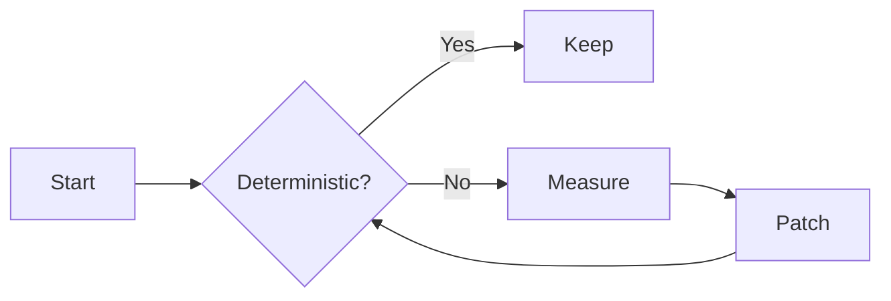
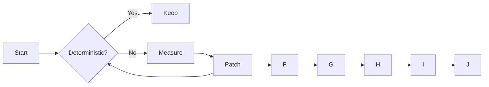
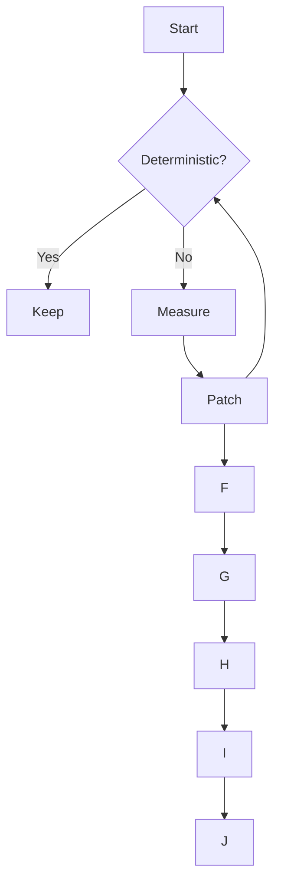
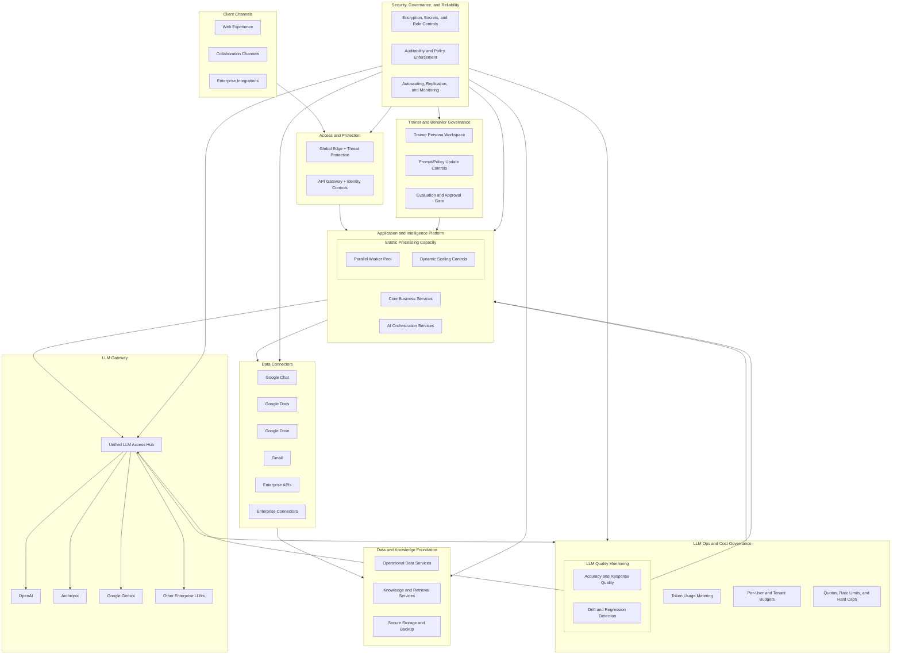

## Control Slide
No diagram here. Use this to verify baseline Reveal layout and scaling.

---

## Mermaid Repro
- point 1
- point 2
- point 3


--



---




--



---

## D2 Repro
- point 1
- point 2
- point 3

```d2
direction: right

A: Start -> B: Deterministic?
B -> C: Keep
B -> D: Measure
D -> E: Patch
E -> B
```

--

```d2
direction: right

A: Start -> B: Deterministic?
B -> C: Keep
B -> D: Measure
D -> E: Patch
E -> B
```

