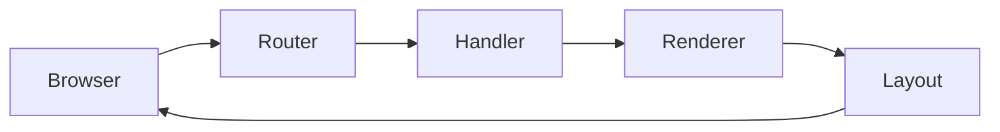
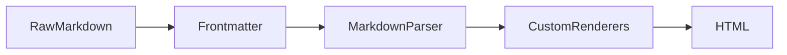
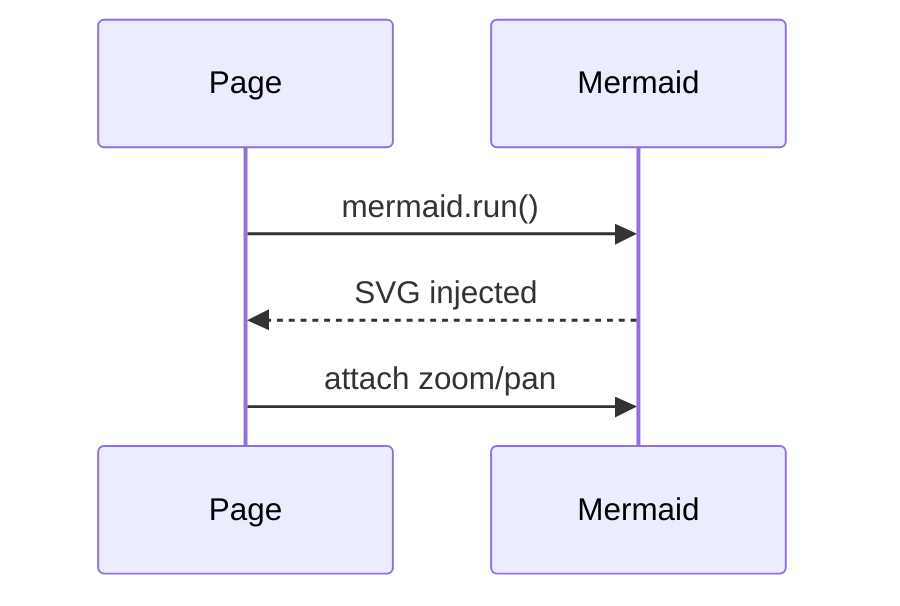
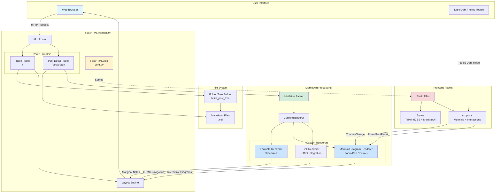
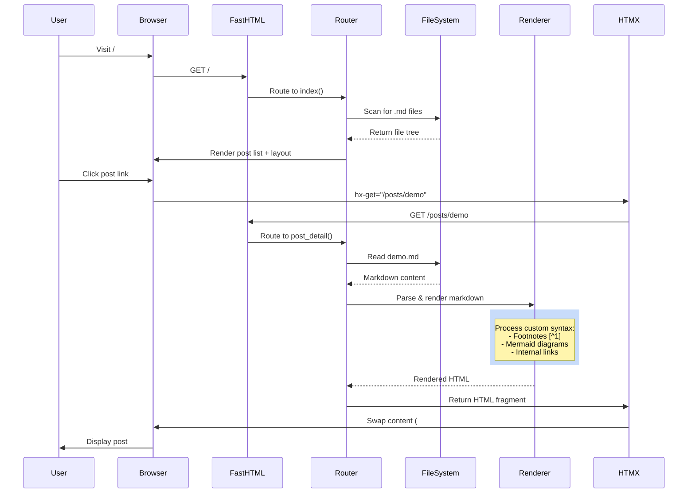
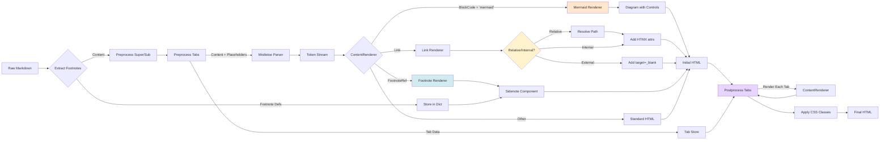
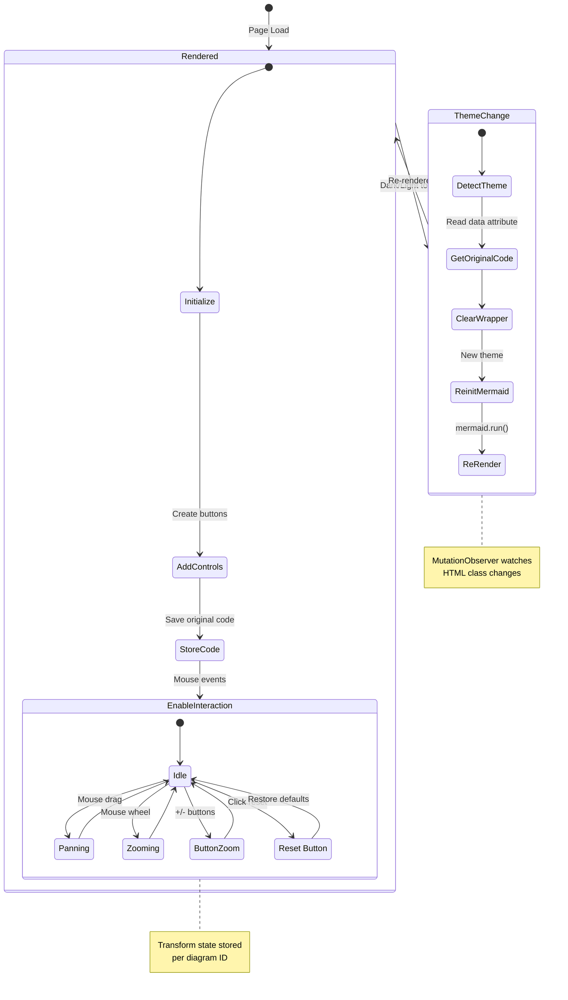

# Architecture Overview

This is a high-level view of how requests flow through Vyasa. These diagrams are here (not in the main README) to keep the README user-focused.

## Request flow

## Markdown processing pipeline

## Mermaid lifecycle

## Architecture Overview

## How Vyasa Works

### 1. Request Flow

### 2. Markdown Processing Pipeline

### 3. Mermaid Diagram Lifecycle

## Navigation & Layout Details

The `layout()` helper builds the complete page structure with intelligent HTMX optimization:

### Layout Components
- **Navbar**: Sticky header with blog title, theme toggle, and mobile menu buttons (posts/TOC toggles)
- **Three-panel layout**: 
  - Left sidebar (72 width): Posts file tree with lazy HTMX loading
  - Main content (flex-1): Swappable content area with section-specific CSS classes
  - Right sidebar (72 width): Auto-generated TOC from headings
- **Mobile panels**: Fullscreen overlays for posts and TOC with smooth slide transitions
- **Footer**: "Powered by Vyasa" right-aligned in max-width container

### HTMX Optimization
When `htmx.request` is detected, `layout()` returns only swappable fragments:
- Main content container with `id="main-content"`
- TOC sidebar with `hx_swap_oob="true"` for out-of-band swap
- CSS container with `hx_swap_oob="true"` for scoped styles
- `Title` element for browser tab title
- Skips navbar, posts sidebar, footer, mobile panels (already in DOM)

### Sidebar Features
- **Left sidebar** (`build_post_tree`): 
  - Recursive folder tree with chevron indicators
  - Folders: Blue folder icon, clickable summary, nested `<ul>` with border
  - Files: Gray file-text icon, HTMX-enhanced links with `data-path` attribute
  - Cached via `@lru_cache` based on max modification time fingerprint
  - Lazy loaded via `/_sidebar/posts` endpoint with loading spinner placeholder
- **Right sidebar** (`extract_toc`):
  - Parses headings from markdown (excludes code blocks)
  - Generates anchor slugs matching heading IDs
  - Indentation based on heading level (`ml-{(level-1)*3}`)
  - Active tracking based on scroll position

### CSS Scoping
`get_custom_css_links()` discovers and loads custom CSS:
1. **Root CSS**: Applies globally (`/posts/custom.css` or `/posts/style.css`)
2. **Folder CSS**: Automatically scoped to section via wrapper class (e.g., `#main-content.section-demo-books-flat-land`)
3. Content wrapped in `<Style>` tag with scoped selector to prevent cross-section leakage
4. All CSS changes swapped via `#scoped-css-container` for HTMX compatibility

### Performance Logging
- Debug logs track timing for each phase (section class, TOC build, CSS resolution, container build)
- Logs written to `/tmp/vyasa_core.log` with rotation (10 MB, 10 days retention)
- Request start/complete markers for easy debugging
