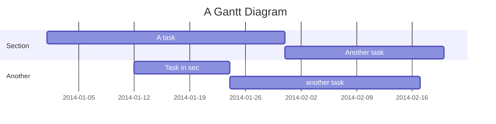

## Headings

:::tabs
::tab{title="Rendered"}
## Headings
::tab{title="Markdown Source"}
```markdown
## Headings
```
:::

:::tabs
::tab{title="Rendered"}
### Setext Style
Heading Level 1
===============
Heading Level 2
---------------
::tab{title="Markdown Source"}
```
### Setext Style
Heading Level 1
===============
Heading Level 2
---------------
```
:::

:::tabs
::tab{title="Rendered"}
### ATX Style
# Heading Level 1
## Heading Level 2
### Heading Level 3
#### Heading Level 4
##### Heading Level 5
::tab{title="Markdown Source"}
```
### ATX Style
# Heading Level 1
## Heading Level 2
### Heading Level 3
#### Heading Level 4
##### Heading Level 5
```
:::

## Paragraphs

:::tabs
::tab{title="Rendered"}
This is a paragraph. It contains multiple sentences to demonstrate how paragraphs work in Markdown.
::tab{title="Markdown Source"}
```markdown
This is a paragraph. It contains multiple sentences to demonstrate how paragraphs work in Markdown.
```
:::

## Line Breaks

:::tabs
::tab{title="Rendered"}
Soft line break (just press Enter):
This is the next line.

Hard line break (use two spaces at the end of the line):  
This is the next line.
::tab{title="Markdown Source"}
```markdown
Soft line break (just press Enter):
This is the next line.

Hard line break (use two spaces at the end of the line):  
This is the next line.
```
:::

## Emphasis

:::tabs
::tab{title="Rendered"}
*Italics* using single asterisks.  
_Italics_ using single underscores.

**Bold** using double asterisks.  
__Bold__ using double underscores.

***Bold and Italics*** using triple asterisks.  
___Bold and Italics___ using triple underscores.
::tab{title="Markdown Source"}
```markdown
*Italics* using single asterisks.  
_Italics_ using single underscores.

**Bold** using double asterisks.  
__Bold__ using double underscores.

***Bold and Italics*** using triple asterisks.  
___Bold and Italics___ using triple underscores.
```
:::

## Blockquotes

:::tabs
::tab{title="Rendered"}
> This is a blockquote.
> > Nested blockquote.
::tab{title="Markdown Source"}
```markdown
> This is a blockquote.
> > Nested blockquote.
```
:::

## Lists

:::tabs
::tab{title="Rendered"}
### Ordered List

1. First item
2. Second item
3. Third item

### Unordered List

- First item
- Second item
- Third item

### Nested List

- Parent item
  - Child item
    - Grandchild item

### Task List

- [x] Completed task
- [ ] Incomplete task
::tab{title="Markdown Source"}
```markdown
### Ordered List

1. First item
2. Second item
3. Third item

### Unordered List

- First item
- Second item
- Third item

### Nested List

- Parent item
  - Child item
    - Grandchild item

### Task List

- [x] Completed task
- [ ] Incomplete task
```
:::

## Code

:::tabs
::tab{title="Rendered"}
### Inline Code

Use `inline code` for short snippets.

### Indented Code Block

    def hello_world():
        print("Hello, world!")

### Fenced Code Block

```python
def hello_world():
    print("Hello, world!")
```
::tab{title="Markdown Source"}
````markdown
### Inline Code

Use `inline code` for short snippets.

### Indented Code Block

    def hello_world():
        print("Hello, world!")

### Fenced Code Block

```python
def hello_world():
    print("Hello, world!")
```
````
:::

## Horizontal Rules

:::tabs
::tab{title="Rendered"}
---
::tab{title="Markdown Source"}
```markdown
---
```
:::

## Links

:::tabs
::tab{title="Rendered"}
### Inline Links

[Visit Google](https://www.google.com)

### Reference-Style Links

[Visit Google][google]

[google]: https://www.google.com

### Autolinks

<https://www.example.com>

### Relative Links
[Flat Land](../books/flat-land/chapter-01.md)

[Home](/)

[Static Build (Outer Link)](../static-build)
::tab{title="Markdown Source"}
```markdown
### Inline Links

[Visit Google](https://www.google.com)

### Reference-Style Links

[Visit Google][google]

[google]: https://www.google.com

### Autolinks

<https://www.example.com>

### Relative Links
[Flat Land](../books/flat-land/chapter-01.md)

[Home](/)

[Static Build (Outer Link)](../static-build)
```
:::

## Images

:::tabs
::tab{title="Rendered"}
### Inline Image


### Reference-Style Image

![Another cute cat][image]

[image]: https://cataas.com/cat/cute?width=300&height=300
::tab{title="Markdown Source"}
```markdown
### Inline Image


### Reference-Style Image

![Another cute cat][image]

[image]: https://cataas.com/cat/cute?width=300&height=300
```
:::

## HTML

:::tabs
::tab{title="Rendered"}
This is <b>bold</b> and this is <i>italic</i>.
::tab{title="Markdown Source"}
```markdown
This is <b>bold</b> and this is <i>italic</i>.
```
:::

## Strikethrough

:::tabs
::tab{title="Rendered"}
~~This text is strikethrough.~~
::tab{title="Markdown Source"}
```markdown
~~This text is strikethrough.~~
```
:::

## Tables

:::tabs
::tab{title="Rendered"}
| Column 1 | Column 2 | Column 3 |
|----------|----------|----------|
| Row 1    | Data     | Data     |
| Row 2    | Data     | Data     |
::tab{title="Markdown Source"}
```markdown
| Column 1 | Column 2 | Column 3 |
|----------|----------|----------|
| Row 1    | Data     | Data     |
| Row 2    | Data     | Data     |
```
:::

## Footnotes

This is a footnote reference[^1].

[^1]: This is the footnote text.

**Markdown Source:**
```markdown
This is a footnote reference[^1].

[ ^1]: This is the footnote text. (Do not put a space after the opening brackets)
```

## Definition Lists

:::tabs
::tab{title="Rendered"}
Term  
: Definition
::tab{title="Markdown Source"}
```markdown
Term  
: Definition
```
:::

## Abbreviations

:::tabs
::tab{title="Rendered"}
The HTML abbreviation is HTML. It stands for *HyperText Markup Language*.

*[HTML]: HyperText Markup Language
::tab{title="Markdown Source"}
```markdown
The HTML abbreviation is HTML. It stands for *HyperText Markup Language*.

*[HTML]: HyperText Markup Language
```
:::

## Superscript and Subscript

:::tabs
::tab{title="Rendered"}
E = mc^2^  
H~2~O
::tab{title="Markdown Source"}
```markdown
E = mc^2^  
H~2~O
```
:::

## Highlight Text

:::tabs
::tab{title="Rendered"}
==Highlighted text==
::tab{title="Markdown Source"}
```markdown
==Highlighted text==
```
:::

## Insertion and Deletion

:::tabs
::tab{title="Rendered"}
{++Inserted text++}  
{--Deleted text--}
::tab{title="Markdown Source"}
```markdown
{++Inserted text++}  
{--Deleted text--}
```
:::

## Comments

:::tabs
::tab{title="Rendered"}
<!-- This is a comment -->
::tab{title="Markdown Source"}
```markdown
<!-- This is a comment -->
```
:::

## Emoji

:::tabs
::tab{title="Rendered"}
:smile: :+1: :heart:
::tab{title="Markdown Source"}
```markdown
:smile: :+1: :heart:
```
:::

## Table of Contents

:::tabs
::tab{title="Rendered"}
[TOC]
::tab{title="Markdown Source"}
```markdown
[TOC]
```
:::

## Heading IDs

:::tabs
::tab{title="Rendered"}
### Custom Heading {#custom-id}
::tab{title="Markdown Source"}
```markdown
### Custom Heading {#custom-id}
```
:::

## Raw HTML Blocks

:::tabs
::tab{title="Rendered"}
<div style="color: red;">This is red text.</div>
::tab{title="Markdown Source"}
```markdown
<div style="color: red;">This is red text.</div>
```
:::

## Embedded Media

:::tabs
::tab{title="Rendered"}
### Video

<video controls>
  <source src="movie.mp4" type="video/mp4">
</video>

### Audio

<audio controls>
  <source src="audio.mp3" type="audio/mpeg">
</audio>

### PDF (iframe)

<iframe
  src="https://www.holybooks.com/wp-content/uploads/Dante-Alighieri-The-Divine-Comedy.pdf"
  width="100%"
  height="600"
  style="border: 1px solid #e2e8f0; border-radius: 8px;"
></iframe>
::tab{title="Markdown Source"}
```markdown
### Video

<video controls>
  <source src="movie.mp4" type="video/mp4">
</video>

### Audio

<audio controls>
  <source src="audio.mp3" type="audio/mpeg">
</audio>

### PDF (iframe)

<iframe
  src="https://www.holybooks.com/wp-content/uploads/Dante-Alighieri-The-Divine-Comedy.pdf"
  width="100%"
  height="600"
  style="border: 1px solid #e2e8f0; border-radius: 8px;"
></iframe>
```
:::

## Mathematical Notation

:::tabs
::tab{title="Rendered"}
### Inline Math

$E = mc^2$

### Block Math

$$
\int_a^b f(x) dx = F(b) - F(a)
$$
::tab{title="Markdown Source"}
```markdown
### Inline Math

$E = mc^2$

### Block Math

$$
\int_a^b f(x) dx = F(b) - F(a)
$$
```
:::

:::tabs
::tab{title="Rendered"}
### Escaping Dollar Signs

\$5 should render as $5 (not math).

\\$ should render as \\$.

\\\$ should render as \\\$.
::tab{title="Markdown Source"}
```markdown
### Escaping Dollar Signs

\$5 should render as $5 (not math).

\\$ should render as \\$.

\\\$ should render as \\\$.
```
:::

## Diagrams
````

````
will render to


## Smart Typography

:::tabs
::tab{title="Rendered"}
"Curly quotes"  
-- En-dash  
--- Em-dash
::tab{title="Markdown Source"}
```markdown
"Curly quotes"  
-- En-dash  
--- Em-dash
```
:::

## Custom Containers

:::tabs
::tab{title="Rendered"}
> [!NOTE]
> This is a note.

> [!WARNING]
> This is a warning.
::tab{title="Markdown Source"}
```markdown
> [!NOTE]
> This is a note.

> [!WARNING]
> This is a warning.
```
:::

## Collapsible Sections

:::tabs
::tab{title="Rendered"}
<details>
<summary>Click to expand</summary>

Hidden content here.

</details>
::tab{title="Markdown Source"}
```markdown
<details>
<summary>Click to expand</summary>

Hidden content here.

</details>
```
:::

## Keyboard Input

:::tabs
::tab{title="Rendered"}
Press <kbd>Ctrl</kbd> + <kbd>C</kbd> to copy.
::tab{title="Markdown Source"}
```markdown
Press <kbd>Ctrl</kbd> + <kbd>C</kbd> to copy.
```
:::

## Line Block

:::tabs
::tab{title="Rendered"}
| Roses are red  
| Violets are blue
::tab{title="Markdown Source"}
```markdown
| Roses are red  
| Violets are blue
```
:::

## Citation

:::tabs
::tab{title="Rendered"}
This is a citation [@doe2025].
::tab{title="Markdown Source"}
```markdown
This is a citation [@doe2025].
```
:::

## Page Break

:::tabs
::tab{title="Rendered"}
\pagebreak
::tab{title="Markdown Source"}
```markdown
\pagebreak
```
:::

## Escaping Characters

:::tabs
::tab{title="Rendered"}
\*Not italicized\*
::tab{title="Markdown Source"}
```markdown
\*Not italicized\*
```
:::

## Tabbed Content

You can create tabbed sections to show multiple versions of content, like code in different languages or rendered output vs source code.

**Syntax:**

To create tabs, use the following markdown syntax:

    :::tabs
    ::tab{title="Python"}
    ```python
    def greet(name):
        return f"Hello, {name}!"
    print(greet("World"))
    ```
    ::tab{title="JavaScript"}
    ```javascript
    function greet(name) {
        return `Hello, ${name}!`;
    }
    console.log(greet("World"));
    ```
    ::tab{title="Output"}
    ```
    Hello, World!
    ```
    :::

**Example:**

:::tabs
::tab{title="Python"}
```python
def greet(name):
    return f"Hello, {name}!"

print(greet("World"))
```
::tab{title="JavaScript"}
```javascript
function greet(name) {
    return `Hello, ${name}!`;
}

console.log(greet("World"));
```
::tab{title="Output"}
```
Hello, World!
```
:::

## Cascading Folder-Specific CSS

To apply `folder-specific CSS styles`{.highlight} that cascade down to all subfolders, you can place a `custom.css` file in any directory. The styles defined in this file will automatically apply to all markdown files within that directory and its subdirectories.

**Example:**

:::tabs
::tab{title="Rendered"}
`hello`{.highlight}
::tab{title="Markdown Source"}
```markdown
`hello`{.highlight}
```
::tab{title="custom.css"}
```css
/* custom.css in the folder */
span.highlight {
    background-color: #fff831;
    padding: 0 4px;
    border-radius: 3px;
    font-weight: bold;
    font-family: 'Courier New', Courier, monospace;
    font-size: 2rem;
}
```
:::
