Vyasa renders Mermaid code blocks with zoom, pan, reset, and fullscreen controls.

## Basic usage

:::tabs
::tab{title="Rendered"}
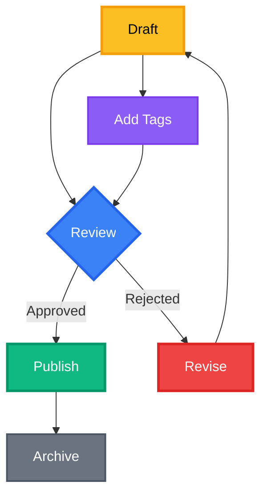
::tab{title="Markdown Source" copy-from="Rendered"}
:::


## Frontmatter controls

You can add a frontmatter block at the top of a Mermaid diagram:
````
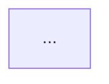
````
Supported keys:
- `width` (default: `65vw`)
- `height` (default: `auto`)
- `min-height` (default: `400px`)
- `aspect_ratio` (Gantt charts)

## Interactions

- Zoom with mouse wheel or the +/− buttons.
- Pan by dragging (mouse or touch).
- Reset zoom with the Reset button.
- Fullscreen with the ⛶ button.

The controls are wired to JavaScript functions in `vyasa/static/scripts.js`:
- `openMermaidFullscreen(id)`: Creates modal with close button and ESC key handler
- `resetMermaidZoom(id)`: Resets transform to `translate(0px, 0px) scale(1)`
- `zoomMermaidIn(id)` / `zoomMermaidOut(id)`: Adjusts scale by 1.1x / 0.9x factors

### Scripted Interaction & Resilience
`vyasa/static/scripts.js` drives the interactive layer with sophisticated features:

#### Mermaid Zoom & Pan
- **Mouse wheel zoom**: Zooms toward cursor position with 1% intensity per wheel event (prevents jarring jumps)
- **Mouse drag panning**: Click and drag to pan, cursor changes to `grabbing` during drag
- **Smart initial scaling**: 
  - Wide diagrams (aspect ratio > 3): Scale to fit width, allow vertical scroll
  - Normal diagrams: Fit to smaller dimension (width or height), max 3x upscaling
  - Accounts for padding: 32px total (16px each side from `p-4` class)
- **State management**: Per-diagram state stored in `mermaidStates` object with scale, translateX, translateY, isPanning, startX, startY
- **Transform origin**: Center-center for natural zoom behavior

#### Theme-Aware Re-rendering
- **MutationObserver** watches `<html>` class changes for dark mode toggle
- `reinitializeMermaid()` function:
  - Detects theme via `getCurrentTheme()` (checks for `.dark` class)
  - Preserves wrapper height before clearing to prevent layout shifts
  - Deletes old state and re-creates fresh diagram
  - Decodes HTML entities from `data-mermaid-code` attribute
  - Re-runs `mermaid.run()` and `initMermaidInteraction()` after 100ms delay
  - Skips reinit on initial load (uses `isInitialLoad` flag)

#### HTMX Integration
- **`htmx:afterSwap` event listener**: Re-runs Mermaid, updates active links, reinitializes mobile menus
- **Sidebar auto-reveal**: Expands parent `<details>` elements and scrolls active post into view
- **Active link highlighting**: Adds blue ring and background to current post in sidebar
- **TOC scroll tracking**: Updates active TOC link based on scroll position with `requestAnimationFrame` throttling

#### Mobile Menu Handling
- Slide-in panels for posts and TOC with `transform` transitions (`-translate-x-full` / `translate-x-full`)
- Auto-close panels when link clicked (100ms delay for smooth transition)
- Toggle buttons in navbar show/hide panels (only one open at a time)

#### Additional Features
- **Fullscreen modal**: Dark backdrop with blur, ESC key and background click to close
- **Tab height stabilization**: Measures all tab panels, sets container to max height on load and after swaps
- **Math rendering**: Auto-runs KaTeX after swaps and on initial load

## flowchart TD
:::tabs
::tab{title="Rendered"}
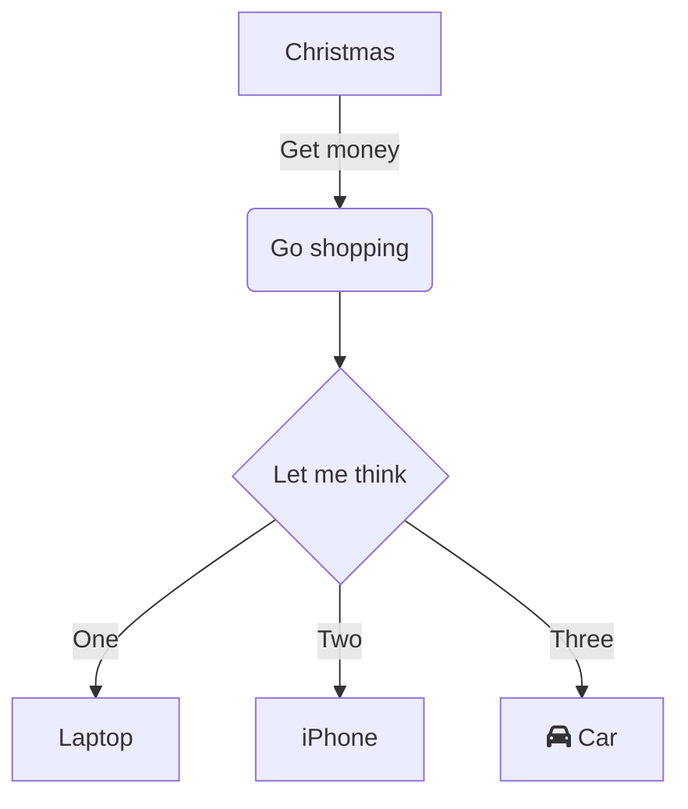
::tab{title="Markdown Source" copy-from="Rendered"}
:::

## classDiagram
:::tabs
::tab{title="Rendered"}
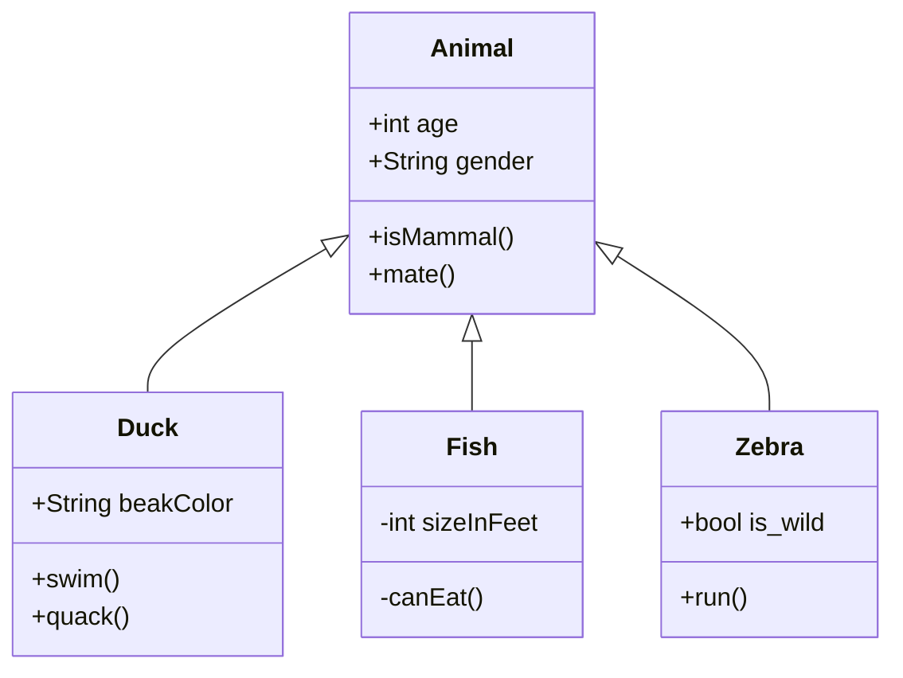
::tab{title="Markdown Source" copy-from="Rendered"}
:::

## sequenceDiagram
:::tabs
::tab{title="Rendered"}
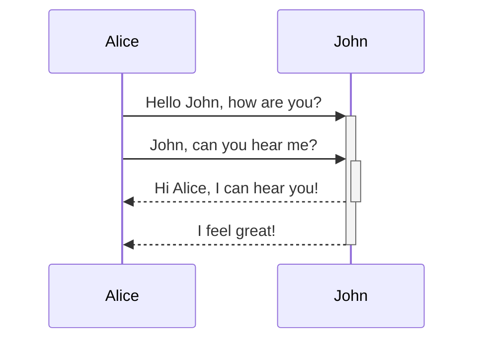
::tab{title="Markdown Source" copy-from="Rendered"}
:::

## erDiagram
:::tabs
::tab{title="Rendered"}
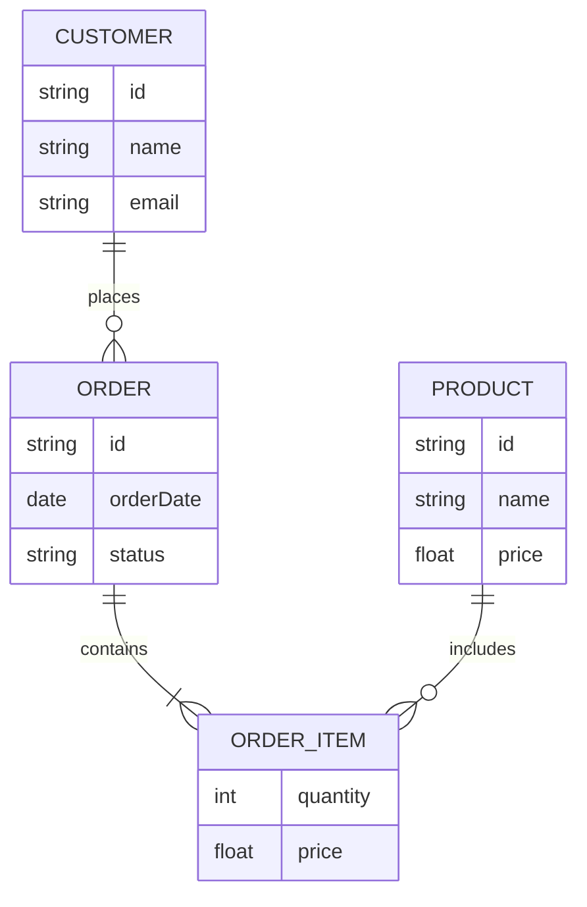
::tab{title="Markdown Source" copy-from="Rendered"}
:::

## stateDiagram-v2
:::tabs
::tab{title="Rendered"}
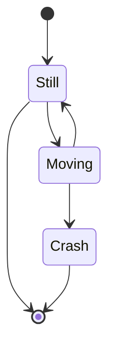
::tab{title="Markdown Source" copy-from="Rendered"}
:::


## mindmap
:::tabs
::tab{title="Rendered"}
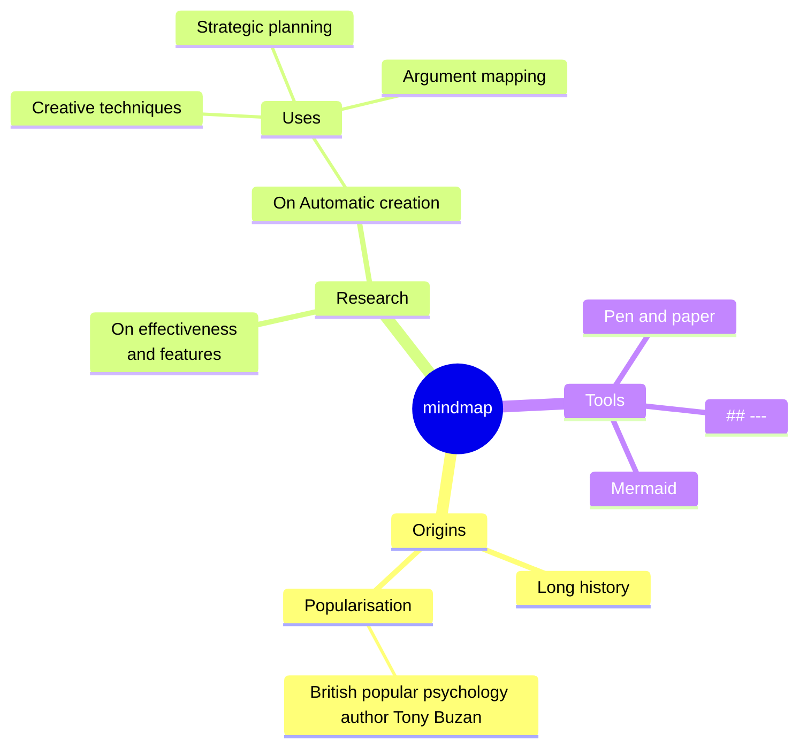
::tab{title="Markdown Source" copy-from="Rendered"}
:::

## sankey beta
:::tabs
::tab{title="Rendered"}
```mermaid
---
width: 85vw
height: 80vh
---
---
config:
  sankey:
    showValues: false
---
sankey-beta

Agricultural 'waste',Bio-conversion,124.729
Bio-conversion,Liquid,0.597
Bio-conversion,Losses,26.862
Bio-conversion,Solid,280.322
Bio-conversion,Gas,81.144
Biofuel imports,Liquid,35
Biomass imports,Solid,35
Coal imports,Coal,11.606
Coal reserves,Coal,63.965
Coal,Solid,75.571
District heating,Industry,10.639
District heating,Heating and cooling - commercial,22.505
District heating,Heating and cooling - homes,46.184
Electricity grid,Over generation / exports,104.453
Electricity grid,Heating and cooling - homes,113.726
Electricity grid,H2 conversion,27.14
Electricity grid,Industry,342.165
Electricity grid,Road transport,37.797
Electricity grid,Agriculture,4.412
Electricity grid,Heating and cooling - commercial,40.858
Electricity grid,Losses,56.691
Electricity grid,Rail transport,7.863
Electricity grid,Lighting & appliances - commercial,90.008
Electricity grid,Lighting & appliances - homes,93.494
Gas imports,NGas,40.719
Gas reserves,NGas,82.233
Gas,Heating and cooling - commercial,0.129
Gas,Losses,1.401
Gas,Thermal generation,151.891
Gas,Agriculture,2.096
Gas,Industry,48.58
Geothermal,Electricity grid,7.013
H2 conversion,H2,20.897
H2 conversion,Losses,6.242
H2,Road transport,20.897
Hydro,Electricity grid,6.995
Liquid,Industry,121.066
Liquid,International shipping,128.69
Liquid,Road transport,135.835
Liquid,Domestic aviation,14.458
Liquid,International aviation,206.267
Liquid,Agriculture,3.64
Liquid,National navigation,33.218
Liquid,Rail transport,4.413
Marine algae,Bio-conversion,4.375
NGas,Gas,122.952
Nuclear,Thermal generation,839.978
Oil imports,Oil,504.287
Oil reserves,Oil,107.703
Oil,Liquid,611.99
Other waste,Solid,56.587
Other waste,Bio-conversion,77.81
Pumped heat,Heating and cooling - homes,193.026
Pumped heat,Heating and cooling - commercial,70.672
Solar PV,Electricity grid,59.901
Solar Thermal,Heating and cooling - homes,19.263
Solar,Solar Thermal,19.263
Solar,Solar PV,59.901
Solid,Agriculture,0.882
Solid,Thermal generation,400.12
Solid,Industry,46.477
Thermal generation,Electricity grid,525.531
Thermal generation,Losses,787.129
Thermal generation,District heating,79.329
Tidal,Electricity grid,9.452
UK land based bioenergy,Bio-conversion,182.01
Wave,Electricity grid,19.013
Wind,Electricity grid,289.366
```
::tab{title="Markdown Source" copy-from="Rendered"}
:::

## radar-beta
:::tabs
::tab{title="Rendered"}
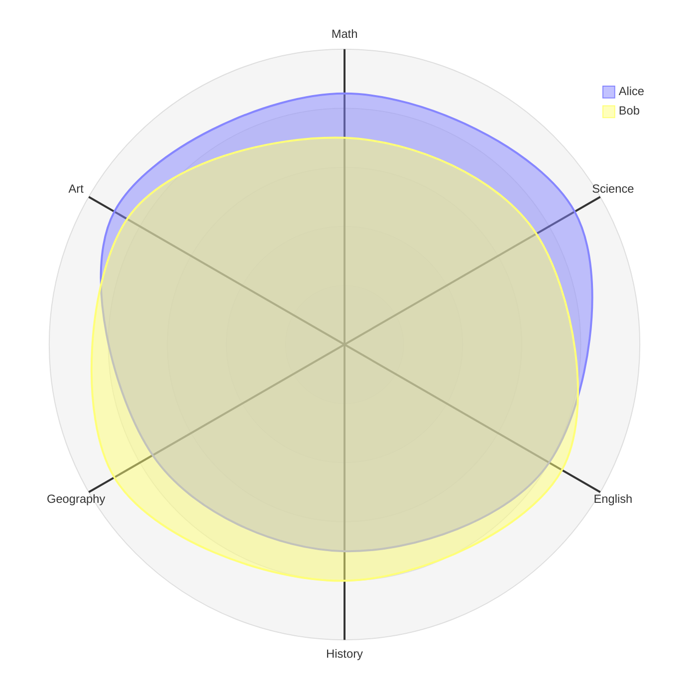
::tab{title="Markdown Source" copy-from="Rendered"}
:::

## treemap-beta
:::tabs
::tab{title="Rendered"}
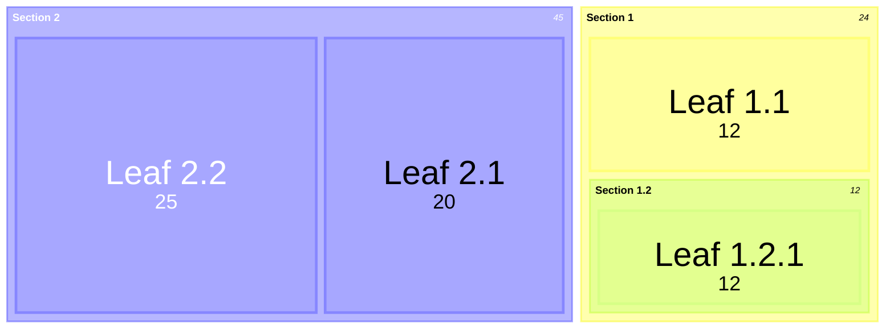
::tab{title="Markdown Source" copy-from="Rendered"}
:::

## timeline
:::tabs
::tab{title="Rendered"}
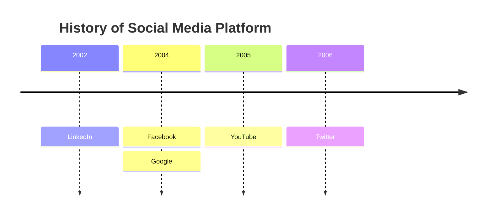
::tab{title="Markdown Source" copy-from="Rendered"}
:::

## C4Context
:::tabs
::tab{title="Rendered"}
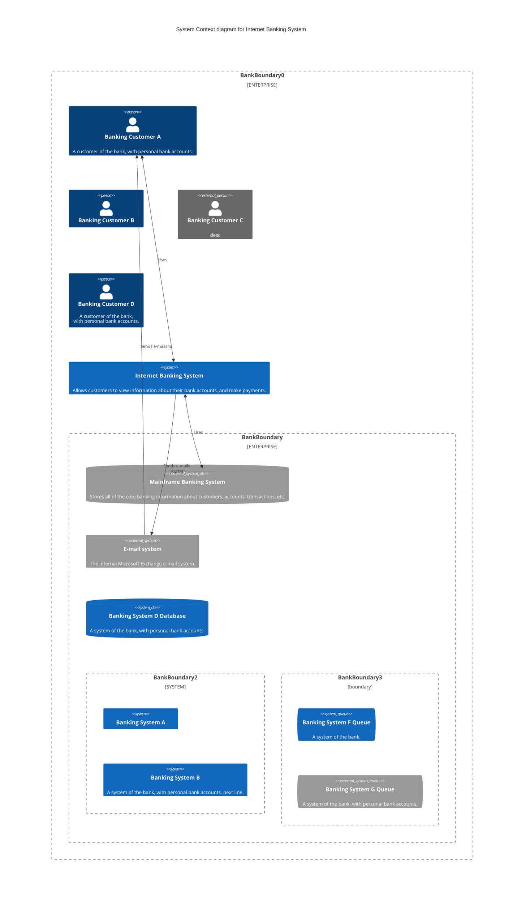
::tab{title="Markdown Source" copy-from="Rendered"}
:::

## gantt
:::tabs
::tab{title="Rendered"}
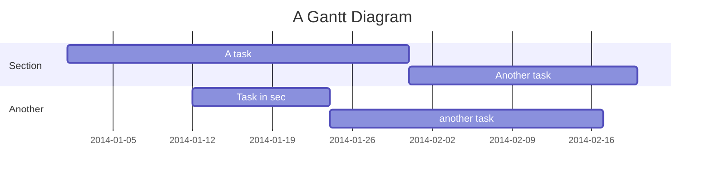
::tab{title="Markdown Source" copy-from="Rendered"}
:::

## architecture-beta
:::tabs
::tab{title="Rendered"}
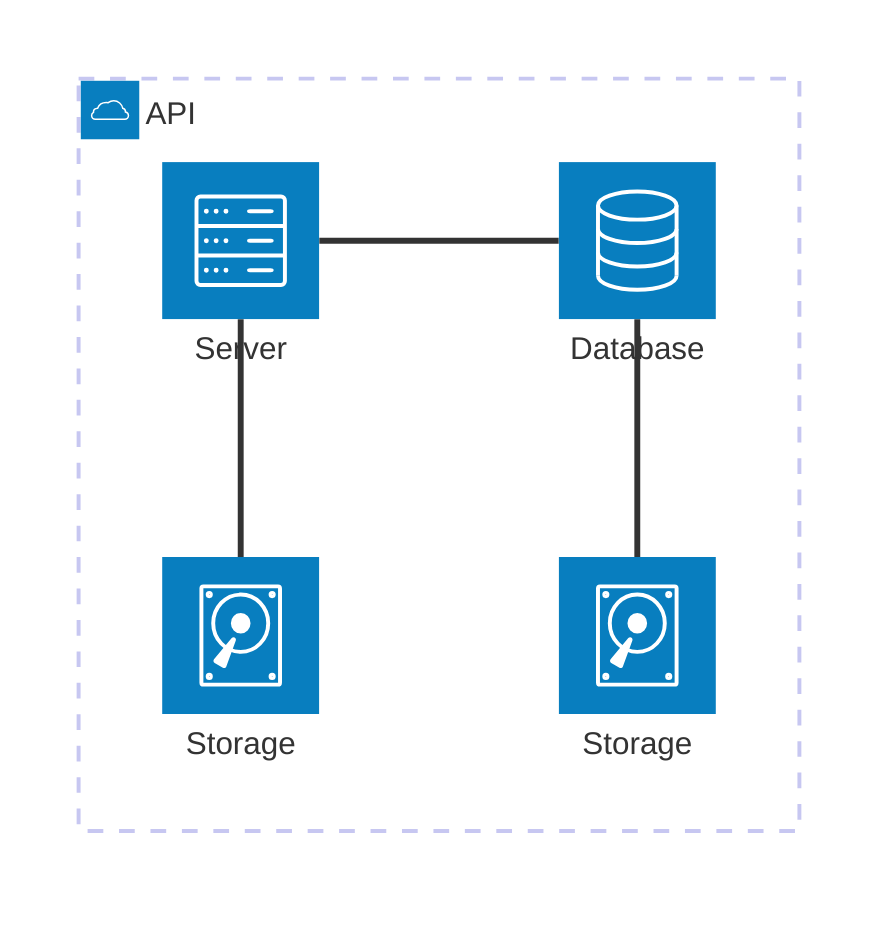
::tab{title="Markdown Source" copy-from="Rendered"}
:::
