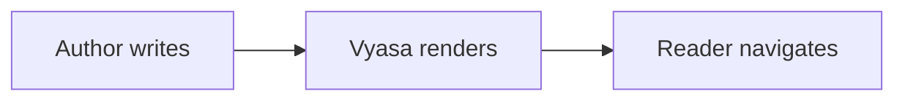

# Mermaid Diagrams

Mermaid is the quickest way to put structure into a Vyasa page without leaving Markdown. The server renders the fence into a diagram container, then the browser runtime in [`vyasa/static/scripts.js`](/Users/yeshwanth/Code/Personal/vyasa/vyasa/static/scripts.js) handles zoom, pan, fullscreen, and theme-aware redraw. This guide is about writing Mermaid that survives real docs, not toy snippets. The habit worth keeping is to explain the flow in prose first, then let the diagram confirm it.

## A Safe Default

````markdown

```mermaid
---
width: 76vw
height: 280px
---
flowchart LR
    Author["Author writes"] --> Renderer["Vyasa renders"]
    Renderer --> Reader["Reader navigates"]
```
````

Use literal `<br/>` inside labels when a node needs multiple lines. Keep sizing in frontmatter so the surrounding page can stay readable, especially when the doc already has tables, sidenotes, or callouts competing for horizontal space.

## Why These Choices Matter

| Choice | Why it matters |
|---|---|
| frontmatter width and height | Prevents diagrams from overwhelming the prose column. |
| `<br/>` in labels | Works with Mermaid parsing and matches Vyasa guidance. |
| prose before diagram | Gives the reader a reason to care before they decode shapes. |
| smaller focused graphs | Load faster and age better than one giant wall chart. |
