Vyasa renders Mermaid code blocks with [pele](https://github.com/obsidianmd/pele), with zoom, pan, reset, and fullscreen controls. Pele targets Mermaid 12.1.0 syntax and uses its own layout, so node positions differ from mermaid.js. ZenUML and other external Mermaid plugins are not supported.

## Basic usage

:::tabs
::tab{title="Rendered"}
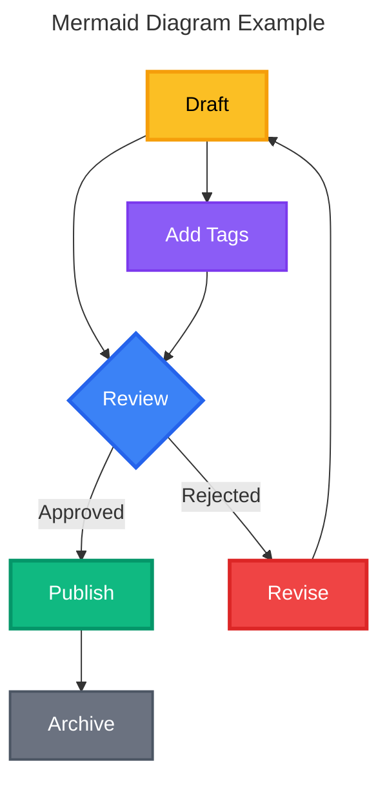
```mermaid
---
title: "Mermaid Diagram Example"
width: 45 vw
---
graph TD
    A[Draft] --> B{Review}
    B -->|Approved| C[Publish]
    B -->|Rejected| D[Revise]
    D --> A
    C --> E[Archive]
    A --> F[Add Tags]
    F --> B
    
    classDef draftStyle fill:#fbbf24,stroke:#f59e0b,stroke-width:3px,color:#000
    classDef reviewStyle fill:#3b82f6,stroke:#2563eb,stroke-width:3px,color:#fff
    classDef publishStyle fill:#10b981,stroke:#059669,stroke-width:3px,color:#fff
    classDef reviseStyle fill:#ef4444,stroke:#dc2626,stroke-width:3px,color:#fff
    classDef archiveStyle fill:#6b7280,stroke:#4b5563,stroke-width:2px,color:#fff
    classDef tagStyle fill:#8b5cf6,stroke:#7c3aed,stroke-width:2px,color:#fff
    
    class A draftStyle
    class B reviewStyle
    class C publishStyle
    class D reviseStyle
    class E archiveStyle
    class F tagStyle
```
::tab{title="Markdown Source" copy-from="Rendered"}
:::


## Frontmatter controls

You can add a frontmatter block at the top of a Mermaid diagram:
````
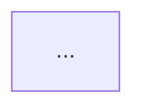
```mermaid
---
width: 85vw
height: 60vh
min-height: 400px
---
graph LR
    ...
```
````
Supported keys:
- `width` (default: `65vw`)
- `height` (default: `auto`)
- `min-height` (default: `400px`)

## Interactions

- Zoom with mouse wheel or the +/− buttons.
- Pan by dragging (mouse or touch).
- Reset zoom with the Reset button.
- Fullscreen with the ⛶ button.

The controls are wired to JavaScript functions in `vyasa/extensions_builtin/mermaid/static/mermaid.js`:
- `openMermaidFullscreen(id)`: Creates modal with close button and ESC key handler
- `resetMermaidZoom(id)`: Resets transform to `translate(0px, 0px) scale(1)`
- `zoomMermaidIn(id)` / `zoomMermaidOut(id)`: Adjusts scale by 1.1x / 0.9x factors

### Scripted Interaction & Resilience
`mermaid.js` drives the interactive layer with sophisticated features:

#### Mermaid Zoom & Pan
- **Mouse wheel zoom**: Zooms toward cursor position with 1% intensity per wheel event (prevents jarring jumps)
- **Mouse drag panning**: Click and drag to pan, cursor changes to `grabbing` during drag
- **Smart initial scaling**: 
  - Wide diagrams (aspect ratio > 3): Scale to fit width, allow vertical scroll
  - Normal diagrams: Fit to smaller dimension (width or height), max 3x upscaling
  - Accounts for padding: 32px total (16px each side from `p-4` class)
- **State management**: Per-diagram state stored in `mermaidStates` object with scale, translateX, translateY, isPanning, startX, startY
- **Transform origin**: Center-center for natural zoom behavior

#### Theme
- Pele colours come from `--pele-*` CSS variables, which `mermaid.css` maps to the Vyasa tokens on `.mermaid-wrapper`.
- A `.dark` class change on `<html>` recolours diagrams without a re-render.
- Colours set inside a diagram with `style` or `classDef` stay fixed in both themes.

#### HTMX Integration
- **`htmx:afterSwap` event listener**: Re-runs Mermaid, updates active links, reinitializes mobile menus
- **Sidebar auto-reveal**: Expands parent `<details>` elements and scrolls active post into view
- **Active link highlighting**: Adds blue ring and background to current post in sidebar
- **TOC scroll tracking**: Updates active TOC link based on scroll position with `requestAnimationFrame` throttling

#### Mobile Menu Handling
- Slide-in panels for posts and TOC with `transform` transitions (`-translate-x-full` / `translate-x-full`)
- Auto-close panels when link clicked (100ms delay for smooth transition)
- Toggle buttons in navbar show/hide panels (only one open at a time)

#### Additional Features
- **Fullscreen modal**: Dark backdrop with blur, ESC key and background click to close
- **Math rendering**: Auto-runs KaTeX after swaps and on initial load

## flowchart TD
:::tabs
::tab{title="Rendered"}
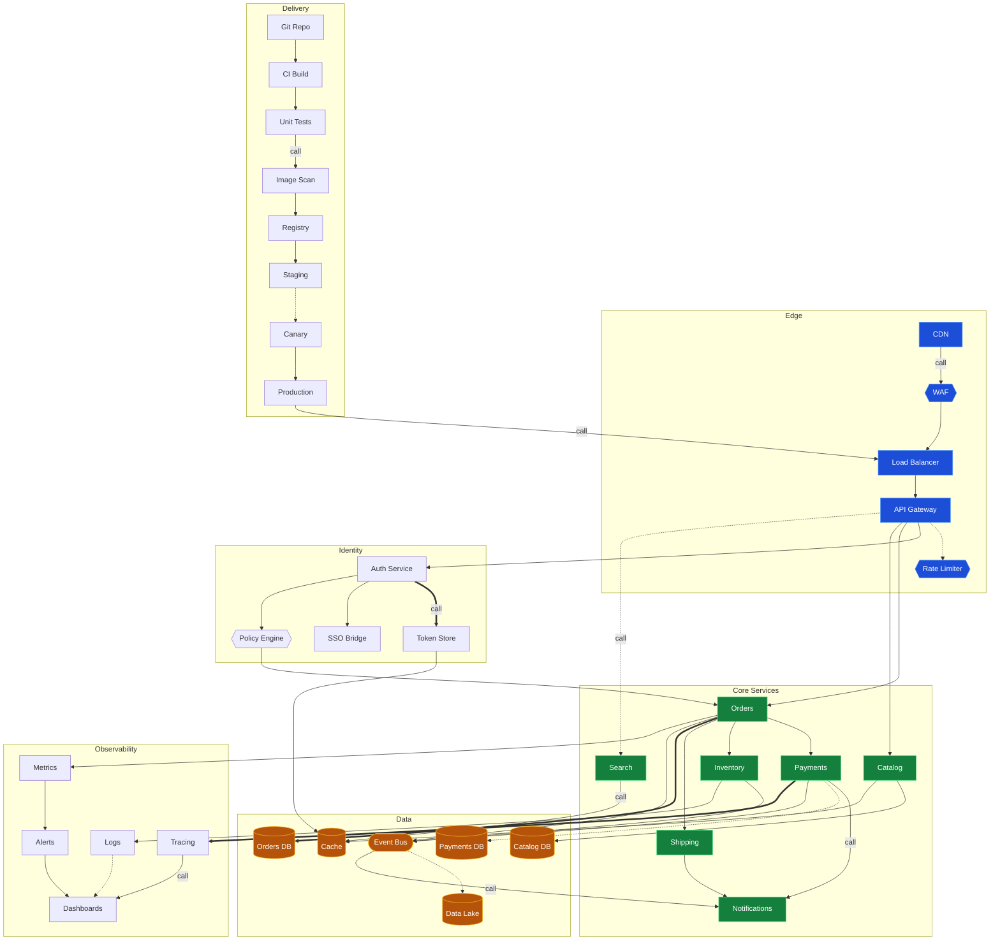
```mermaid
---
width: 85vw
---
flowchart TD
    subgraph G0["Edge"]
        direction LR
        G0N0["CDN"]
        G0N1{{"WAF"}}
        G0N2["Load Balancer"]
        G0N3["API Gateway"]
        G0N4{{"Rate Limiter"}}
    end
    subgraph G1["Identity"]
        direction LR
        G1N0["Auth Service"]
        G1N1["Token Store"]
        G1N2["SSO Bridge"]
        G1N3{{"Policy Engine"}}
    end
    subgraph G2["Core Services"]
        direction LR
        G2N0["Orders"]
        G2N1["Payments"]
        G2N2["Inventory"]
        G2N3["Catalog"]
        G2N4["Shipping"]
        G2N5["Notifications"]
        G2N6["Search"]
    end
    subgraph G3["Data"]
        direction LR
        G3N0[("Orders DB")]
        G3N1[("Payments DB")]
        G3N2[("Catalog DB")]
        G3N3[("Cache")]
        G3N4(["Event Bus"])
        G3N5[("Data Lake")]
    end
    subgraph G4["Observability"]
        direction LR
        G4N0["Metrics"]
        G4N1["Tracing"]
        G4N2["Logs"]
        G4N3["Alerts"]
        G4N4["Dashboards"]
    end
    subgraph G5["Delivery"]
        direction LR
        G5N0["Git Repo"]
        G5N1["CI Build"]
        G5N2["Unit Tests"]
        G5N3["Image Scan"]
        G5N4["Registry"]
        G5N5["Staging"]
        G5N6["Canary"]
        G5N7["Production"]
    end
    G0N0 -->|call| G0N1
    G0N1 --> G0N2
    G0N2 --> G0N3
    G0N3 -.-> G0N4
    G0N3 --> G1N0
    G1N0 ==>|call| G1N1
    G1N0 --> G1N2
    G1N0 --> G1N3
    G0N3 --> G2N0
    G0N3 --> G2N3
    G0N3 -.->|call| G2N6
    G2N0 --> G2N1
    G2N0 --> G2N2
    G2N0 --> G2N4
    G2N4 --> G2N5
    G2N1 -->|call| G2N5
    G2N0 ==> G3N0
    G2N1 -.-> G3N1
    G2N3 --> G3N2
    G2N3 --> G3N3
    G2N6 -->|call| G3N3
    G2N0 --> G3N4
    G2N1 --> G3N4
    G2N2 --> G3N4
    G3N4 -.-> G3N5
    G3N4 -->|call| G2N5
    G2N0 --> G4N0
    G2N1 ==> G4N1
    G2N2 --> G4N2
    G4N0 --> G4N3
    G4N1 -->|call| G4N4
    G4N2 -.-> G4N4
    G4N3 --> G4N4
    G5N0 --> G5N1
    G5N1 --> G5N2
    G5N2 -->|call| G5N3
    G5N3 --> G5N4
    G5N4 --> G5N5
    G5N5 -.-> G5N6
    G5N6 --> G5N7
    G5N7 -->|call| G0N2
    G1N3 --> G2N0
    G1N1 --> G3N3
    classDef edge fill:#1d4ed8,stroke:#60a5fa,color:#fff
    classDef data fill:#b45309,stroke:#fbbf24,color:#fff
    classDef svc fill:#15803d,stroke:#4ade80,color:#fff
    class G0N0,G0N1,G0N2,G0N3,G0N4 edge
    class G3N0,G3N1,G3N2,G3N3,G3N4,G3N5 data
    class G2N0,G2N1,G2N2,G2N3,G2N4,G2N5,G2N6 svc
```
::tab{title="Markdown Source" copy-from="Rendered"}
:::

## classDiagram
:::tabs
::tab{title="Rendered"}
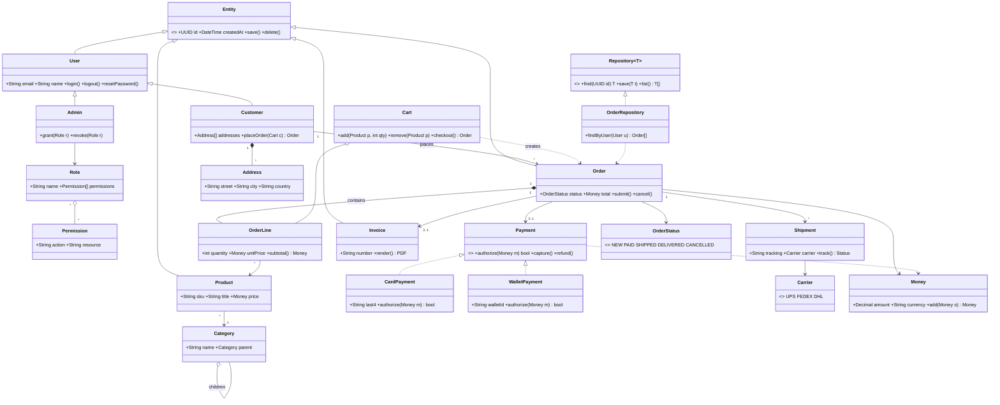
```mermaid
---
width: 85vw
---
classDiagram
    class Entity { <<abstract>> +UUID id +DateTime createdAt +save() +delete() }
    class User { +String email +String name +login() +logout() +resetPassword() }
    class Admin { +grant(Role r) +revoke(Role r) }
    class Customer { +Address[] addresses +placeOrder(Cart c) Order }
    class Role { +String name +Permission[] permissions }
    class Permission { +String action +String resource }
    class Order { +OrderStatus status +Money total +submit() +cancel() }
    class OrderLine { +int quantity +Money unitPrice +subtotal() Money }
    class Product { +String sku +String title +Money price }
    class Category { +String name +Category parent }
    class Cart { +add(Product p, int qty) +remove(Product p) +checkout() Order }
    class Payment { <<interface>> +authorize(Money m) bool +capture() +refund() }
    class CardPayment { +String last4 +authorize(Money m) bool }
    class WalletPayment { +String walletId +authorize(Money m) bool }
    class Invoice { +String number +render() PDF }
    class Shipment { +String tracking +Carrier carrier +track() Status }
    class Carrier { <<enumeration>> UPS FEDEX DHL }
    class OrderStatus { <<enumeration>> NEW PAID SHIPPED DELIVERED CANCELLED }
    class Money { +Decimal amount +String currency +add(Money o) Money }
    class Address { +String street +String city +String country }
    class Repository~T~ { <<interface>> +find(UUID id) T +save(T t) +list() T[] }
    class OrderRepository { +findByUser(User u) Order[] }
    Entity <|-- User
    Entity <|-- Order
    Entity <|-- Product
    Entity <|-- Invoice
    User <|-- Admin
    User <|-- Customer
    Payment <|.. CardPayment
    Payment <|.. WalletPayment
    Customer "1" --> "*" Order : places
    Customer "1" *-- "*" Address
    Order "1" *-- "*" OrderLine : contains
    OrderLine "*" --> "1" Product
    Product "*" --> "1" Category
    Category o-- Category : children
    Cart ..> Order : creates
    Cart "1" o-- "*" OrderLine
    Order "1" --> "0..1" Payment
    Order "1" --> "0..1" Invoice
    Order "1" --> "*" Shipment
    Shipment --> Carrier
    Order --> OrderStatus
    Role "*" o-- "*" Permission
    Admin --> Role
    Order --> Money
    Payment ..> Money
    Repository <|.. OrderRepository
    OrderRepository ..> Order
```
::tab{title="Markdown Source" copy-from="Rendered"}
:::

## sequenceDiagram
:::tabs
::tab{title="Rendered"}
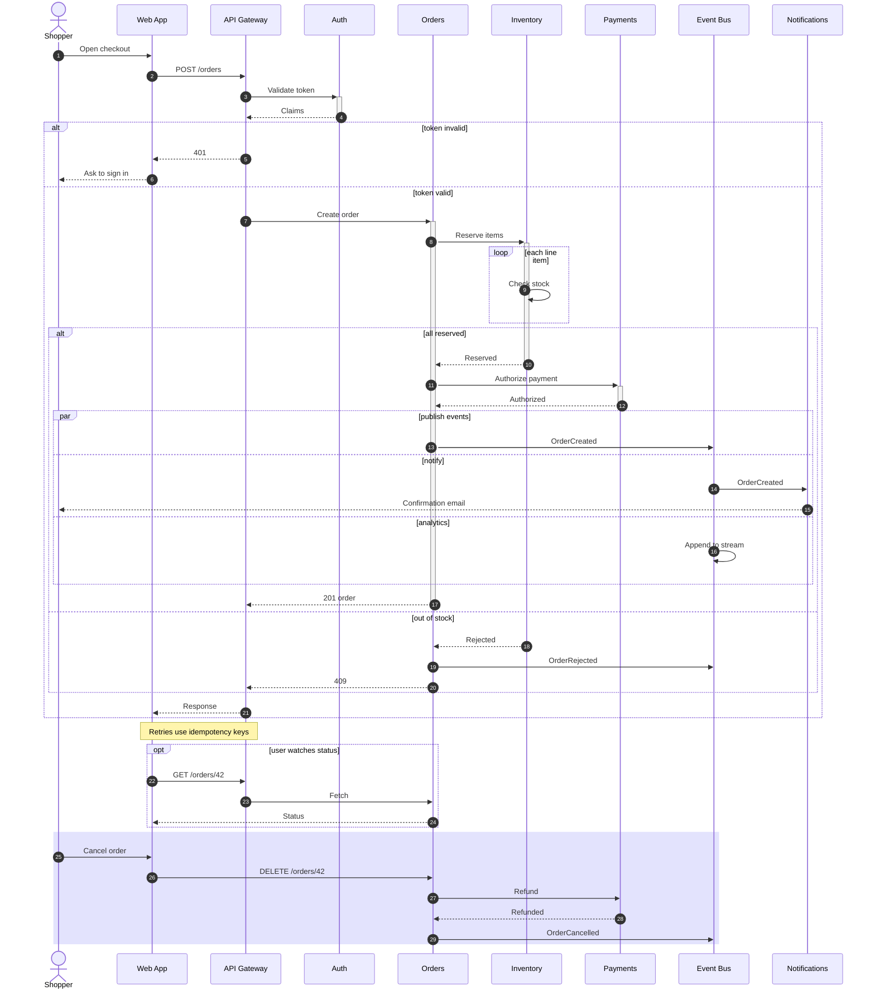
```mermaid
---
width: 85vw
---
sequenceDiagram
    autonumber
    actor U as Shopper
    participant W as Web App
    participant G as API Gateway
    participant A as Auth
    participant O as Orders
    participant I as Inventory
    participant P as Payments
    participant B as Event Bus
    participant N as Notifications
    U->>W: Open checkout
    W->>G: POST /orders
    G->>+A: Validate token
    A-->>-G: Claims
    alt token invalid
        G-->>W: 401
        W-->>U: Ask to sign in
    else token valid
        G->>+O: Create order
        O->>+I: Reserve items
        loop each line item
            I->>I: Check stock
        end
        alt all reserved
            I-->>-O: Reserved
            O->>+P: Authorize payment
            P-->>-O: Authorized
            par publish events
                O->>B: OrderCreated
            and notify
                B->>N: OrderCreated
                N-->>U: Confirmation email
            and analytics
                B->>B: Append to stream
            end
            O-->>-G: 201 order
        else out of stock
            I-->>O: Rejected
            O->>B: OrderRejected
            O-->>G: 409
        end
        G-->>W: Response
    end
    Note over W,G: Retries use idempotency keys
    opt user watches status
        W->>G: GET /orders/42
        G->>O: Fetch
        O-->>W: Status
    end
    rect rgba(99, 102, 241, 0.18)
        U->>W: Cancel order
        W->>O: DELETE /orders/42
        O->>P: Refund
        P-->>O: Refunded
        O->>B: OrderCancelled
    end
```
::tab{title="Markdown Source" copy-from="Rendered"}
:::

## erDiagram
:::tabs
::tab{title="Rendered"}
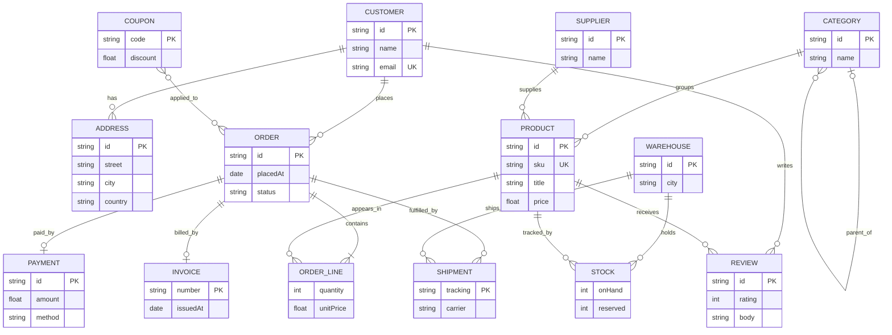
```mermaid
---
width: 85vw
---
erDiagram
    CUSTOMER ||--o{ ADDRESS : has
    CUSTOMER ||--o{ ORDER : places
    ORDER ||--|{ ORDER_LINE : contains
    PRODUCT ||--o{ ORDER_LINE : appears_in
    CATEGORY ||--o{ PRODUCT : groups
    SUPPLIER ||--o{ PRODUCT : supplies
    WAREHOUSE ||--o{ STOCK : holds
    PRODUCT ||--o{ STOCK : tracked_by
    ORDER ||--o| PAYMENT : paid_by
    ORDER ||--o| INVOICE : billed_by
    ORDER ||--o{ SHIPMENT : fulfilled_by
    WAREHOUSE ||--o{ SHIPMENT : ships_from
    CUSTOMER ||--o{ REVIEW : writes
    PRODUCT ||--o{ REVIEW : receives
    COUPON }o--o{ ORDER : applied_to
    CATEGORY |o--o{ CATEGORY : parent_of
    CUSTOMER {
        string id PK
        string name
        string email UK
    }
    ADDRESS {
        string id PK
        string street
        string city
        string country
    }
    ORDER {
        string id PK
        date placedAt
        string status
    }
    ORDER_LINE {
        int quantity
        float unitPrice
    }
    PRODUCT {
        string id PK
        string sku UK
        string title
        float price
    }
    CATEGORY {
        string id PK
        string name
    }
    SUPPLIER {
        string id PK
        string name
    }
    WAREHOUSE {
        string id PK
        string city
    }
    STOCK {
        int onHand
        int reserved
    }
    PAYMENT {
        string id PK
        float amount
        string method
    }
    INVOICE {
        string number PK
        date issuedAt
    }
    SHIPMENT {
        string tracking PK
        string carrier
    }
    REVIEW {
        string id PK
        int rating
        string body
    }
    COUPON {
        string code PK
        float discount
    }
```
::tab{title="Markdown Source" copy-from="Rendered"}
:::

## stateDiagram-v2
:::tabs
::tab{title="Rendered"}
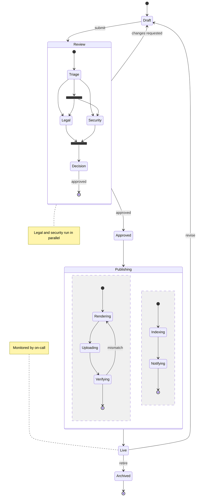
```mermaid
---
width: 85vw
---
stateDiagram-v2
    [*] --> Draft
    Draft --> Review : submit
    state Review {
        [*] --> Triage
        Triage --> Legal
        Triage --> Security
        state fork_in <<fork>>
        Triage --> fork_in
        fork_in --> Legal
        fork_in --> Security
        state join_out <<join>>
        Legal --> join_out
        Security --> join_out
        join_out --> Decision
        state Decision <<choice>>
        Decision --> [*] : approved
    }
    Review --> Draft : changes requested
    Review --> Approved : approved
    Approved --> Publishing
    state Publishing {
        [*] --> Rendering
        Rendering --> Uploading
        Uploading --> Verifying
        Verifying --> Rendering : mismatch
        Verifying --> [*]
        --
        [*] --> Indexing
        Indexing --> Notifying
        Notifying --> [*]
    }
    Publishing --> Live
    Live --> Archived : retire
    Live --> Draft : revise
    Archived --> [*]
    note right of Review : Legal and security run in parallel
    note left of Live : Monitored by on-call
```
::tab{title="Markdown Source" copy-from="Rendered"}
:::


## mindmap
:::tabs
::tab{title="Rendered"}
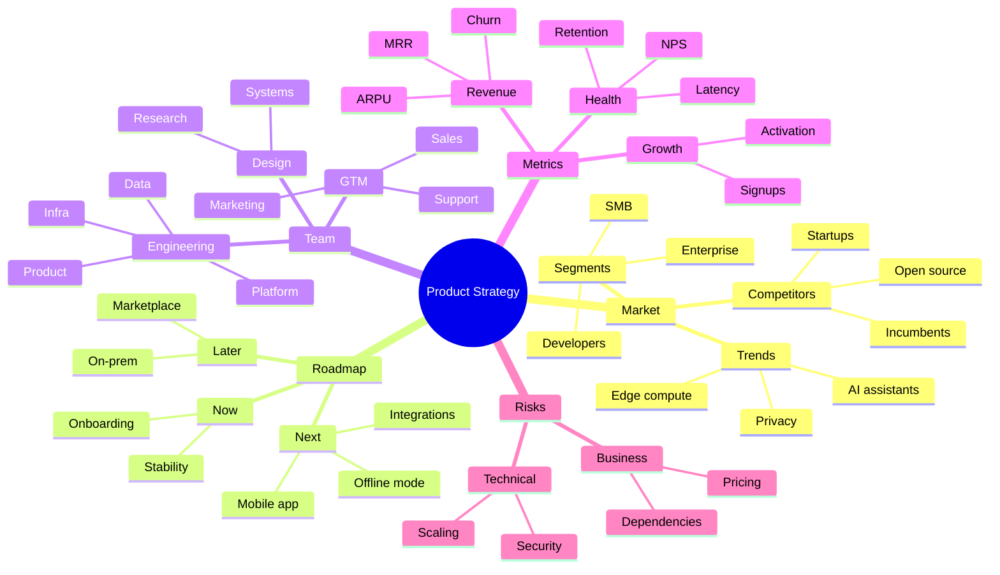
```mermaid
---
width: 85vw
---
mindmap
  root((Product Strategy))
    Market
      Segments
        Enterprise
        SMB
        Developers
      Competitors
        Incumbents
        Startups
        Open source
      Trends
        AI assistants
        Edge compute
        Privacy
    Roadmap
      Now
        Stability
        Onboarding
      Next
        Integrations
        Mobile app
        Offline mode
      Later
        Marketplace
        On-prem
    Team
      Engineering
        Platform
        Product
        Infra
        Data
      Design
        Research
        Systems
      GTM
        Sales
        Support
        Marketing
    Metrics
      Growth
        Signups
        Activation
      Health
        Retention
        NPS
        Latency
      Revenue
        MRR
        Churn
        ARPU
    Risks
      Technical
        Scaling
        Security
      Business
        Pricing
        Dependencies
```
::tab{title="Markdown Source" copy-from="Rendered"}
:::

## sankey beta
:::tabs
::tab{title="Rendered"}
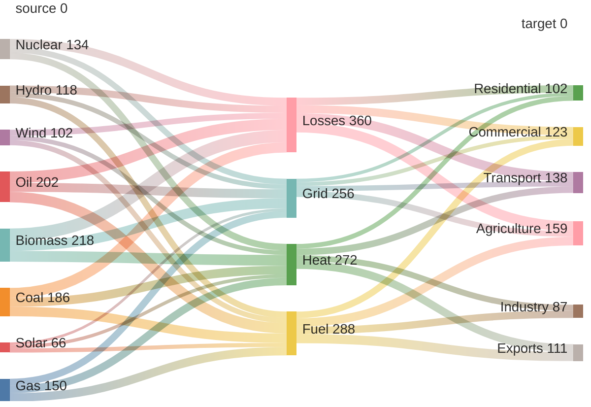
```mermaid
---
width: 85vw
height: 80vh
---
sankey-beta

source,target,value
Solar,Grid,17
Solar,Heat,22
Solar,Fuel,27
Wind,Heat,29
Wind,Fuel,34
Wind,Losses,39
Hydro,Grid,31
Hydro,Fuel,41
Hydro,Losses,46
Nuclear,Grid,38
Nuclear,Heat,43
Nuclear,Losses,53
Gas,Grid,45
Gas,Heat,50
Gas,Fuel,55
Coal,Heat,57
Coal,Fuel,62
Coal,Losses,67
Oil,Grid,59
Oil,Fuel,69
Oil,Losses,74
Biomass,Grid,66
Biomass,Heat,71
Biomass,Losses,81
Grid,Residential,22
Grid,Commercial,26
Grid,Transport,34
Grid,Agriculture,38
Heat,Residential,31
Heat,Industry,39
Heat,Transport,43
Heat,Exports,51
Fuel,Commercial,44
Fuel,Industry,48
Fuel,Agriculture,56
Fuel,Exports,60
Losses,Residential,49
Losses,Commercial,53
Losses,Transport,61
Losses,Agriculture,65
```
::tab{title="Markdown Source" copy-from="Rendered"}
:::

## radar-beta
:::tabs
::tab{title="Rendered"}
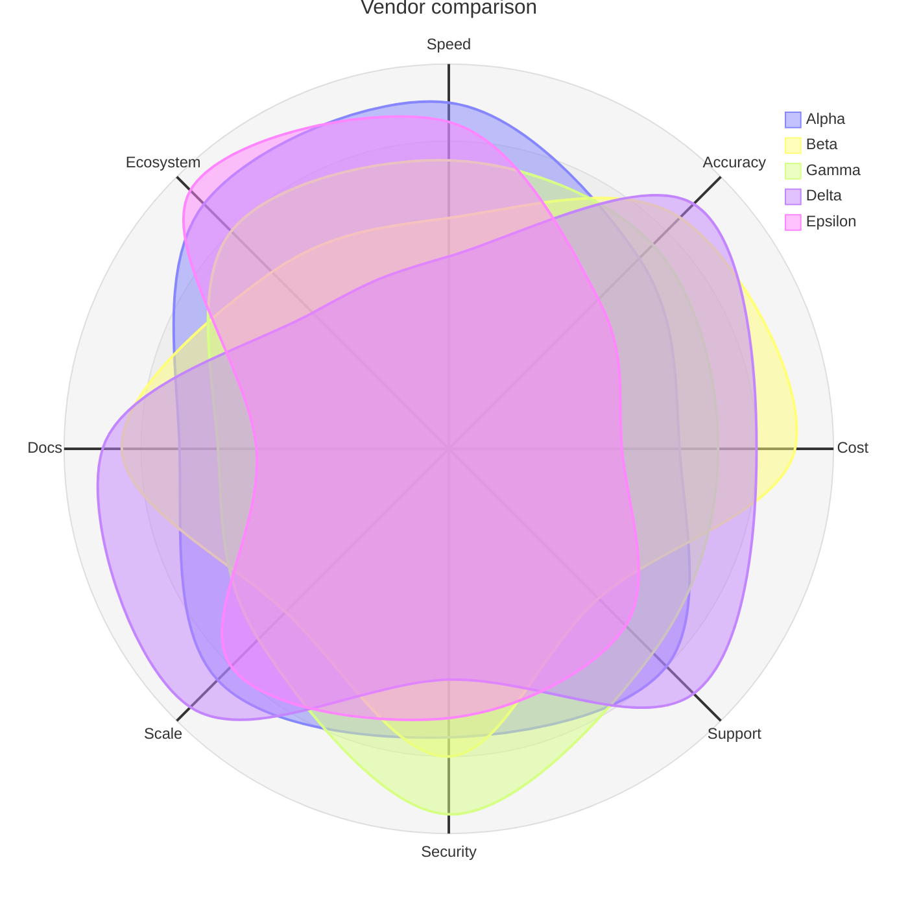
```mermaid
---
width: 85vw
---
radar-beta
  title Vendor comparison
  axis a0["Speed"]
  axis a1["Accuracy"]
  axis a2["Cost"]
  axis a3["Support"]
  axis a4["Security"]
  axis a5["Scale"]
  axis a6["Docs"]
  axis a7["Ecosystem"]
  curve c0["Alpha"]{90, 70, 60, 80, 75, 85, 70, 90}
  curve c1["Beta"]{60, 85, 90, 55, 80, 60, 85, 65}
  curve c2["Gamma"]{75, 75, 70, 75, 95, 70, 60, 80}
  curve c3["Delta"]{50, 90, 80, 90, 60, 95, 90, 50}
  curve c4["Epsilon"]{85, 55, 45, 65, 70, 80, 50, 95}
  max 100
  min 0
  ticks 5
```
::tab{title="Markdown Source" copy-from="Rendered"}
:::

## treemap-beta
:::tabs
::tab{title="Rendered"}
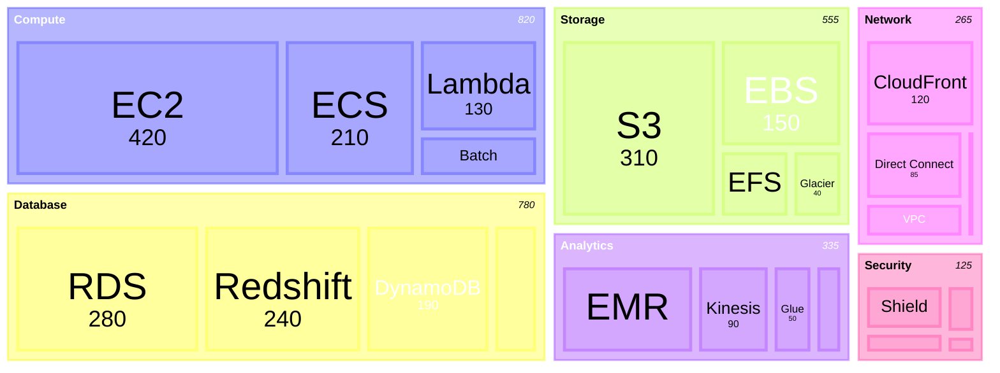
```mermaid
---
width: 85vw
---
treemap-beta
"Compute"
    "EC2": 420
    "Lambda": 130
    "ECS": 210
    "Batch": 60
"Storage"
    "S3": 310
    "EBS": 150
    "Glacier": 40
    "EFS": 55
"Database"
    "RDS": 280
    "DynamoDB": 190
    "Redshift": 240
    "ElastiCache": 70
"Network"
    "CloudFront": 120
    "Route53": 15
    "VPC": 45
    "Direct Connect": 85
"Analytics"
    "Athena": 35
    "EMR": 160
    "Kinesis": 90
    "Glue": 50
"Security"
    "WAF": 30
    "GuardDuty": 25
    "KMS": 10
    "Shield": 60
```
::tab{title="Markdown Source" copy-from="Rendered"}
:::

## timeline
:::tabs
::tab{title="Rendered"}

```mermaid
---
width: 85vw
---
timeline
    title History of computing
    section 1940s
        1943 : Colossus
        1945 : ENIAC
        1947 : Transistor
    section 1950s
        1951 : UNIVAC I
        1956 : First hard drive
        1957 : FORTRAN
    section 1960s
        1964 : BASIC
        1965 : Moore's law
        1969 : ARPANET : Unix begins
    section 1970s
        1971 : Microprocessor : Floppy disk
        1973 : Ethernet
        1976 : Apple I
        1978 : Spreadsheet
    section 1980s
        1981 : IBM PC
        1984 : Macintosh
        1989 : World Wide Web proposed
    section 1990s
        1991 : Linux
        1993 : Mosaic
        1995 : Java : JavaScript
        1998 : Google
    section 2000s
        2004 : Social networks
        2007 : iPhone
        2008 : Cloud computing : Git hosting
    section 2010s
        2012 : Deep learning wins ImageNet
        2015 : Containers
        2017 : Transformers
    section 2020s
        2020 : Large language models
        2022 : Generative AI
        2024 : Agents
```
::tab{title="Markdown Source" copy-from="Rendered"}
:::

## C4Context
:::tabs
::tab{title="Rendered"}
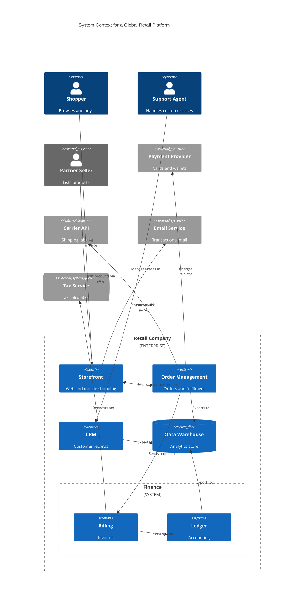
```mermaid
---
width: 85vw
---
C4Context
    title System Context for a Global Retail Platform
    Person(shopper, "Shopper", "Browses and buys")
    Person(agent, "Support Agent", "Handles customer cases")
    Person_Ext(partner, "Partner Seller", "Lists products")
    Enterprise_Boundary(co, "Retail Company") {
        System(shop, "Storefront", "Web and mobile shopping")
        System(oms, "Order Management", "Orders and fulfilment")
        System(crm, "CRM", "Customer records")
        SystemDb(dw, "Data Warehouse", "Analytics store")
        System_Boundary(fin, "Finance") {
            System(billing, "Billing", "Invoices")
            System(ledger, "Ledger", "Accounting")
        }
    }
    System_Ext(pay, "Payment Provider", "Cards and wallets")
    System_Ext(ship, "Carrier API", "Shipping labels")
    System_Ext(mail, "Email Service", "Transactional mail")
    SystemQueue_Ext(tax, "Tax Service", "Tax calculation")
    Rel(shopper, shop, "Uses", "HTTPS")
    Rel(agent, crm, "Manages cases in")
    Rel(partner, shop, "Lists products via", "API")
    BiRel(shop, oms, "Places and tracks orders")
    Rel(oms, pay, "Charges", "HTTPS")
    Rel(oms, ship, "Creates labels", "REST")
    Rel(oms, billing, "Sends orders to")
    Rel(billing, ledger, "Posts entries")
    Rel(billing, tax, "Requests tax")
    Rel(shop, mail, "Sends mail via")
    Rel(crm, dw, "Exports to")
    Rel(oms, dw, "Exports to")
    Rel(ledger, dw, "Exports to")
```
::tab{title="Markdown Source" copy-from="Rendered"}
:::

## gantt
:::tabs
::tab{title="Rendered"}
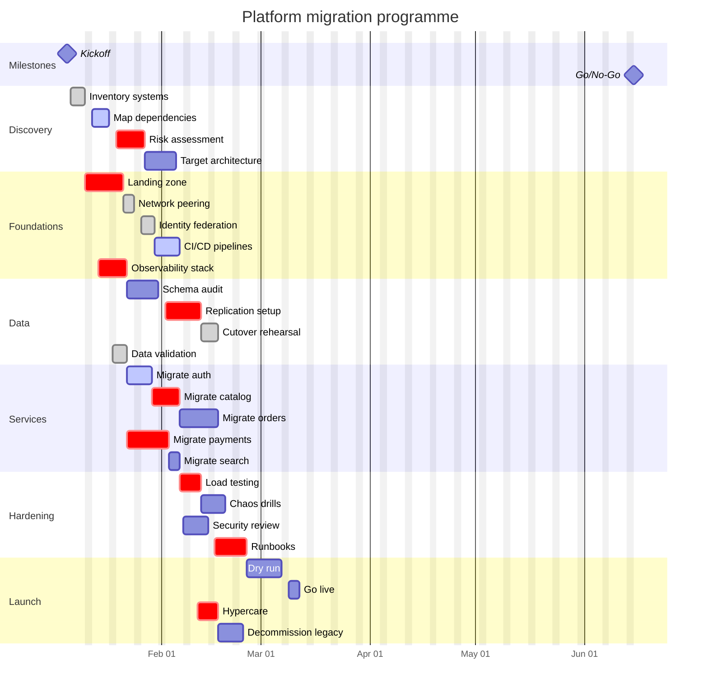
```mermaid
---
width: 85vw
---
gantt
    title Platform migration programme
    dateFormat YYYY-MM-DD
    axisFormat %b %d
    excludes weekends
    section Milestones
    Kickoff :milestone, m1, 2026-01-05, 0d
    Go/No-Go :milestone, m2, 2026-06-15, 0d
    section Discovery
    Inventory systems :done, t1, 2026-01-06, 4d
    Map dependencies :active, t2, after t1, 5d
    Risk assessment :crit, t3, after t2, 6d
    Target architecture :t4, after t3, 7d
    section Foundations
    Landing zone :crit, t5, 2026-01-10, 8d
    Network peering :done, t6, after t5, 3d
    Identity federation :done, t7, after t6, 4d
    CI/CD pipelines :active, t8, after t7, 5d
    Observability stack :crit, t9, 2026-01-14, 6d
    section Data
    Schema audit :t10, after t9, 7d
    Replication setup :crit, t11, after t10, 8d
    Cutover rehearsal :done, t12, after t11, 3d
    Data validation :done, t13, 2026-01-18, 4d
    section Services
    Migrate auth :active, t14, after t13, 5d
    Migrate catalog :crit, t15, after t14, 6d
    Migrate orders :t16, after t15, 7d
    Migrate payments :crit, t17, 2026-01-22, 8d
    Migrate search :t18, after t17, 3d
    section Hardening
    Load testing :crit, t19, after t18, 4d
    Chaos drills :t20, after t19, 5d
    Security review :t21, 2026-02-07, 6d
    Runbooks :crit, t22, after t21, 7d
    section Launch
    Dry run :t23, after t22, 8d
    Go live :t24, after t23, 3d
    Hypercare :crit, t25, 2026-02-11, 4d
    Decommission legacy :t26, after t25, 5d
```
::tab{title="Markdown Source" copy-from="Rendered"}
:::

## architecture-beta
:::tabs
::tab{title="Rendered"}
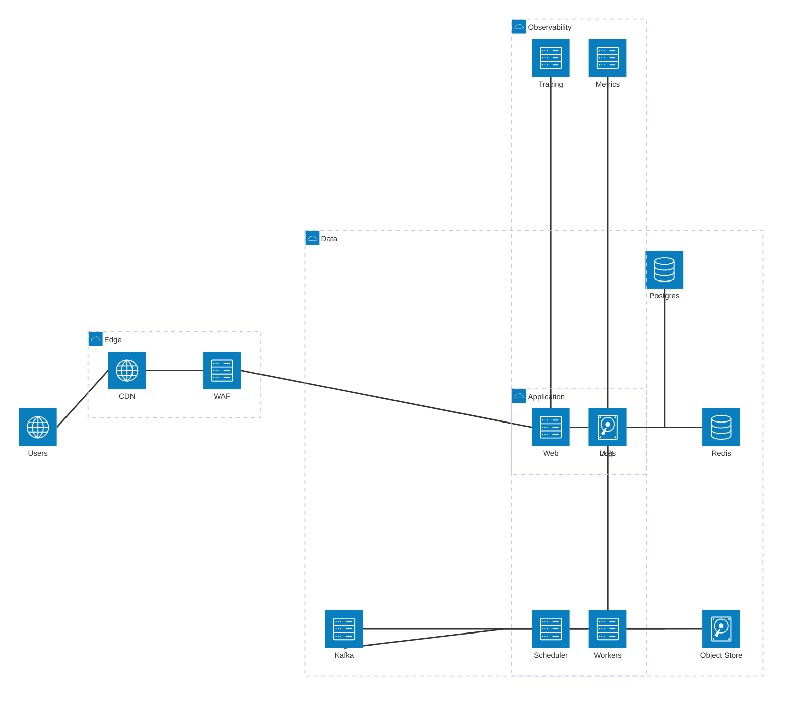
```mermaid
---
width: 85vw
---
architecture-beta
    group edge(cloud)[Edge]
    service cdn(internet)[CDN] in edge
    service waf(server)[WAF] in edge
    group app(cloud)[Application]
    service web(server)[Web] in app
    service api(server)[API] in app
    service worker(server)[Workers] in app
    service sched(server)[Scheduler] in app
    group data(cloud)[Data]
    service pg(database)[Postgres] in data
    service redis(database)[Redis] in data
    service s3(disk)[Object Store] in data
    service kafka(server)[Kafka] in data
    group obs(cloud)[Observability]
    service prom(server)[Metrics] in obs
    service logs(disk)[Logs] in obs
    service trace(server)[Tracing] in obs
    service users(internet)[Users]
    junction j1
    junction j2
    users:R -- L:cdn
    cdn:R -- L:waf
    waf:R -- L:web
    web:R -- L:api
    api:R -- L:j1
    j1:T -- B:pg
    j1:R -- L:redis
    api:B -- T:worker
    worker:R -- L:j2
    j2:T -- B:kafka
    j2:R -- L:s3
    sched:R -- L:worker
    api:T -- B:prom
    worker:T -- B:logs
    web:T -- B:trace
    kafka:R -- L:sched
```
::tab{title="Markdown Source" copy-from="Rendered"}
:::

## gitGraph
:::tabs
::tab{title="Rendered"}
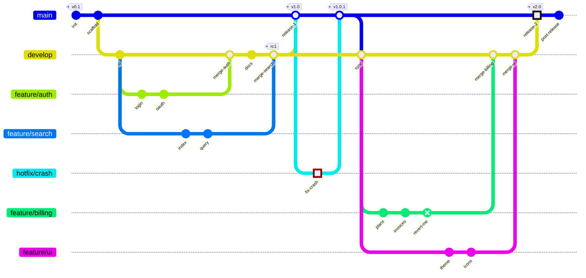
```mermaid
---
width: 85vw
---
gitGraph
   commit id: "init" tag: "v0.1"
   commit id: "scaffold"
   branch develop
   checkout develop
   commit id: "ci"
   branch feature/auth
   checkout feature/auth
   commit id: "login"
   commit id: "oauth"
   checkout develop
   branch feature/search
   checkout feature/search
   commit id: "index"
   commit id: "query"
   checkout develop
   merge feature/auth id: "merge-auth"
   commit id: "docs"
   merge feature/search id: "merge-search" tag: "rc1"
   checkout main
   merge develop id: "release-1" tag: "v1.0"
   branch hotfix/crash
   checkout hotfix/crash
   commit id: "fix-crash" type: HIGHLIGHT
   checkout main
   merge hotfix/crash tag: "v1.0.1"
   checkout develop
   merge main id: "sync"
   branch feature/billing
   checkout feature/billing
   commit id: "plans"
   commit id: "invoices"
   commit id: "revert-me" type: REVERSE
   checkout develop
   branch feature/ui
   checkout feature/ui
   commit id: "theme"
   commit id: "icons"
   checkout develop
   merge feature/billing id: "merge-billing"
   merge feature/ui id: "merge-ui"
   checkout main
   merge develop id: "release-2" tag: "v2.0" type: HIGHLIGHT
   commit id: "post-release"
```
::tab{title="Markdown Source" copy-from="Rendered"}
:::

## pie
:::tabs
::tab{title="Rendered"}
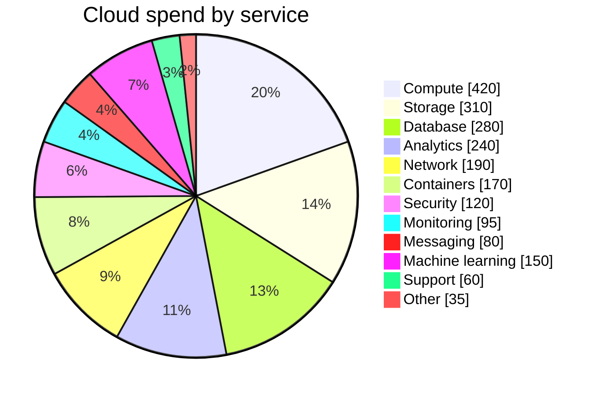
```mermaid
---
width: 85vw
---
pie showData
    title Cloud spend by service
    "Compute" : 420
    "Storage" : 310
    "Database" : 280
    "Analytics" : 240
    "Network" : 190
    "Containers" : 170
    "Security" : 120
    "Monitoring" : 95
    "Messaging" : 80
    "Machine learning" : 150
    "Support" : 60
    "Other" : 35
```
::tab{title="Markdown Source" copy-from="Rendered"}
:::

## journey
:::tabs
::tab{title="Rendered"}
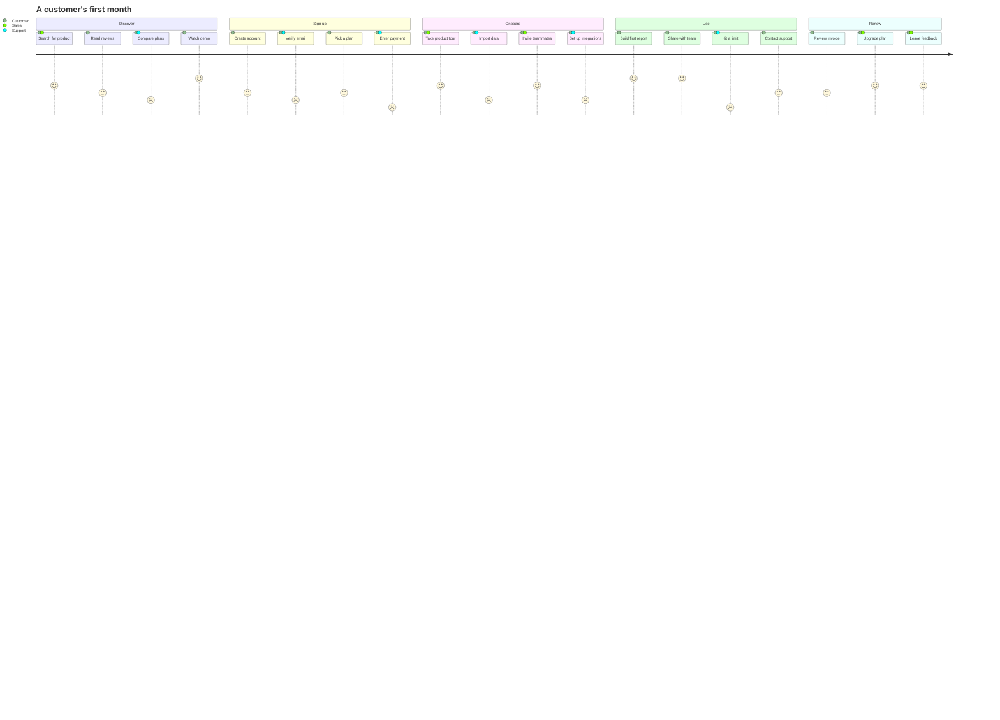
```mermaid
---
width: 85vw
---
journey
    title A customer's first month
    section Discover
      Search for product: 4: Customer, Sales
      Read reviews: 3: Customer
      Compare plans: 2: Customer, Support
      Watch demo: 5: Customer
    section Sign up
      Create account: 3: Customer
      Verify email: 2: Customer, Support
      Pick a plan: 3: Customer
      Enter payment: 1: Customer, Support
    section Onboard
      Take product tour: 4: Customer, Sales
      Import data: 2: Customer, Support
      Invite teammates: 4: Customer, Sales
      Set up integrations: 2: Customer, Support
    section Use
      Build first report: 5: Customer
      Share with team: 5: Customer
      Hit a limit: 1: Customer, Support
      Contact support: 3: Customer
    section Renew
      Review invoice: 3: Customer
      Upgrade plan: 4: Customer, Sales
      Leave feedback: 4: Customer, Sales
```
::tab{title="Markdown Source" copy-from="Rendered"}
:::

## quadrantChart
:::tabs
::tab{title="Rendered"}
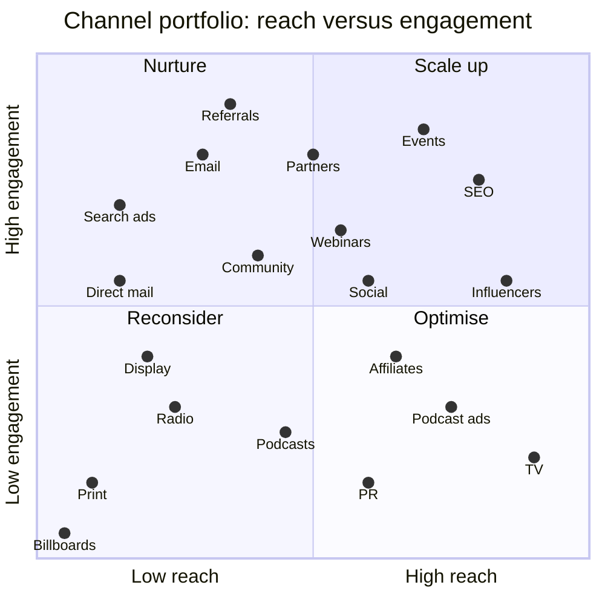
```mermaid
---
width: 85vw
---
quadrantChart
    title Channel portfolio: reach versus engagement
    x-axis Low reach --> High reach
    y-axis Low engagement --> High engagement
    quadrant-1 Scale up
    quadrant-2 Nurture
    quadrant-3 Reconsider
    quadrant-4 Optimise
    Search ads: [0.15, 0.7]
    Email: [0.3, 0.8]
    Podcasts: [0.45, 0.25]
    Webinars: [0.55, 0.65]
    Affiliates: [0.65, 0.4]
    Influencers: [0.85, 0.55]
    Print: [0.1, 0.15]
    Radio: [0.25, 0.3]
    TV: [0.9, 0.2]
    Events: [0.7, 0.85]
    Referrals: [0.35, 0.9]
    SEO: [0.8, 0.75]
    Social: [0.6, 0.55]
    Display: [0.2, 0.4]
    Direct mail: [0.15, 0.55]
    Partners: [0.5, 0.8]
    Community: [0.4, 0.6]
    Podcast ads: [0.75, 0.3]
    Billboards: [0.05, 0.05]
    PR: [0.6, 0.15]
```
::tab{title="Markdown Source" copy-from="Rendered"}
:::

## xychart
:::tabs
::tab{title="Rendered"}

```mermaid
---
width: 85vw
---
xychart-beta
    title "Revenue, cost and forecast"
    x-axis [Jan, Feb, Mar, Apr, May, Jun, Jul, Aug, Sep, Oct, Nov, Dec]
    y-axis "USD (thousands)" 0 --> 1400
    bar [310, 340, 380, 420, 470, 520, 560, 610, 680, 750, 830, 910]
    bar [260, 270, 300, 320, 350, 380, 400, 430, 470, 500, 540, 590]
    line [300, 350, 400, 450, 500, 560, 620, 700, 780, 880, 1000, 1150]
    line [280, 300, 330, 370, 420, 470, 520, 580, 640, 720, 810, 900]
```
::tab{title="Markdown Source" copy-from="Rendered"}
:::

## requirementDiagram
:::tabs
::tab{title="Rendered"}
```mermaid
---
width: 85vw
---
requirementDiagram
    functionalRequirement req1 {
        id: R1
        text: The system shall satisfy behaviour number 1
        risk: medium
        verifymethod: analysis
    }
    performanceRequirement req2 {
        id: R2
        text: The system shall satisfy behaviour number 2
        risk: high
        verifymethod: inspection
    }
    interfaceRequirement req3 {
        id: R3
        text: The system shall satisfy behaviour number 3
        risk: low
        verifymethod: demonstration
    }
    physicalRequirement req4 {
        id: R4
        text: The system shall satisfy behaviour number 4
        risk: medium
        verifymethod: test
    }
    designConstraint req5 {
        id: R5
        text: The system shall satisfy behaviour number 5
        risk: high
        verifymethod: analysis
    }
    requirement req6 {
        id: R6
        text: The system shall satisfy behaviour number 6
        risk: low
        verifymethod: inspection
    }
    functionalRequirement req7 {
        id: R7
        text: The system shall satisfy behaviour number 7
        risk: medium
        verifymethod: demonstration
    }
    performanceRequirement req8 {
        id: R8
        text: The system shall satisfy behaviour number 8
        risk: high
        verifymethod: test
    }
    interfaceRequirement req9 {
        id: R9
        text: The system shall satisfy behaviour number 9
        risk: low
        verifymethod: analysis
    }
    physicalRequirement req10 {
        id: R10
        text: The system shall satisfy behaviour number 10
        risk: medium
        verifymethod: inspection
    }
    element comp1 {
        type: service
        docref: docs/comp1.md
    }
    element comp2 {
        type: simulation
        docref: docs/comp2.md
    }
    element comp3 {
        type: document
        docref: docs/comp3.md
    }
    element comp4 {
        type: module
        docref: docs/comp4.md
    }
    element comp5 {
        type: service
        docref: docs/comp5.md
    }
    element comp6 {
        type: simulation
        docref: docs/comp6.md
    }
    comp1 - satisfies -> req1
    comp2 - satisfies -> req2
    comp3 - satisfies -> req3
    comp4 - satisfies -> req4
    comp5 - satisfies -> req5
    comp6 - satisfies -> req6
    req1 - contains -> req2
    req3 - contains -> req4
    req5 - contains -> req6
    req7 - contains -> req8
    req9 - derives -> req2
    req10 - refines -> req4
    comp1 - verifies -> req10
    req6 - traces -> req8
    req8 - copies -> req3
```
::tab{title="Markdown Source" copy-from="Rendered"}
:::

## kanban
:::tabs
::tab{title="Rendered"}
```mermaid
---
width: 85vw
---
kanban
  col0[Backlog]
    t1[Dark mode]@{ ticket: PRJ-101, assigned: 'raj', priority: 'High' }
    t2[Export to PDF]@{ ticket: PRJ-102, assigned: 'li', priority: 'Very High' }
    t3[SSO via SAML]@{ ticket: PRJ-103, assigned: 'sam', priority: 'Very Low' }
    t4[Audit log]@{ ticket: PRJ-104, assigned: 'ana', priority: 'Low' }
  col104[Ready]
    t105[Rate limiting]@{ ticket: PRJ-205, assigned: 'raj', priority: 'High' }
    t106[Webhook retries]@{ ticket: PRJ-206, assigned: 'li', priority: 'Very High' }
    t107[Bulk import]@{ ticket: PRJ-207, assigned: 'sam', priority: 'Very Low' }
  col207[In progress]
    t208[Search relevance]@{ ticket: PRJ-308, assigned: 'ana', priority: 'Low' }
    t209[Mobile onboarding]@{ ticket: PRJ-309, assigned: 'raj', priority: 'High' }
    t210[Billing portal]@{ ticket: PRJ-310, assigned: 'li', priority: 'Very High' }
  col310[Review]
    t311[Fix timezone bug]@{ ticket: PRJ-411, assigned: 'sam', priority: 'Very Low' }
    t312[Cache invalidation]@{ ticket: PRJ-412, assigned: 'ana', priority: 'Low' }
  col412[Done]
    t413[CI speedup]@{ ticket: PRJ-513, assigned: 'raj', priority: 'High' }
    t414[Upgrade Postgres]@{ ticket: PRJ-514, assigned: 'li', priority: 'Very High' }
    t415[Docs revamp]@{ ticket: PRJ-515, assigned: 'sam', priority: 'Very Low' }
    t416[Error budget policy]@{ ticket: PRJ-516, assigned: 'ana', priority: 'Low' }
```
::tab{title="Markdown Source" copy-from="Rendered"}
:::

## C4Container
:::tabs
::tab{title="Rendered"}
```mermaid
---
width: 85vw
---
C4Container
    title Containers of the Order Platform
    Person(user, "Shopper", "Places orders")
    Person(ops, "Operator", "Runs the platform")
    System_Boundary(sys, "Order Platform") {
        Container(spa, "Web App", "React", "Storefront UI")
        Container(mobile, "Mobile App", "Swift, Kotlin", "Native clients")
        Container(gw, "API Gateway", "Envoy", "Routing, auth, limits")
        Container(orders, "Orders Service", "Go", "Order lifecycle")
        Container(pay, "Payments Service", "Java", "Payment orchestration")
        Container(inv, "Inventory Service", "Rust", "Stock reservations")
        Container(notif, "Notification Worker", "Python", "Email and push")
        ContainerQueue(bus, "Event Bus", "Kafka", "Domain events")
        ContainerDb(odb, "Orders DB", "PostgreSQL", "Orders")
        ContainerDb(pdb, "Payments DB", "PostgreSQL", "Payments")
        ContainerDb(cache, "Cache", "Redis", "Sessions and carts")
        ContainerDb(search, "Search Index", "OpenSearch", "Catalog search")
    }
    System_Ext(psp, "Payment Provider", "Cards")
    System_Ext(mail, "Email Service", "Mail")
    System_Ext(idp, "Identity Provider", "OIDC")
    Rel(user, spa, "Uses", "HTTPS")
    Rel(user, mobile, "Uses")
    Rel(spa, gw, "Calls", "JSON/HTTPS")
    Rel(mobile, gw, "Calls", "JSON/HTTPS")
    Rel(gw, idp, "Validates tokens", "OIDC")
    Rel(gw, orders, "Routes", "gRPC")
    Rel(gw, search, "Queries")
    Rel(orders, inv, "Reserves", "gRPC")
    Rel(orders, pay, "Requests payment", "gRPC")
    Rel(orders, odb, "Reads/writes", "SQL")
    Rel(pay, pdb, "Reads/writes", "SQL")
    Rel(pay, psp, "Charges", "HTTPS")
    Rel(orders, bus, "Publishes")
    Rel(bus, notif, "Delivers")
    Rel(notif, mail, "Sends", "SMTP")
    Rel(gw, cache, "Caches")
    Rel(ops, gw, "Administers")
```
::tab{title="Markdown Source" copy-from="Rendered"}
:::

## C4Component
:::tabs
::tab{title="Rendered"}
```mermaid
---
width: 85vw
---
C4Component
    title Components of the Orders Service
    Container(gw, "API Gateway", "Envoy", "Routing")
    ContainerDb(db, "Orders DB", "PostgreSQL", "Orders")
    ContainerQueue(bus, "Event Bus", "Kafka", "Events")
    Container(inv, "Inventory Service", "Rust", "Stock")
    Container(pay, "Payments Service", "Java", "Payments")
    Container_Boundary(svc, "Orders Service") {
        Component(api, "Order API", "gRPC handlers", "Request entry points")
        Component(val, "Order Validator", "Go package", "Business rules")
        Component(wf, "Order Workflow", "State machine", "Lifecycle transitions")
        Component(price, "Pricing Engine", "Go package", "Totals, discounts, tax")
        Component(repo, "Order Repository", "sqlx", "Persistence")
        Component(out, "Outbox Publisher", "Go routine", "Reliable event publishing")
        Component(idem, "Idempotency Guard", "Middleware", "Deduplicates requests")
        Component(audit, "Audit Logger", "Go package", "Change history")
    }
    Rel(gw, idem, "Calls", "gRPC")
    Rel(idem, api, "Forwards")
    Rel(api, val, "Validates with")
    Rel(api, wf, "Drives")
    Rel(wf, price, "Prices with")
    Rel(wf, repo, "Persists via")
    Rel(wf, inv, "Reserves stock", "gRPC")
    Rel(wf, pay, "Requests payment", "gRPC")
    Rel(repo, db, "Reads/writes", "SQL")
    Rel(wf, out, "Queues events")
    Rel(out, bus, "Publishes")
    Rel(wf, audit, "Records")
    Rel(audit, db, "Writes history", "SQL")
```
::tab{title="Markdown Source" copy-from="Rendered"}
:::

## C4Dynamic
:::tabs
::tab{title="Rendered"}
```mermaid
---
width: 85vw
---
C4Dynamic
    title Checkout request flow
    Person(user, "Shopper", "Checks out")
    Container(spa, "Web App", "React", "UI")
    Container(gw, "API Gateway", "Envoy", "Edge")
    Container(orders, "Orders Service", "Go", "Orders")
    Container(inv, "Inventory Service", "Rust", "Stock")
    Container(pay, "Payments Service", "Java", "Payments")
    ContainerQueue(bus, "Event Bus", "Kafka", "Events")
    Container(notif, "Notification Worker", "Python", "Mail")
    System_Ext(psp, "Payment Provider", "Cards")
    System_Ext(mail, "Email Service", "Mail")
    Rel(user, spa, "1. Clicks Pay")
    Rel(spa, gw, "2. POST /orders", "HTTPS")
    Rel(gw, orders, "3. Create order", "gRPC")
    Rel(orders, inv, "4. Reserve items", "gRPC")
    Rel(orders, pay, "5. Authorize", "gRPC")
    Rel(pay, psp, "6. Charge card", "HTTPS")
    Rel(orders, bus, "7. Publish OrderCreated")
    Rel(bus, notif, "8. Deliver event")
    Rel(notif, mail, "9. Send confirmation", "SMTP")
    Rel(gw, spa, "10. Return 201")
```
::tab{title="Markdown Source" copy-from="Rendered"}
:::

## C4Deployment
:::tabs
::tab{title="Rendered"}
```mermaid
---
width: 85vw
---
C4Deployment
    title Production deployment
    Deployment_Node(cloud, "Cloud Region eu-west", "AWS") {
        Deployment_Node(edge, "Edge", "CloudFront + WAF") {
            Container(cdn, "CDN", "CloudFront", "Static assets")
        }
        Deployment_Node(k8s, "Kubernetes", "EKS") {
            Deployment_Node(ns1, "orders namespace", "3 replicas") {
                Container(orders, "Orders Service", "Go", "Orders")
            }
            Deployment_Node(ns2, "payments namespace", "3 replicas") {
                Container(pay, "Payments Service", "Java", "Payments")
            }
            Deployment_Node(ns3, "gateway namespace", "4 replicas") {
                Container(gw, "API Gateway", "Envoy", "Edge routing")
            }
        }
        Deployment_Node(data, "Data tier", "Managed services") {
            Deployment_Node(rds, "Aurora cluster", "PostgreSQL 16") {
                ContainerDb(odb, "Orders DB", "PostgreSQL", "Orders")
                ContainerDb(pdb, "Payments DB", "PostgreSQL", "Payments")
            }
            Deployment_Node(msk, "MSK cluster", "Kafka") {
                ContainerQueue(bus, "Event Bus", "Kafka", "Events")
            }
            Deployment_Node(ec, "ElastiCache", "Redis") {
                ContainerDb(cache, "Cache", "Redis", "Sessions")
            }
        }
    }
    Deployment_Node(dev, "Customer device", "Browser") {
        Container(spa, "Web App", "React", "Storefront")
    }
    Rel(spa, cdn, "Loads", "HTTPS")
    Rel(spa, gw, "Calls", "HTTPS")
    Rel(gw, orders, "Routes", "gRPC")
    Rel(orders, pay, "Calls", "gRPC")
    Rel(orders, odb, "Reads/writes", "SQL")
    Rel(pay, pdb, "Reads/writes", "SQL")
    Rel(orders, bus, "Publishes")
    Rel(gw, cache, "Caches")
```
::tab{title="Markdown Source" copy-from="Rendered"}
:::

## block
:::tabs
::tab{title="Rendered"}
```mermaid
---
width: 85vw
---
block
  columns 5
  Client(("Client")) space:1 CDN["CDN"] space:1 Edge["Edge"]
  Gateway["Gateway"]:2 Auth{{"Auth"}} Limiter["Limiter"] Router["Router"]
  block:svc:5
    columns 5
    Orders Payments Inventory Catalog Search
  end
  space DB1[("Orders DB")] DB2[("Payments DB")] Cache[("Cache")] Index[("Index")]
  Bus["Event Bus"]:5
  Client --> CDN
  CDN --> Edge
  Edge --> Gateway
  Gateway --> Auth
  Auth --> Limiter
  Limiter --> Router
  Router --> svc
  Orders --> DB1
  Payments --> DB2
  Catalog --> Cache
  Search --> Index
  svc --> Bus
  style Client fill:#7e3a7e,stroke:#d8a8d8,color:#fff
  style Bus fill:#3a7e3a,stroke:#a8d8a8,color:#fff
```
::tab{title="Markdown Source" copy-from="Rendered"}
:::

## packet
:::tabs
::tab{title="Rendered"}
```mermaid
---
width: 85vw
---
packet
0-3: "Version"
4-7: "IHL"
8-13: "DSCP"
14-15: "ECN"
16-31: "Total Length"
32-47: "Identification"
48: "Reserved"
49: "DF"
50: "MF"
51-63: "Fragment Offset"
64-71: "TTL"
72-79: "Protocol"
80-95: "Header Checksum"
96-127: "Source Address"
128-159: "Destination Address"
160-191: "Options"
192-207: "TCP Source Port"
208-223: "TCP Destination Port"
224-255: "Sequence Number"
256-287: "Acknowledgment Number"
288-291: "Data Offset"
292-297: "Reserved"
298: "URG"
299: "ACK"
300: "PSH"
301: "RST"
302: "SYN"
303: "FIN"
304-319: "Window"
320-335: "Checksum"
336-351: "Urgent Pointer"
352-415: "Payload"
```
::tab{title="Markdown Source" copy-from="Rendered"}
:::

## swimlane-beta
:::tabs
::tab{title="Rendered"}
```mermaid
---
width: 85vw
---
swimlane-beta LR
  subgraph Customer
    L0N0[Place order]
    L0N1[Receive confirmation]
    L0N2[Receive goods]
    L0N3[Rate service]
  end
  subgraph Sales
    L1N0[Validate order]
    L1N1[Check credit]
    L1N2[Approve discount]
  end
  subgraph Warehouse
    L2N0[Pick items]
    L2N1[Pack order]
    L2N2[Hand to carrier]
    L2N3[Handle return]
  end
  subgraph Finance
    L3N0[Create invoice]
    L3N1[Collect payment]
    L3N2[Reconcile]
    L3N3[Issue refund]
  end
  subgraph Support
    L4N0[Answer queries]
    L4N1[Open case]
    L4N2[Resolve case]
  end
  L0N0 --> L1N0
  L1N0 --> L1N1
  L1N1 -->|over limit| L1N2
  L1N1 -->|ok| L3N0
  L1N2 --> L3N0
  L3N0 --> L3N1
  L3N1 -->|paid| L2N0
  L2N0 --> L2N1
  L2N1 --> L2N2
  L2N2 --> L0N2
  L1N0 --> L0N1
  L0N2 --> L0N3
  L0N2 -->|problem| L4N1
  L4N1 --> L4N0
  L4N0 --> L4N2
  L4N2 -->|return| L2N3
  L2N3 --> L3N3
  L3N3 --> L3N2
  L3N1 --> L3N2
```
::tab{title="Markdown Source" copy-from="Rendered"}
:::

## agentflow-beta
:::tabs
::tab{title="Rendered"}
```mermaid
---
width: 85vw
---
agentflow-beta TB
  connector llm["LLM API"]
  llm@{ protocol: "http", endpoint: "https://api.example.com/chat" }
  flow newsroom["Newsroom"]
    topic["topic"]@{ shape: input, value: "Open source" }
    flow researcher["Researcher"]
      search["search_web"]@{ shape: tool, params: "query :: String", returns: "Sources" }
      summarise["summarise"]@{ shape: tool, connectorRef: "llm.chat", returns: "Brief" }
      topic --> search --> summarise
    end
    researcher@{ instruction: "Collect sources and write a brief." }
    flow writer["Writer"]
      draft["draft_article"]@{ shape: tool, connectorRef: "llm.chat", returns: "Draft" }
      brand["House Style Guide"]@{ shape: refdoc }
      draft -.- brand
    end
    flow editor["Editor"]
      review["review_draft"]@{ shape: tool, connectorRef: "llm.chat", returns: "Review" }
      facts["Fact Database"]@{ shape: refdoc }
      review -.- facts
    end
    researcher --> writer
    writer --> editor
  end
```
::tab{title="Markdown Source" copy-from="Rendered"}
:::

## usecase-beta
:::tabs
::tab{title="Rendered"}
```mermaid
---
width: 85vw
---
usecase-beta
direction LR
actor Customer("Customer")
actor Staff("Order staff")@{ type: hollow, business: true } <<Employee>>
actor Courier("Courier")
actor Bank("Payment bank")
systemBoundary shop["Storefront"]@{ type: package }
  Browse("Browse products")
  Search("Search catalog")
  Cart("Manage cart")
  Checkout("Checkout") <<Core>>
  Pay("Process payment")
  Track("Track order")
end
systemBoundary back["Back office"]@{ type: package }
  Review("Review order")
  Pick("Pick and pack")
  Refund("Issue refund")
  Report("Run sales report")
end
Customer --> Browse
Customer --> Search
Customer --> Cart
Customer --> Checkout
Customer --> Track
Checkout --> Pay
Bank --> Pay
Staff --> Review
Staff --> Pick
Staff --> Refund
Staff --> Report
Courier --> Pick
Courier --> Track
```
::tab{title="Markdown Source" copy-from="Rendered"}
:::

## venn-beta
:::tabs
::tab{title="Rendered"}
```mermaid
---
width: 85vw
---
venn-beta
  title Skills across a platform team
  set Backend
  set Frontend
  set Data
  set Security
  set Operations
  set Design
  union Backend,Frontend["Full stack"]
  union Backend,Data["Data engineering"]
  union Backend,Operations["Platform"]
  union Backend,Security["AppSec"]
  union Frontend,Design["Design engineering"]
  union Data,Security["Privacy"]
  union Operations,Security["SecOps"]
  union Backend,Frontend,Operations["Generalist"]
  union Backend,Data,Operations["MLOps"]
```
::tab{title="Markdown Source" copy-from="Rendered"}
:::

## ishikawa-beta
:::tabs
::tab{title="Rendered"}
```mermaid
---
width: 85vw
---
ishikawa-beta
    Production outage
    People
        On-call fatigue
        Unclear ownership
        Knowledge silos
            Single expert on payments
            Docs out of date
    Process
        Risky release cadence
        No canary stage
        Skipped change review
        Incident handling
            Late escalation
            No runbook
    Technology
        Monolithic database
        Connection pool exhaustion
        Hidden coupling
            Shared cache keys
            Cross-service transactions
        Legacy queue
    Monitoring
        Alert noise
        Missing SLOs
        Blind spots
            No tracing on batch jobs
    Environment
        Traffic spike
        Cloud provider incident
        Expired certificate
    Tools
        Slow rollback
        Manual failover
        Flaky tests
```
::tab{title="Markdown Source" copy-from="Rendered"}
:::

## eventmodeling
:::tabs
::tab{title="Rendered"}
```mermaid
---
width: 85vw
---
eventmodeling

timeframe 01 ui CartUI
timeframe 02 command AddItem
timeframe 03 event ItemAdded
timeframe 04 ui CheckoutUI
timeframe 05 command PlaceOrder
timeframe 06 event OrderPlaced
timeframe 07 readmodel OrderSummary
timeframe 08 command AuthorizePayment
timeframe 09 event PaymentAuthorized
timeframe 10 event PaymentFailed
timeframe 11 command ReserveStock
timeframe 12 event StockReserved
timeframe 13 command ShipOrder
timeframe 14 event OrderShipped
timeframe 15 readmodel TrackingView
timeframe 16 ui TrackingUI
timeframe 17 command CancelOrder
timeframe 18 event OrderCancelled
timeframe 19 command RefundPayment
timeframe 20 event PaymentRefunded

data AddItem {
  description: string
  price: number
}

data ItemAdded {
  cartId: string
  description: string
  price: number
}

data OrderPlaced {
  orderId: string
  total: number
}
```
::tab{title="Markdown Source" copy-from="Rendered"}
:::

## wardley-beta
:::tabs
::tab{title="Rendered"}
```mermaid
---
width: 85vw
---
wardley-beta
title E-commerce value chain
size [1200, 900]

evolution Genesis@0.25 -> Custom@0.5 -> Product@0.75 -> Commodity@1.0

anchor Customer [0.98, 0.9]
component "Mobile app" [0.88, 0.62]
component "Web app" [0.85, 0.7]
component "Checkout" [0.78, 0.55]
component "Recommendations" [0.72, 0.35]
component "Search" [0.68, 0.6]
component "Payments" [0.62, 0.8]
component "Order management" [0.58, 0.5]
component "Identity" [0.52, 0.75]
component "Inventory" [0.48, 0.45]
component "Data platform" [0.42, 0.4]
component "ML platform" [0.36, 0.25]
component "API gateway" [0.45, 0.72]
component "Message queue" [0.32, 0.78]
component "Container platform" [0.25, 0.82]
component "Compute" [0.15, 0.92]
component "Network" [0.1, 0.95]
component "Power" [0.04, 0.98]
Customer -> "Mobile app"
Customer -> "Web app"
"Mobile app" -> "Checkout"
"Web app" -> "Checkout"
"Web app" -> "Search"
"Checkout" -> "Payments"
"Checkout" -> "Order management"
"Search" -> "Recommendations"
"Recommendations" -> "ML platform"
"Order management" -> "Inventory"
"Order management" -> "Identity"
"Inventory" -> "Data platform"
"ML platform" -> "Data platform"
"Payments" -> "API gateway"
"Identity" -> "API gateway"
"API gateway" -> "Message queue"
"Message queue" -> "Container platform"
"Data platform" -> "Container platform"
"Container platform" -> "Compute"
"Compute" -> "Network"
"Network" -> "Power"
evolve "ML platform" 0.7
evolve "Recommendations" 0.6
evolve "Container platform" 0.95

annotations [0.05, 0.05]
annotation 1,[0.70, 0.40] "Differentiating capability"
annotation 2,[0.50, 0.60] "Undifferentiated, buy"
annotation 3,[0.25, 0.85] "Utility services"

note "Invest in recommendations" [0.80, 0.30]
note "Move data platform to managed service" [0.40, 0.45]
```
::tab{title="Markdown Source" copy-from="Rendered"}
:::

## cynefin-beta
:::tabs
::tab{title="Rendered"}
```mermaid
---
width: 85vw
---
cynefin-beta
title Where our problems live

clear
"Password reset"
"Invoice numbering"
"Backup schedule"
"Onboarding checklist"
"Holiday coverage"

complicated
"Capacity planning"
"Tax compliance"
"Database tuning"
"Security audit"
"Vendor evaluation"

complex
"Market entry"
"Team culture"
"Product-market fit"
"Partner ecosystem"
"AI adoption"

chaotic
"Data breach"
"Region outage"
"Viral incident"
"Key supplier collapse"

confusion
"Unlabelled legacy job"
"Ambiguous customer complaint"
"Conflicting metrics"

complex --> complicated : "Pattern found"
complicated --> clear : "Best practice"
clear --> chaotic : "Complacency"
chaotic --> complex : "Stabilise"
confusion --> complex : "Probe"
confusion --> complicated : "Analyse"
```
::tab{title="Markdown Source" copy-from="Rendered"}
:::

## treeView-beta
:::tabs
::tab{title="Rendered"}
```mermaid
---
width: 85vw
---
treeView-beta
    monorepo/
        apps/
            web/
                src/
                    App.tsx :::highlight ## root component
                    routes/
                        index.tsx
                        settings.tsx
                    components/
                        Button.tsx
                        Chart.tsx
                package.json
            api/
                cmd/
                    server/
                        main.go ## entry point
                internal/
                    orders/
                        handler.go
                        repo.go
                    payments/
                        handler.go
                        provider.go
                go.mod
            mobile/
                ios/
                android/
        packages/
            ui/
                tokens.css
                index.ts
            config/
                eslint.js
                tsconfig.base.json
        infra/
            terraform/
                main.tf
                variables.tf
            k8s/
                deployment.yaml
                ingress.yaml
        docs/
            architecture.md
            runbooks/
                outage.md
        .github/
            workflows/
                ci.yml
                release.yml
        README.md
        Makefile
```
::tab{title="Markdown Source" copy-from="Rendered"}
:::

## railroad-beta
:::tabs
::tab{title="Rendered"}
```mermaid
---
width: 85vw
---
railroad-beta
title JSON grammar
json = nonterminal("value") ;
value = choice(nonterminal("object"), nonterminal("array"), nonterminal("string"), nonterminal("number"), terminal("true"), terminal("false"), terminal("null")) ;
object = sequence(terminal("{"), optional(sequence(nonterminal("pair"), zeroOrMore(sequence(terminal(","), nonterminal("pair"))))), terminal("}")) ;
pair = sequence(nonterminal("string"), terminal(":"), nonterminal("value")) ;
array = sequence(terminal("["), optional(sequence(nonterminal("value"), zeroOrMore(sequence(terminal(","), nonterminal("value"))))), terminal("]")) ;
string = sequence(terminal("\""), zeroOrMore(choice(nonterminal("char"), sequence(terminal("\\"), nonterminal("escape")))), terminal("\"")) ;
escape = choice(terminal("n"), terminal("t"), terminal("r"), terminal("b"), terminal("f"), terminal("/"), terminal("\\"), sequence(terminal("u"), nonterminal("hex"), nonterminal("hex"), nonterminal("hex"), nonterminal("hex"))) ;
number = sequence(optional(terminal("-")), nonterminal("int"), optional(nonterminal("frac")), optional(nonterminal("exp"))) ;
int = choice(terminal("0"), sequence(nonterminal("digit1"), zeroOrMore(nonterminal("digit")))) ;
frac = sequence(terminal("."), oneOrMore(nonterminal("digit"))) ;
exp = sequence(choice(terminal("e"), terminal("E")), optional(choice(terminal("+"), terminal("-"))), oneOrMore(nonterminal("digit"))) ;
```
::tab{title="Markdown Source" copy-from="Rendered"}
:::
